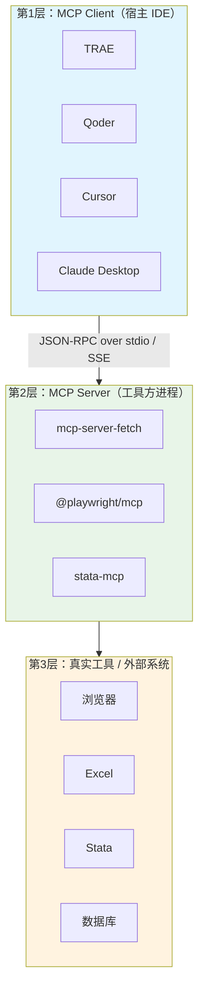
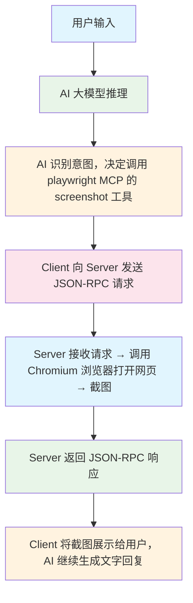
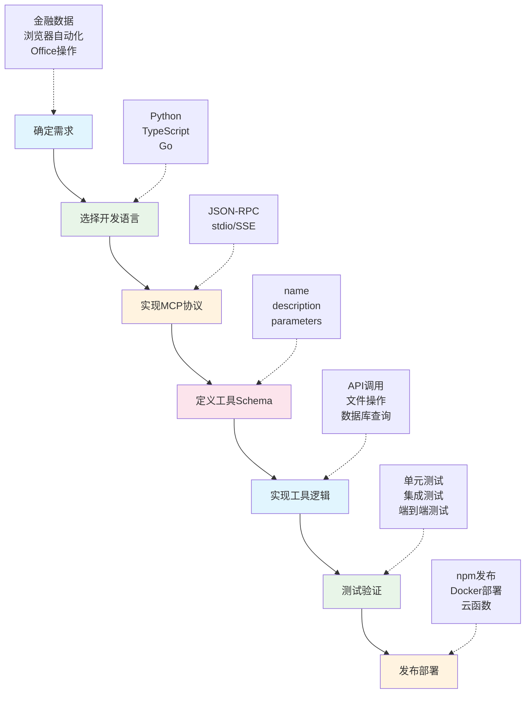

<div class="chapter-audio-player" style="display:flex;align-items:center;gap:12px;padding:12px 16px;background:linear-gradient(135deg,#f0f9ff,#e0f2fe);border:1px solid #bae6fd;border-radius:12px;margin-bottom:24px">
  <button id="ch03-play-btn" onclick="toggleChapterAudio('ch03')" style="width:40px;height:40px;border:none;border-radius:50%;background:linear-gradient(135deg,#3B82F6,#2563EB);color:white;font-size:16px;cursor:pointer;display:flex;align-items:center;justify-content:center;flex-shrink:0">▶</button>
  <div style="flex:1;min-width:0">
    <div style="font-weight:600;font-size:14px;color:#0f172a">📢 本章语音导览</div>
    <audio id="ch03-audio" preload="none" style="width:100%;height:32px;margin-top:4px">
      <source src="/audio/ch03_narration.mp3" type="audio/mpeg">
    </audio>
  </div>
  <a href="/slides/#ch03" style="font-size:13px;color:#2563EB;text-decoration:none;white-space:nowrap">🖼️ 查看课件 →</a>
</div>

# 第3章 MCP协议：让AI连接金融世界

## MCP协议理论基础

<figure id="fig:mcp-arch" data-latex-placement="H">

<figcaption>MCP 三层架构示意（自制）</figcaption>
</figure>

<figure id="fig:mcp-lifecycle" data-latex-placement="H">

<figcaption>MCP 一次调用的完整生命周期（自制）</figcaption>
</figure>

### MCP的诞生背景

在AI大模型快速发展的2023--2024年间，一个核心矛盾日益凸显：大模型拥有强大的推理与生成能力，却无法直接访问外部工具和数据源------它像一位博学但足不出户的学者，无法查阅实时汇率、操作电子表格、驱动浏览器。各AI平台纷纷推出自己的\"工具调用\"方案，但彼此互不兼容：

- OpenAI 推出 **Function Calling**，仅适用于 GPT 系列模型

- Anthropic 推出 **Tool Use**，仅适用于 Claude 系列模型

- 各家IDE（Cursor、Windsurf、Copilot）各自定义工具接入方式

- 开发者为每个AI平台重复编写工具适配代码，维护成本极高

2024年11月，Anthropic 正式发布 **Model Context Protocol**（MCP），一种开放标准，旨在统一\"AI模型与外部工具/数据源\"之间的通信方式。MCP 的核心理念可以类比于USB接口------在USB出现之前，键盘、鼠标、打印机各有专用接口；USB统一了物理层与协议层后，任意设备只需一根线缆即可连接。

::: notebox
MCP 解决的不是\"AI如何调用工具\"（这是Function Calling的事），而是\"工具方如何以统一标准接入AI\"。前者是模型侧的接口规范，后者是工具侧的通信协议------MCP属于后者。
:::

MCP发布后迅速获得行业响应：2025年3月，OpenAI宣布ChatGPT和Agents SDK支持MCP协议；Google Gemini、Microsoft Azure AI Services等平台紧随其后。截至2026年，已有超过1000个开源MCP连接器，覆盖数据库、浏览器、办公软件、开发工具等几乎全部常见场景。

### 三层架构详解

MCP协议采用经典的三层架构，每一层各司其职，通过标准化接口实现层间解耦：



下面逐层深入解析：

**第1层：MCP Client（宿主进程）**

Client 是AI模型的\"大本营\"，运行在IDE或桌面应用中。它的核心职责包括：

1.  **工具发现**：启动时向每个已配置的Server发送 `tools/list` 请求，获取可用工具的名称、参数、描述

2.  **意图路由**：根据用户输入，AI模型决定调用哪个工具------这一步依赖Tool Schema中的描述信息

3.  **请求构造**：将AI的调用意图转化为标准JSON-RPC请求

4.  **结果呈现**：接收Server返回的结果，嵌入AI的上下文窗口，生成最终回复

常见的Client包括：TRAE、Qoder、Cursor、Claude Desktop、VS Code + Copilot等。用户只需在Client的配置文件（`mcp.json`）中声明要加载哪些Server，Client便在启动时自动建立连接。

**第2层：MCP Server（工具方进程）**

Server是连接AI与真实工具的\"桥梁\"。每个Server是一个独立进程，通过stdin/stdout或HTTP与Client通信。它的核心职责包括：

1.  **Schema声明**：Server启动时向Client注册自己提供的工具清单，每个工具包含名称、参数JSON Schema、文字描述

2.  **请求处理**：接收Client发来的 `tools/call` 请求，解析参数

3.  **工具调用**：将解析后的参数映射为对真实工具的操作指令

4.  **结果封装**：将真实工具的输出封装为标准JSON-RPC响应返回给Client

Server的实现语言不限------Python、TypeScript、Go均可，只要遵循MCP协议规范即可。例如 `@playwright/mcp` 用TypeScript编写，`mcp-server-fetch` 用Python编写。

**第3层：真实工具/外部系统**

这一层是实际执行操作的实体：浏览器引擎（Chromium）、办公软件（Excel/Word/PPT）、统计软件（Stata）、数据库（PostgreSQL）、Web API等。Server通过各自的方式驱动这些工具------例如Playwright Server通过CDP协议驱动Chromium，Excel Server通过Python库openpyxl操作xlsx文件。

**核心设计思想**：

- **解耦**：Client不需要知道工具如何实现，只需知道工具的schema（输入/输出格式）

- **可插拔**：新增一个MCP Server只需在mcp.json中加一段配置，无需修改IDE代码

- **标准化**：所有Server都用相同的JSON-RPC协议通信，AI模型学会一种调用方式即可操作所有工具

### JSON-RPC 2.0通信协议详解

MCP协议的通信层基于JSON-RPC 2.0规范------一种轻量级的远程过程调用协议。理解其消息格式，有助于调试MCP通信问题。

#### 请求（Request）

Client向Server发送的调用请求，包含三个必填字段：

``` {style="json"}
{
  "jsonrpc": "2.0",
  "method": "tools/call",
  "params": {
    "name": "browser_navigate",
    "arguments": {
      "url": "https://www.cmbchina.com"
    }
  },
  "id": 1
}
```

- `jsonrpc`：固定为`"2.0"`，标识协议版本

- `method`：要调用的方法名，MCP定义了`tools/list`、`tools/call`等标准方法

- `params`：方法参数，包含工具名称和输入参数

- `id`：请求标识符，用于将响应与请求配对

#### 响应（Response）

Server处理完请求后返回的结果：

``` {style="json"}
{
  "jsonrpc": "2.0",
  "result": {
    "content": [
      {
        "type": "text",
        "text": "Page loaded: https://www.cmbchina.com"
      },
      {
        "type": "image",
        "data": "base64_encoded_image_data...",
        "mimeType": "image/png"
      }
    ]
  },
  "id": 1
}
```

响应中的`content`数组支持多种类型：`text`（文本）、`image`（图片）、`resource`（资源引用）。这一设计使得MCP可以传递截图、文件等富媒体内容。

#### 通知（Notification）

不需要响应的单向消息，如进度通知、日志输出：

``` {style="json"}
{
  "jsonrpc": "2.0",
  "method": "notifications/progress",
  "params": {
    "progressToken": "task-123",
    "progress": 50,
    "total": 100
  }
}
```

通知没有`id`字段，Server发送后不期待Client回复。这在长时间运行的任务（如大文件处理）中用于报告进度。

#### 错误处理（Error）

当Server无法完成请求时，返回错误响应：

``` {style="json"}
{
  "jsonrpc": "2.0",
  "error": {
    "code": -32602,
    "message": "Invalid params",
    "data": {
      "tool": "browser_navigate",
      "missing_param": "url"
    }
  },
  "id": 1
}
```

JSON-RPC 2.0定义了标准错误码：`-32700`（解析错误）、`-32600`（无效请求）、`-32601`（方法不存在）、`-32602`（无效参数）、`-32603`（内部错误）。MCP在此基础上可以扩展自定义错误码。

### 一次MCP调用的完整生命周期

当你在TRAE中输入「请用playwright打开百度并截图」时，背后发生了什么？



下面对每一步进行更详细的解释：

下面对每一步进行更详细的解释：

**步骤①：意图识别与工具选择**

AI模型接收到用户输入后，首先在自己的工具清单中搜索匹配的工具。这个清单是在Client启动时通过`tools/list`请求从各个Server获取的。AI根据每个工具的`name`和`description`字段判断哪个工具最合适。例如，\"打开网页\"匹配`browser_navigate`，\"截图\"匹配`browser_screenshot`。

**步骤②：请求构造**

AI确定要调用的工具及参数后，Client将调用意图转化为标准JSON-RPC请求。参数值由AI根据用户输入和Tool Schema中的参数定义自动填充。

**步骤③：Server端处理**

Server收到请求后，首先验证参数是否符合Tool Schema定义------类型是否匹配、必填参数是否齐全。验证通过后，Server将参数映射为对真实工具的操作指令。以Playwright为例，Server调用Chromium的CDP协议打开指定URL的页面，等待加载完成，执行截图操作。

**步骤④：结果封装与返回**

Server将真实工具的输出封装为JSON-RPC响应。截图操作的结果是一张PNG图片，Server将其进行Base64编码后放入`content`数组的`image`类型条目中。

**步骤⑤：结果呈现与上下文更新**

Client收到响应后，将结果内容注入AI的上下文窗口。对于图片，Client将其显示在对话界面；对于文本，AI将其纳入后续推理的参考信息。此时AI可以继续生成文字回复，解释截图内容或建议下一步操作。

  **概念**       **说明**
  -------------- ----------------------------------------------------------------------------------------
  Tool Schema    每个MCP Server启动时向Client声明自己有哪些工具（名称、参数、描述），AI据此决定何时调用
  JSON-RPC 2.0   轻量远程过程调用协议，MCP固定使用此格式；一个请求 = 一个method + params + id
  stdio / SSE    传输层：本地MCP用标准输入输出（stdio），远程MCP用Server-Sent Events（SSE）
  工具发现       Client启动时向每个Server发tools/list请求，获取可用工具清单

### Tool Schema与工具发现机制

Tool Schema是MCP协议中最重要的元数据结构。每个MCP Server在启动时，会向Client声明自己提供的工具清单，每个工具的声明格式如下：

``` {style="json"}
{
  "name": "browser_navigate",
  "description": "Navigate to a URL in the browser",
  "inputSchema": {
    "type": "object",
    "properties": {
      "url": {
        "type": "string",
        "description": "The URL to navigate to"
      }
    },
    "required": ["url"]
  }
}
```

其中：

- `name`：工具的唯一标识符，Client在调用时使用此名称

- `description`：自然语言描述，AI模型据此判断何时该调用此工具------描述的质量直接影响AI的工具选择准确性

- `inputSchema`：JSON Schema格式的参数定义，声明参数的名称、类型、是否必填

工具发现的完整流程如下：

1.  Client启动，读取`mcp.json`配置文件，获取所有Server的启动命令

2.  Client逐一启动Server进程，通过stdio/SSE建立连接

3.  Client向每个Server发送`tools/list`请求

4.  Server返回自己提供的所有工具的Schema声明

5.  Client将所有工具的Schema汇总后注入AI的上下文

6.  AI在后续对话中，根据这些Schema决定何时调用哪个工具

::: notebox
建议在讲完概念后，让学生在TRAE中故意输入一个错误的MCP工具名，观察AI如何报错------加深对Tool Schema发现机制的理解。
:::

### stdio vs SSE传输层对比

MCP协议支持两种传输层，适用于不同场景：

  **特性**   **stdio**                           **SSE（Server-Sent Events）**
  ---------- ----------------------------------- --------------------------------------
  通信方式   标准输入/输出流                     HTTP长连接
  适用场景   本地MCP Server                      远程MCP Server
  启动方式   Client直接启动Server子进程          Server独立运行，Client连接URL
  跨网络     不支持                              支持
  配置示例   `"command": "npx", "args": [...]`   `"url": "http://localhost:4000/mcp"`
  延迟       极低（本地IPC）                     较高（网络往返）
  安全性     本地隔离，天然安全                  需要认证与加密
  典型应用   本机安装的工具MCP                   云端API、远程数据库MCP

本课程使用的8组MCP均采用stdio传输，因为所有工具都运行在本机。但在企业级应用中，SSE传输更为常见------例如银行内部部署的MCP网关，可以通过SSE将数据库查询能力安全地暴露给AI。

::: theorybox
许多初学者会问：MCP不就是另一种API吗？二者有本质区别：

1.  **调用者不同**：传统API由**开发者**在代码中硬编码调用；MCP由**AI模型**在运行时自主决策调用------AI根据Tool Schema的描述自动选择工具和填充参数

2.  **接口发现**：传统API需要开发者查阅文档；MCP的工具发现是**自动**的------Client启动时自动获取所有工具清单

3.  **可组合性**：传统API的调用链由开发者预设；MCP的调用链由AI**动态编排**------AI可以在一次对话中组合多个工具，形成前所未有的工作流

4.  **人与工具的关系**：传统模式下人是\"驾驶员\"，直接操控每个API；MCP模式下人是\"指挥官\"，只描述目标，AI自主选择工具达成目标

一言以蔽之：传统API是\"人→工具\"的直接通道，MCP是\"人→AI→工具\"的智能中介层。这个中介层使得非技术人员也能通过自然语言驱动复杂工具链。
:::

## MCP生态全景

### 支持MCP的主流平台

截至2026年，已有超过1000个开源MCP连接器。主流支持平台包括：

- **Anthropic**：Claude Desktop、Claude Code

- **OpenAI**：ChatGPT、Agents SDK、Responses API

- **Google**：Gemini SDK

- **Microsoft**：Azure AI Services

- **开发工具**：Zed、Replit、Codeium、Sourcegraph

- **国产IDE**：腾讯CodeBuddy、通义灵码、字节TraeCN、百度Comate等均已支持MCP协议

这种跨平台支持意味着：你为一个Client编写的MCP Server，无需修改即可在所有支持MCP的平台上使用------这是标准化的真正力量。

### 常见MCP市场

  **市场**              **网址**                                            **说明**
  --------------------- --------------------------------------------------- ------------------------------------------------------------
  官方注册表            <https://github.com/modelcontextprotocol/servers>   MCP协议作者维护的reference servers + community servers列表
  Smithery              <https://smithery.ai>                               最活跃的第三方MCP市场，支持一键安装
  MCP.so                <https://mcp.so>                                    中文友好的聚合站，按场景分类
  PulseMCP              <https://www.pulsemcp.com>                          含使用人数、更新频率排行
  Glama MCP Directory   <https://glama.ai/mcp/servers>                      服务器+客户端两个目录，有评分
  Awesome MCP Servers   <https://github.com/punkpeye/awesome-mcp-servers>   GitHub收集向list

### MCP生态发展趋势

MCP生态正在快速演化，以下三个方向值得关注：

**1. 标准化深化**

MCP协议本身仍在快速迭代。2025年发布了Streamable HTTP传输规范（替代SSE），2026年预计推出OAuth 2.1集成的认证标准。标准化进程由Linux基金会下的MCP工作组推进，确保协议的中立性与开放性。

**2. 企业级应用**

金融机构对MCP的关注点在于**安全性与合规性**。企业级MCP网关需要支持：基于角色的访问控制（RBAC）、操作审计日志、敏感数据脱敏、速率限制与配额管理。目前Microsoft Azure AI Services和Amazon Bedrock均提供了企业级MCP托管方案。

**3. 安全认证体系**

MCP安全模型正在从\"本地信任\"向\"零信任\"演进。关键进展包括：Server身份验证（防止恶意Server冒充合法工具）、调用签名（确保AI发出的工具调用未被篡改）、沙箱隔离（限制Server的文件系统与网络访问范围）。

### 本课程使用的全部MCP全景

截至2026年7月，本机Qoder共配置了30+个MCP服务，按金融从业场景分为10个组别。下方表格是讲师机实测可用的完整清单，所有MCP均使用本机默认配置即可启动。

+------------+---------------------------------+----------+---------------------------------------------------+-------------------------------------------+
| **组别**   | **MCP名称**                     | **类型** | **官方/GitHub项目**                               | **主要能力**                              |
+:===========+:================================+:=========+:==================================================+:==========================================+
| ***1. 浏览器组***                                                                                                                                       |
+------------+---------------------------------+----------+---------------------------------------------------+-------------------------------------------+
| 浏览器     | playwright                      | stdio    | (Microsoft)                                       | 操作Chromium / Firefox / WebKit           |
+------------+---------------------------------+----------+---------------------------------------------------+-------------------------------------------+
| 浏览器     | chrome-devtools                 | stdio    | (Google)                                          | Chrome DevTools (Lighthouse等)            |
+------------+---------------------------------+----------+---------------------------------------------------+-------------------------------------------+
| 浏览器     | browser-use                     | stdio    | (Magnitude)                                       | AI驱动浏览器自动化                        |
+------------+---------------------------------+----------+---------------------------------------------------+-------------------------------------------+
| ***2. 金融数据组***                                                                                                                                     |
+------------+---------------------------------+----------+---------------------------------------------------+-------------------------------------------+
| 金融数据   | tushareMcp                      | SSE远程  | <https://tushare.pro/document/1?doc_id=463>       | A股/港股/美股/基金/期货/期权/宏观200+接口 |
+------------+---------------------------------+----------+---------------------------------------------------+-------------------------------------------+
| 金融数据   | china-stock-mcp                 | stdio    | <https://github.com/xinkuang/china-stock-mcp>     | A股行情/财务/资金流/技术指标              |
+------------+---------------------------------+----------+---------------------------------------------------+-------------------------------------------+
| 金融数据   | yahoo-finance                   | stdio    | <https://github.com/sdpa/yahoo-finance-mcp>       | 全球股票/ETF/期权/加密货币                |
+------------+---------------------------------+----------+---------------------------------------------------+-------------------------------------------+
| 金融数据   | finance-mcp                     | SSE远程  | <https://finvestai.top/mcp>                       | 基于Tushare的AI金融数据                   |
+------------+---------------------------------+----------+---------------------------------------------------+-------------------------------------------+
| 金融数据   | hexin-ifind-ds-stock-mcp        | SSE远程  | <https://mcp.51ifind.com/>                        | 同花顺iFinD股票数据                       |
+------------+---------------------------------+----------+---------------------------------------------------+-------------------------------------------+
| 金融数据   | hexin-ifind-ds-bond-mcp         | SSE远程  | <https://mcp.51ifind.com/>                        | 同花顺iFinD债券数据                       |
+------------+---------------------------------+----------+---------------------------------------------------+-------------------------------------------+
| 金融数据   | hexin-ifind-ds-fund-mcp         | SSE远程  | <https://mcp.51ifind.com/>                        | 同花顺iFinD基金数据                       |
+------------+---------------------------------+----------+---------------------------------------------------+-------------------------------------------+
| 金融数据   | hexin-ifind-ds-edb-mcp          | SSE远程  | <https://mcp.51ifind.com/>                        | 同花顺iFinD宏观经济数据库                 |
+------------+---------------------------------+----------+---------------------------------------------------+-------------------------------------------+
| 金融数据   | hexin-ifind-ds-index-mcp        | SSE远程  | <https://mcp.51ifind.com/>                        | 同花顺iFinD指数数据                       |
+------------+---------------------------------+----------+---------------------------------------------------+-------------------------------------------+
| 金融数据   | hexin-ifind-ds-global-stock-mcp | SSE远程  | <https://mcp.51ifind.com/>                        | 同花顺iFinD全球股票数据                   |
+------------+---------------------------------+----------+---------------------------------------------------+-------------------------------------------+
| 金融数据   | hexin-ifind-ds-news-mcp         | SSE远程  | <https://mcp.51ifind.com/>                        | 同花顺iFinD财经新闻                       |
+------------+---------------------------------+----------+---------------------------------------------------+-------------------------------------------+
| 金融数据   | openbb-mcp                      | HTTP     | <https://github.com/OpenBB-finance/OpenBB>        | 开放金融研究平台                          |
+------------+---------------------------------+----------+---------------------------------------------------+-------------------------------------------+
| ***3. 经济数据组***                                                                                                                                     |
+------------+---------------------------------+----------+---------------------------------------------------+-------------------------------------------+
| 经济数据   | oecd-mcp                        | stdio    | <https://github.com/isakskogstad/OECD-MCP>        | OECD 38国经济/教育/环境数据               |
+------------+---------------------------------+----------+---------------------------------------------------+-------------------------------------------+
| 经济数据   | worldbank-data360               | SSE远程  | <https://github.com/worldbank/data360-mcp>        | 世界银行200+国家发展指标                  |
+------------+---------------------------------+----------+---------------------------------------------------+-------------------------------------------+
| 经济数据   | openecon-data                   | SSE远程  | <https://github.com/hanlulong/openecon-data>      | 330K+指标(FRED/WB/IMF/Eurostat)           |
+------------+---------------------------------+----------+---------------------------------------------------+-------------------------------------------+
| ***4. Office组***                                                                                                                                       |
+------------+---------------------------------+----------+---------------------------------------------------+-------------------------------------------+
| Office     | excel                           | stdio    | <https://github.com/negokaz/excel-mcp-server>     | Excel读写/表格/图表/截图                  |
+------------+---------------------------------+----------+---------------------------------------------------+-------------------------------------------+
| Office     | word                            | stdio    | (Office-Word-MCP-Server)                          | Word读写/样式/目录/页码                   |
+------------+---------------------------------+----------+---------------------------------------------------+-------------------------------------------+
| Office     | office-powerpoint               | stdio    | (office-powerpoint-mcp-server)                    | PPT生成/模板/批量改稿                     |
+------------+---------------------------------+----------+---------------------------------------------------+-------------------------------------------+
| ***5. 图表可视化组***                                                                                                                                   |
+------------+---------------------------------+----------+---------------------------------------------------+-------------------------------------------+
| 图表可视化 | mcp-server-chart                | stdio    | <https://github.com/antvis/mcp-server-chart>      | AntV 25+图表类型                          |
+------------+---------------------------------+----------+---------------------------------------------------+-------------------------------------------+
| ***6. 地图地理组***                                                                                                                                     |
+------------+---------------------------------+----------+---------------------------------------------------+-------------------------------------------+
| 地图       | amap-maps                       | stdio    | <https://lbs.amap.com/api/mcp-server/summary>     | 高德地理编码/路径/POI/天气                |
+------------+---------------------------------+----------+---------------------------------------------------+-------------------------------------------+
| ***7. PDF文献组***                                                                                                                                      |
+------------+---------------------------------+----------+---------------------------------------------------+-------------------------------------------+
| PDF        | scansci-pdf                     | stdio    | <https://github.com/Rimagination/scansci-pdf>     | 学术论文PDF搜索/下载                      |
+------------+---------------------------------+----------+---------------------------------------------------+-------------------------------------------+
| ***8. 系统自动化组***                                                                                                                                   |
+------------+---------------------------------+----------+---------------------------------------------------+-------------------------------------------+
| 系统       | WindowsMCP.Net                  | stdio    | (Windows专用)                                     | Windows原生UI操作                         |
+------------+---------------------------------+----------+---------------------------------------------------+-------------------------------------------+
| 系统       | automation-mcp                  | stdio    | <https://github.com/ashwwwin/automation-mcp>      | macOS键鼠/窗口/截图                       |
+------------+---------------------------------+----------+---------------------------------------------------+-------------------------------------------+
| 系统       | macos-automator                 | stdio    | <https://github.com/steipete/macos-automator-mcp> | macOS AppleScript/JXA脚本                 |
+------------+---------------------------------+----------+---------------------------------------------------+-------------------------------------------+
| ***9. AI辅助组***                                                                                                                                       |
+------------+---------------------------------+----------+---------------------------------------------------+-------------------------------------------+
| AI辅助     | sequential-thinking             | stdio    | <https://github.com/modelcontextprotocol/servers> | 结构化逐步推理                            |
+------------+---------------------------------+----------+---------------------------------------------------+-------------------------------------------+
| AI辅助     | context7                        | stdio    | <https://github.com/upstash/context7-mcp>         | 实时库文档查询                            |
+------------+---------------------------------+----------+---------------------------------------------------+-------------------------------------------+
| ***10. 云部署组***                                                                                                                                      |
+------------+---------------------------------+----------+---------------------------------------------------+-------------------------------------------+
| 云部署     | vercel                          | SSE远程  | <https://mcp.vercel.com>                          | Vercel部署/项目管理                       |
+------------+---------------------------------+----------+---------------------------------------------------+-------------------------------------------+
| 云部署     | cloudflare-api                  | SSE远程  | <https://mcp.cloudflare.com>                      | Cloudflare账户管理                        |
+------------+---------------------------------+----------+---------------------------------------------------+-------------------------------------------+
| 云部署     | cloudflare-builds               | SSE远程  | <https://builds.mcp.cloudflare.com>               | Cloudflare Workers构建                    |
+------------+---------------------------------+----------+---------------------------------------------------+-------------------------------------------+
| 云部署     | cloudflare-bindings             | SSE远程  | <https://bindings.mcp.cloudflare.com>             | Cloudflare KV/R2/D1绑定                   |
+------------+---------------------------------+----------+---------------------------------------------------+-------------------------------------------+
| 云部署     | cloudflare-observability        | SSE远程  | <https://observability.mcp.cloudflare.com>        | Cloudflare日志/分析                       |
+------------+---------------------------------+----------+---------------------------------------------------+-------------------------------------------+
| 云部署     | cloudflare-docs                 | SSE远程  | <https://docs.mcp.cloudflare.com>                 | Cloudflare文档实时查询                    |
+------------+---------------------------------+----------+---------------------------------------------------+-------------------------------------------+
| 云部署     | edgeone-makers                  | SSE远程  | <https://mcp-on-edge.edgeone.site>                | 腾讯EdgeOne HTML部署                      |
+------------+---------------------------------+----------+---------------------------------------------------+-------------------------------------------+

::: warningbox
WindowsMCP.Net仅支持Windows系统。macOS用户可使用 automation-mcp 与 macos-automator 替代完成本地UI自动化任务。
:::

这30+个MCP覆盖了金融从业者最常见的四类操作：数据采集（浏览器组）、金融数据（金融数据组）、宏观研究（经济数据组）、文档处理（Office组）、可视化（图表组）、空间分析（地图组）、文献调研（PDF组）、系统操作（系统组）、AI增强（AI辅助组）、项目上线（云部署组）。后续各节将按组别逐一详解，其中金融数据组和经济数据组是本课程的核心新增内容。

## MCP配置实操

### 找到配置文件路径

MCP的配置通过一个JSON文件完成，不同IDE的配置文件路径不同：

**Windows（TRAE CN）**：

按 Win + R，输入 `%APPDATA%\Trae CN\User`，找到 `mcp.json`。

完整路径：`C:\Users\<你的用户名>\AppData\Roaming\Trae CN\User\mcp.json`

**macOS（TRAE CN）**：

` /Library/Application Support/Trae CN/User/mcp.json`

**Qoder对应路径**：

- Windows：`%APPDATA%\Qoder\SharedClientCache\extension\local\mcp.json`

- macOS：` /Library/Application Support/Qoder/SharedClientCache/extension/local/mcp.json`

::: practicebox
如果不确定配置文件在哪里，可以在IDE的Builder模式中输入：「请帮我找到mcp.json配置文件的路径」，AI会自动搜索并显示完整路径。
:::

### 课程标准配置（讲师机实测版）

把`mcp.json`内容替换为下列JSON（与本机讲师机一致）。下面同时展示本地stdio与远程SSE两种配置方式。

``` {style="json"}
{
  "mcpServers": {
    "fetch": {
      "command": "uvx",
      "args": ["mcp-server-fetch"]
    },
    "playwright": {
      "command": "npx",
      "args": ["@playwright/mcp@latest"]
    },
    "chrome-devtools": {
      "command": "npx",
      "args": ["-y", "chrome-devtools-mcp@latest"]
    },
    "excel": {
      "command": "npx",
      "args": ["--yes", "@negokaz/excel-mcp-server"],
      "env": { "EXCEL_MCP_PAGING_CELLS_LIMIT": "10000" }
    },
    "word": {
      "command": "uvx",
      "args": ["--from", "office-word-mcp-server", "word_mcp_server"]
    },
    "ppt": {
      "command": "uvx",
      "args": ["--from", "office-powerpoint-mcp-server", "ppt_mcp_server"]
    },
    "WindowsMCP.Net": {
      "command": "C:\\Users\\<用户名>\\.dotnet\\tools\\Windows-MCP.Net.exe",
      "args": []
    },
    "stata-mcp": {
      "command": "uvx",
      "args": ["stata-mcp"],
      "env": {
        "STATA_PATH": "C:\\Program Files\\Stata18\\StataMP-64.exe",
        "MCP_STATA_LOGLEVEL": "INFO"
      }
    },
    "tushareMcp": {
      "url": "https://api.tushare.pro/mcp/?token=<YOUR_TUSHARE_TOKEN>",
      "disabled": false
    },
    "china-stock-mcp": {
      "command": "uvx",
      "args": ["china-stock-mcp"]
    },
    "yahoo-finance": {
      "command": "npx",
      "args": ["-y", "yahoo-finance-mcp-server"]
    },
    "mcp-server-chart": {
      "command": "npx",
      "args": ["-y", "@antv/mcp-server-chart"]
    },
    "oecd-mcp": {
      "command": "npx",
      "args": ["-y", "oecd-mcp"]
    },
    "worldbank-data360": {
      "url": "https://maimcpext.worldbank.org/ext/data360/mcp"
    },
    "amap-maps": {
      "command": "npx",
      "args": ["-y", "@amap/amap-maps-mcp-server"],
      "env": { "AMAP_MAPS_API_KEY": "<YOUR_AMAP_KEY>" }
    },
    "scansci-pdf": {
      "command": "scansci-pdf",
      "args": ["run"]
    },
    "automation-mcp": {
      "command": "bun",
      "args": ["run", "/Users/<你的用户名>/automation-mcp/index.ts", "--stdio"]
    },
    "macos-automator": {
      "command": "npx",
      "args": ["-y", "--package", "@steipete/macos-automator-mcp", "macos-automator-mcp"]
    },
    "sequential-thinking": {
      "command": "npx",
      "args": ["-y", "@modelcontextprotocol/server-sequential-thinking"]
    },
    "context7": {
      "command": "npx",
      "args": ["-y", "@upstash/context7-mcp@latest"]
    },
    "openbb-mcp": {
      "url": "http://127.0.0.1:8001/mcp"
    }
  }
}
```

::: warningbox
- 将`<用户名>`替换为你的Windows/macOS实际用户名

- `STATA_PATH`必须与本机Stata实际安装路径一致

- `<YOUR_TUSHARE_TOKEN>`为Tushare个人Token（在 <https://tushare.pro> 注册后于个人中心获取）

- `<YOUR_AMAP_KEY>`为高德开放平台API Key（在 <https://lbs.amap.com> 申请）

- JSON中反斜杠必须写成`\\`
:::

**同花顺iFinD与finance-mcp等远程MCP配置**（在浏览器组SSE配置区中追加即可）：

``` {style="json"}
"hexin-ifind-ds-stock-mcp":   { "url": "https://api-mcp.51ifind.com:8643/ds-mcp-servers/hexin-ifind-ds-stock-mcp" },
"hexin-ifind-ds-bond-mcp":   { "url": "https://api-mcp.51ifind.com:8643/ds-mcp-servers/hexin-ifind-ds-bond-mcp" },
"hexin-ifind-ds-fund-mcp":   { "url": "https://api-mcp.51ifind.com:8643/ds-mcp-servers/hexin-ifind-ds-fund-mcp" },
"hexin-ifind-ds-edb-mcp":    { "url": "https://api-mcp.51ifind.com:8643/ds-mcp-servers/hexin-ifind-ds-edb-mcp" },
"hexin-ifind-ds-index-mcp":  { "url": "https://api-mcp.51ifind.com:8643/ds-mcp-servers/hexin-ifind-ds-index-mcp" },
"hexin-ifind-ds-global-stock-mcp": { "url": "https://api-mcp.51ifind.com:8643/ds-mcp-servers/hexin-ifind-ds-global-stock-mcp" },
"hexin-ifind-ds-news-mcp":   { "url": "https://api-mcp.51ifind.com:8643/ds-mcp-servers/hexin-ifind-ds-news-mcp" },
"finance-mcp": { "url": "https://finvestai.top/mcp" },
"openecon-data": { "url": "https://data.openecon.ai/mcp" },
"vercel": { "url": "https://mcp.vercel.com" },
"cloudflare-api": { "url": "https://mcp.cloudflare.com/mcp" },
"cloudflare-docs": { "url": "https://docs.mcp.cloudflare.com/mcp" },
"edgeone-makers-mcp-server": { "url": "https://mcp-on-edge.edgeone.site/mcp-server" }
```

**macOS Stata路径示例**：

``` {style="json"}
"stata-mcp": {
  "command": "uvx",
  "args": ["stata-mcp"],
  "env": {
    "STATA_PATH": "/Applications/Stata/StataMP.app/Contents/MacOS/stata-mp",
    "MCP_STATA_LOGLEVEL": "INFO"
  }
}
```

**配置差异总结**：本地stdio MCP需要`command`字段指定启动命令；远程SSE MCP只需`url`字段指向服务地址。Tushare/iFinD/finance-mcp等远程服务需要额外的API Key或Token才能调用付费接口。

### 字段含义

  **字段**     **含义**
  ------------ -------------------------------------------------
  mcpServers   顶层对象，键 = MCP名称（自定义），值 = 启动配置
  command      实际启动二进制（npx / uvx / .exe绝对路径）
  args         命令行参数，TRAE启动时按数组顺序拼接
  env          环境变量；放API Key、路径、限制参数
  disabled     true时不加载该MCP

理解这些字段的含义，有助于后续排查配置问题。其中`env`字段特别重要------许多MCP Server需要通过环境变量接收API密钥、安装路径等敏感信息，避免将这些信息硬编码在工具参数中。

### MCP服务运行条件准备提示词

在TRAE IDE的**Builder模式**（Ctrl+U）中输入以下内容：

    请为我准备智慧银行课程所需的所有 MCP 服务运行条件：

    【1】安装核心依赖
    1. 安装 uv：pip install uv
    2. 安装 Windows-MCP.Net：dotnet tool install -g Windows-MCP.Net
    3. 确认 Node.js >= v20、Python >= 3.10

    【2】配置环境变量
    1. 设置 STATA_PATH（设置前检查本机是否安装）
    2. 设置 EXCEL_MCP_PAGING_CELLS_LIMIT=10000
    3. 设置 MCP_STATA_LOGLEVEL=INFO

    【3】配置 MCP 服务器
    创建配置文件内容如下，请替换 <用户名> 为实际用户名：
    （此处粘贴上方 mcp.json 内容）

    【4】验证所有服务
    1. 测试 fetch 服务能否正常获取网页
    2. 测试 excel 服务能否创建表格
    3. 测试 playwright 服务能否启动浏览器
    4. 输出完整的配置报告和服务状态

    请按步骤执行并输出详细的执行日志。

### 重启验证

1.  **完全退出TRAE**（任务栏右键 → 退出）

2.  重新打开TRAE

3.  在Builder模式输入：请用playwright打开百度首页并截图

4.  AI自动调用MCP → 浏览器弹出 → 截图回传 = 配置成功

::: notebox
MCP配置文件只在IDE启动时读取。修改mcp.json后，仅在IDE内\"关闭窗口\"是不够的------需要完全退出进程后重新启动，新配置才会生效。
:::

### 配置常见问题

  **现象**         **原因**                   **解决**
  ---------------- -------------------------- --------------------------------------
  找不到npx        Node.js未装或未加入PATH    重装Node.js，勾选Add to PATH
  找不到uvx        未装uv                     pip install uv或winget安装
  MCP工具不出现    mcp.json语法错误           把整段JSON贴给AI，让它检查格式
  playwright报错   首次运行需下载浏览器内核   AI会执行npx playwright install，等待
  stata-mcp报错    STATA_PATH不正确           改为本机Stata实际安装路径

::: practicebox
完成配置后，依次验证以下项目：

1.  在终端运行 `npx --version`，确认npx可用

2.  在终端运行 `uvx --version`，确认uvx可用

3.  打开IDE，检查状态栏是否显示已加载的MCP数量

4.  在Builder模式输入「列出当前可用的MCP工具」，AI应返回8组工具清单

5.  逐个测试：fetch抓网页、playwright截图、excel创建表格
:::

## 浏览器组MCP：金融网页数据采集

浏览器组包含三个MCP Server，分别负责不同的数据采集场景：Playwright MCP提供完整的浏览器自动化能力，Chrome DevTools MCP提供网页质量审计能力，Fetch MCP提供轻量级HTTP请求能力。三者协同，覆盖了金融数据采集的完整需求链。

### Playwright MCP详解

#### 工具能力清单

Playwright MCP基于微软Playwright测试框架，可以驱动Chromium、Firefox和WebKit三种浏览器引擎。其核心工具包括：

  **工具名**                **功能**
  ------------------------- ----------------------------
  `browser_navigate`        导航到指定URL
  `browser_click`           点击页面元素
  `browser_fill`            填写表单输入框
  `browser_screenshot`      对当前页面截图
  `browser_evaluate`        在页面上下文执行JavaScript
  `browser_select_option`   选择下拉菜单选项
  `browser_hover`           鼠标悬停触发交互
  `browser_type`            模拟键盘输入
  `browser_wait`            等待元素出现或页面加载

其中最常用的五个工具是`navigate`（打开页面）、`screenshot`（截图）、`click`（点击）、`fill`（填表）和`evaluate`（执行JS）。`evaluate`工具尤为强大------它允许在浏览器上下文中执行任意JavaScript代码，可以提取页面中的动态数据（如AJAX加载的表格内容）。

#### 示范提示词

    请用 playwright MCP 完成：
    1. 打开 https://www.cmbchina.com（招商银行官网）；
    2. 截图保存为 figures/cmb_home.png；
    3. 对该页面跑 lighthouse_audit，输出"性能/可访问性/最佳实践/SEO"四项分数；
    4. 用 100 字中文总结这家银行官网的优缺点。

**学生练习**：选择家乡的一家城商行/农商行官网，重复上述4步。

::: theorybox
在金融行业，Web自动化有三大核心应用场景：

**场景一：公开数据采集**。银行官网、交易所网站、监管机构公示平台包含大量结构化数据（理财产品列表、公告信息、利率报价），但这些数据往往没有提供API接口。Playwright可以模拟用户浏览操作，自动提取页面数据。

**场景二：业务流程监控**。银行需要持续监控自身及竞品的线上渠道表现------网页是否正常加载、关键业务入口是否可达、页面响应时间是否达标。Playwright的截图+评估组合，可以自动化这一监控流程。

**场景三：合规性验证**。金融监管要求银行网站满足可访问性标准（如WCAG 2.1），确保残障人士可以使用。Chrome DevTools的Lighthouse审计可以自动检测可访问性合规情况。

需要注意的是，Web自动化采集必须遵守目标网站的`robots.txt`规则和服务条款，不得过度请求导致服务器压力，也不得采集非公开的个人隐私数据。
:::

### Chrome DevTools MCP

#### Lighthouse审计指标详解

Chrome DevTools MCP的核心能力是调用Lighthouse引擎对网页进行全方位审计。Lighthouse从四个维度评估网页质量：

  **维度**                     **权重**   **关键指标**
  ---------------------------- ---------- ------------------------------------------------------------------------------------
  性能（Performance）          高         首次内容绘制（FCP）、最大内容绘制（LCP）、累积布局偏移（CLS）、首次输入延迟（FID）
  可访问性（Accessibility）    高         对比度、Alt文本、ARIA标签、键盘导航
  最佳实践（Best Practices）   中         HTTPS使用、安全漏洞、浏览器错误
  SEO（搜索引擎优化）          中         标题标签、Meta描述、结构化数据、移动友好性

每个维度的分数范围是0--100分。对于银行官网，通常关注性能和可访问性两个维度------性能影响用户体验和转化率，可访问性则关乎监管合规。

#### L1任务提示词

    请用 chrome-devtools MCP 完成：
    1. 打开 https://www.cmbchina.com（招商银行官网）；
    2. 截图保存为 figures/cmb_home.png；
    3. 对该页面跑 lighthouse_audit，输出"性能/可访问性/最佳实践/SEO"四项分数；
    4. 用 100 字中文总结这家银行官网的优缺点。

### Fetch MCP

#### RESTful API概念简述

RESTful API是当今Web服务的主流架构风格。其核心思想是：将一切数据抽象为\"资源\"，通过HTTP动词（GET/POST/PUT/DELETE）对资源进行操作。理解RESTful API有助于使用Fetch MCP高效获取金融数据。

  **HTTP动词**   **操作**   **示例**
  -------------- ---------- --------------
  GET            获取资源   获取实时汇率
  POST           创建资源   提交订单
  PUT            更新资源   修改利率设置
  DELETE         删除资源   取消订阅

Fetch MCP本质上是AI驱动的HTTP客户端------它可以根据自然语言指令自动构造正确的HTTP请求，并解析返回的JSON/HTML内容。相比Playwright，Fetch更轻量、更快速，但不能处理需要JavaScript渲染的动态页面。

#### 金融API数据获取

金融行业有大量公开API提供实时数据。以下是一些典型场景：

- **汇率数据**：中国银行、央行公布的外汇牌价

- **利率数据**：LPR贷款市场报价利率、各期限存款利率

- **公告信息**：上市公司公告、银行新闻动态

- **宏观数据**：国家统计局GDP、CPI、PMI等数据

**拓展任务B：实时汇率/利率数据获取**

    任务：使用 fetch MCP 调用银行公开 API 获取实时金融数据

    1. 使用 fetch MCP 访问中国银行外汇牌价页面，提取当日主要货币买入/卖出汇率
    2. 使用 fetch MCP 获取 LPR 贷款市场报价利率
    3. 将汇率数据和利率数据整理为 Markdown 表格输出
    4. 撰写 50 字简评：当前汇率走势对银行外汇业务的影响

**拓展任务C：手机端 vs PC端对比审计**

    任务：对比同一银行官网在不同设备上的表现

    1. 用 playwright 以默认 PC 视口（1920x1080）打开建设银行官网，截图保存
    2. 用 playwright 设置 iPhone 14 视口（390x844）重新打开同一页面，截图保存
    3. 分别对两个视口跑 lighthouse 审计，对比性能分数差异
    4. 撰写 150 字分析报告：该银行响应式设计的优劣势

::: casebox
某研究团队使用Playwright MCP + Chrome DevTools MCP对10家上市银行官网进行自动化审计，流程如下：

**步骤1**：使用Playwright依次打开10家银行官网首页，截图存档。

**步骤2**：使用Chrome DevTools的Lighthouse对每个页面进行审计，获取性能/可访问性/SEO/最佳实践四项分数。

**步骤3**：使用Fetch MCP获取各银行官网的页面源码，提取关键元数据（页面大小、请求数、JS体积）。

**步骤4**：使用Excel MCP将审计结果汇总为对比表格，生成柱状图和雷达图。

**关键发现**：大型国有银行官网的平均性能分数（62分）显著低于股份制银行（78分），主要原因是国有银行官网页面元素更多、第三方脚本更重。在可访问性维度，所有银行均未达到WCAG 2.1 AA级标准------这是监管合规的潜在风险点。

这一案例展示了浏览器组三MCP协同工作的典型模式：Playwright负责操作、DevTools负责审计、Fetch负责轻量抓取。
:::

## 金融数据组MCP：投资研究数据中枢

金融数据组是本课程**最重要的新增内容**。浏览器组只能访问公开网页，调用频率高时易被反爬。金融数据组MCP通过官方授权的API（TuShare、Yahoo Finance、同花顺iFinD等）提供高频、稳定、合规的结构化金融数据，是构建可复现量化研究的基础。本节详解六个主要金融数据MCP：Tushare、同花顺iFinD系列、Yahoo Finance、China Stock、Finance-MCP、OpenBB。

### Tushare MCP

**官方项目**：<https://tushare.pro/document/1?doc_id=463>（Tushare官方MCP文档）

Tushare是国内最流行的金融数据接口平台之一，提供了200+个数据接口，覆盖股票、基金、债券、期货、期权、指数、外汇、行业、宏观经济等几乎所有金融领域。Tushare MCP将所有接口以**工具函数**的形式暴露给AI，AI可以像调用Python函数一样调用Tushare的全部能力。

#### 主要数据能力清单

  **数据类别**   **主要工具（示例）**
  -------------- ----------------------------------------------------------------------------
  股票基础信息   `stock_basic`（股票列表）、`stock_company`（公司概况）
  行情数据       `daily`（日线）、`weekly`（周线）、`monthly`（月线）
  财务数据       `income`（利润表）、`balancesheet`（资产负债表）、`cashflow`（现金流量表）
  财务指标       `fina_indicator`（主要财务指标）、`fina_audit`（审计意见）
  资金流向       `moneyflow`（个股资金流）、`moneyflow_hsgt`（沪深港通资金）
  股东与机构     `top10_holders`（前十大股东）、`top_inst`（龙虎榜机构）
  基金           `fund_basic`（基金列表）、`fund_nav`（基金净值）
  指数           `index_basic`（指数列表）、`index_daily`（指数日线）
  期货与期权     `fut_basic`、`fut_daily`、`opt_daily`
  宏观与利率     `shibor`、`libor`、`cn_gdp`、`cn_cpi`、`cn_pmi`
  新闻公告       `news`、`anns_d`（公告查询）

#### L1任务提示词：股票多因子分析

    任务：使用 tushareMcp 完成招商银行（600036）多因子分析

    【1】数据获取
    1. 调用 stock_basic 获取所有 A 股银行股列表
    2. 调用 daily 获取招商银行 2024 年全年日线行情
    3. 调用 fina_indicator 获取招商银行 2020-2024 年主要财务指标
    4. 调用 moneyflow_hsgt 获取同期沪深港通资金流向

    【2】数据处理
    1. 计算招商银行 2024 年月度收益率、波动率、最大回撤
    2. 提取年报中的 ROE、ROA、不良贷款率、拨备覆盖率
    3. 汇总北向资金对招商银行的净买入金额

    【3】报告输出
    1. 使用 Excel MCP 将数据保存为 reports/cmb_factor_2024.xlsx
    2. 撰写 300 字投研摘要：招商银行基本面与资金面表现

::: theorybox
Tushare采用积分制管理API调用权限：注册用户默认100积分，可调用基础接口；高级接口（如分钟线、龙虎榜）需要5000以上积分。Token可在Tushare官网个人中心获取，配置到MCP的`url`字段中。每个Token对应一个用户身份，\*\*请勿在公开仓库中泄露Token\*\*。
:::

### 同花顺iFinD系列MCP

**官方项目**：<https://mcp.51ifind.com/>（同花顺iFinD官方MCP服务）

同花顺iFinD是国内金融机构使用最广泛的金融数据终端之一。2026年3月，同花顺正式推出iFinD MCP服务（*《iFinD金融MCP正式上线，给OpenClaw们配上专业的金融数据》*，新浪财经报道），将iFinD的7大数据子库通过MCP协议开放给AI智能体：

  **MCP名称**                         **对应数据子库**   **核心能力**
  ----------------------------------- ------------------ -------------------------------------------------
  `hexin-ifind-ds-stock-mcp`          股票               A股/港股/美股行情、财务数据、估值指标、股东信息
  `hexin-ifind-ds-bond-mcp`           债券               利率债、信用债、可转债行情与估值
  `hexin-ifind-ds-fund-mcp`           基金               公募/私募基金净值、持仓、业绩归因
  `hexin-ifind-ds-edb-mcp`            宏观数据库         GDP/CPI/PMI/M2/社融/信贷等宏观指标
  `hexin-ifind-ds-index-mcp`          指数               中证/国证/申万等行业指数与风格指数
  `hexin-ifind-ds-global-stock-mcp`   全球股票           美股/港股/欧股/日股基本面与行情
  `hexin-ifind-ds-news-mcp`           财经新闻           实时财经新闻、公告、研报摘要

#### L2任务提示词：债券信用利差分析

    任务：使用 hexin-ifind-ds-bond-mcp 与 hexin-ifind-ds-edb-mcp 完成宏观利率分析

    【1】利率数据获取
    1. 使用 edb MCP 获取 2024 年 10 年期国债收益率、1 年期国债收益率
    2. 计算期限利差（10Y-1Y）月度均值与波动率
    3. 使用 edb MCP 获取 CPI、PPI、PMI 月度数据

    【2】信用债数据获取
    1. 使用 bond MCP 获取 2024 年 AA+ 级 3 年期公司债收益率
    2. 使用 bond MCP 获取同期限国开债收益率
    3. 计算信用利差（公司债 - 国开债）

    【3】分析报告
    1. 使用 Excel MCP 输出利率-利差-CPI 三图对比
    2. 撰写 300 字分析：当前宏观环境对城投债投资的影响

#### L3任务提示词：基金持仓归因

    任务：使用 hexin-ifind-ds-fund-mcp 分析某明星基金经理持仓

    【1】基金数据
    1. 获取易方达蓝筹精选（005827）2024 年 4 个季度前十大重仓股
    2. 获取基金日净值与基准（沪深300）日行情

    【2】持仓分析
    1. 使用 Excel MCP 计算行业分布、市值分布、估值分位
    2. 使用 Excel MCP 绘制 Brinson 业绩归因表
    3. 导出 reports/fund_holding_2024.xlsx

### Yahoo Finance MCP

**GitHub项目**：<https://github.com/sdpa/yahoo-finance-mcp>

Yahoo Finance是全球最全面的免费金融数据源之一，覆盖美股、港股、欧股、日股、ETF、期权、期货、外汇、加密货币。Yahoo Finance MCP基于`yahoo-finance2`库，通过非官方API获取数据（与Tushare/iFinD的官方授权不同，Yahoo Finance数据\*\*仅供学术研究使用\*\*）。

#### 主要数据能力清单

  **数据类别**   **代表工具**
  -------------- ----------------------------------------------------------------
  股票行情       `get_stock_summary`、`get_stock_info`、`get_stock_performance`
  财务报表       `get_stock_financials`
  股东信息       `get_stock_shareholders`
  风险指标       `get_risk_indicators`
  事件日历       `get_stock_events`
  ESG数据        `get_esg_data`
  高频行情       `stock_highfreq_quotes`

#### L4任务提示词：中美银行股估值对比

    任务：使用 yahoo-finance 完成中美头部银行股估值对比

    【1】美股银行（5家）
    1. 摩根大通 (JPM)、美国银行 (BAC)、富国银行 (WFC)、花旗集团 (C)、高盛 (GS)
    2. 获取 P/E、P/B、ROE、股息率、营收增速

    【2】A股银行（5家）
    1. 招商银行 (600036)、兴业银行 (601166)、宁波银行 (002142)、工商银行 (601398)、平安银行 (000001)
    2. 通过 tushareMcp 获取相同指标

    【3】对比报告
    1. 使用 Excel MCP 生成 10 行对比表
    2. 使用 mcp-server-chart 生成雷达图
    3. 撰写 400 字分析：中美银行估值差异成因

### China Stock MCP

**GitHub项目**：<https://github.com/xinkuang/china-stock-mcp>

China Stock MCP是基于`akshare`库的A股专业数据MCP，提供行情、财务、资金流、技术指标、股东户数、龙虎榜等A股特色数据。与Tushare的差异在于：China Stock完全免费且无需Token，Tushare高阶接口需要积分但数据更稳定。

#### 特色能力

  **特色能力**   **说明**
  -------------- --------------------------------------------------------
  实时行情       通过新浪/东财接口抓取实时报价（频率高于Tushare免费档）
  龙虎榜         个股/游资/机构席位明细
  涨停板         涨停强度、连板数、炸板率统计
  资金流         北向/南向/大单/中单/小单分类资金流
  股东户数       A股股东户数变化趋势
  技术指标       MACD/KDJ/BOLL等通过`stock_technical_rank`直接调用

::: notebox
**策略1**：日常行情监控用China Stock（免费、高频、实时），财务深度分析用Tushare（稳定、字段全、含历史财报）；

**策略2**：龙虎榜、涨停板、连板等A股特色数据用China Stock（Tushare无对应接口）；

**策略3**：分钟级回测用Tushare+积分制（2000积分以上可用1/5/15/30/60分钟线），低频分析用China Stock。
:::

### Finance-MCP

**官方服务**：<https://finvestai.top/mcp>

Finance-MCP是FinvestAI团队基于Tushare API封装的金融数据MCP，与Tushare MCP的区别在于：Finance-MCP将多个相关接口组合为**复合工具**（如`get_stock_fundamental_analysis`一次性返回估值、财务、机构持仓），适合AI直接产出**结构化研报**而非原始数据。

    任务：使用 finance-mcp 生成贵州茅台（600519）深度分析报告

    1. 调用 get_stock_fundamental_analysis 获取茅台估值与财务全貌
    2. 调用 get_analyst_consensus 获取一致预期与目标价
    3. 调用 get_industry_comparison 获取白酒行业可比公司估值
    4. 调用 word MCP 生成 maotai_report_2024.docx，包含估值表+业务亮点+风险提示

### OpenBB MCP

**GitHub项目**：<https://github.com/OpenBB-finance/OpenBB>（OpenBB官方）

**PyPI**：<https://pypi.org/project/openbb-mcp-server/>

OpenBB是开源金融研究平台的代表项目，前身为Gamestonk Terminal。OpenBB MCP通过MCP协议暴露了OpenBB Platform的全部REST API，覆盖股票、期权、期货、外汇、加密货币、经济数据、新闻等。OpenBB的优势在于**数据源聚合**------同一指标可从Yahoo、FRED、SEC、Quandl等多个源获取，并提供交叉验证。

::: notebox
需要**官方授权、稳定、合规**的金融数据 → **Tushare MCP**（A股为主）或**同花顺iFinD**（机构级数据）

需要**全球跨市场**数据（美股/港股/欧股） → **Yahoo Finance MCP**

需要**A股特色数据**（龙虎榜/涨停板/资金流） → **China Stock MCP**

需要**复合研报数据**（一次返回多维度） → **Finance-MCP**

需要**多源交叉验证** → **OpenBB MCP**
:::

## 经济数据组MCP：宏观研究数据源

经济数据组MCP专注于宏观与跨国数据，是开展货币政策、汇率、跨境资本流动、金融开放等宏观研究的基础。本节详解三个核心MCP：OECD、World Bank Data360、OpenEcon。

### OECD MCP

**GitHub项目**：<https://github.com/isakskogstad/OECD-MCP>

**npm包**：<https://www.npmjs.com/package/oecd-mcp>

OECD MCP由社区开发者isakskogstad维护，封装了OECD的SDMX API，覆盖38个成员国及部分非成员国的经济、教育、健康、环境、就业、金融等17个类别的**1500+数据集**。

#### 典型数据集

  **数据集代码**   **名称**                    **金融研究应用**
  ---------------- --------------------------- ------------------------
  `EO`             Economic Outlook            GDP增速、通胀预测
  `KEI`            Key Economic Indicators     利率、失业率、贸易差额
  `SNA_TABLE1`     GDP by Industry             三次产业结构分析
  `CPI`            Consumer Prices             跨国通胀比较
  `IRLT`           Long-term Interest Rates    主权债收益率
  `BSCI`           Bank Soundness Indicators   跨国银行稳健性指标
  `FDI`            FDI Flows                   跨境投资分析

#### L5任务提示词：跨国银行业稳健性对比

    任务：使用 oecd-mcp 完成 G7 国家银行业稳健性对比

    【1】数据获取
    1. 调用 oecd-mcp 获取 BSCI 数据库中 G7 国家 2010-2024 年数据
    2. 提取指标：资本充足率（CAR）、不良贷款率（NPL）、ROE、拨备覆盖率

    【2】跨国比较
    1. 使用 Excel MCP 计算各国均值、标准差
    2. 使用 mcp-server-chart 生成多国 CAR 趋势折线图
    3. 生成 NPL 与 GDP 增速散点图

    【3】报告输出
    1. 撰写 500 字分析：G7 银行体系稳健性差异
    2. 使用 word MCP 输出 reports/g7_bank_soundness.docx

### World Bank Data360 MCP

**GitHub项目**：<https://github.com/worldbank/data360-mcp>（世界银行官方）

**官方文档**：<https://worldbank.github.io/data360-mcp/>

World Bank Data360是世界银行在2024年推出的新一代数据平台，整合了World Development Indicators、International Debt Statistics、Doing Business等10+个数据库。Data360 MCP是世界银行官方维护的MCP服务，提供**200+国家、5000+指标**的访问。

#### 核心能力

- `data360_search_indicators`：按关键词搜索指标（如\"financial inclusion\"）

- `data360_search_datasets`：搜索数据集

- `data360_get_data`：获取指标时间序列数据

- `data360_rank_countries`：跨国排名

- `data360_compare_countries`：多国对比

- `data360_summarize_data`：数据汇总统计

#### L6任务提示词：全球金融包容性分析

    任务：使用 worldbank-data360 完成全球金融包容性分析

    【1】指标获取
    1. 检索"Account at a financial institution"指标
    2. 获取 2010-2023 年中国、印度、美国、德国、肯尼亚年度数据
    3. 检索"Domestic credit to private sector"指标
    4. 获取 5 国同期数据

    【2】对比分析
    1. 使用 Excel MCP 计算各国金融包容性变化幅度
    2. 使用 mcp-server-chart 生成双轴折线图
    3. 输出金融包容性与私人部门信贷占比的散点图

    【3】报告输出
    1. 撰写 500 字分析：金融科技对发展中国家的影响
    2. 使用 word MCP 输出 reports/fin_inclusion.docx

### OpenEcon Data MCP

**GitHub项目**：<https://github.com/hanlulong/openecon-data>

**官方网站**：<https://openecon.ai>

OpenEcon Data MCP是hanlulong（同时也是stata-mcp作者）开发的经济数据聚合服务，将**10+数据源**统一为一个MCP接口：

  **数据源**   **说明**
  ------------ -----------------------------------
  FRED         美联储经济数据库（80万+时间序列）
  World Bank   世界银行指标
  IMF          国际货币基金组织（国际金融统计）
  Eurostat     欧盟统计局
  BIS          国际清算银行
  OECD         经合组织
  Census       美国人口普查局
  BEA          美国经济分析局

    任务：使用 openecon-data 完成美联储加息周期对新兴市场影响分析

    【1】数据获取
    1. 查询"Federal Funds Rate"（联邦基金利率）2022-2024 月度数据
    2. 查询"EMBI Global"（新兴市场债券利差）月度数据
    3. 查询"Argentina CPI"、"Turkey CPI"、"Brazil CPI"

    【2】相关性分析
    1. 使用 Excel MCP 计算利率与利差相关系数
    2. 使用 mcp-server-chart 生成三图对比

    【3】报告输出
    1. 撰写 400 字分析报告
    2. 使用 word MCP 输出 reports/em_impact.docx

::: theorybox
**金融数据MCP**（Tushare/iFinD/Yahoo）：以**微观主体**（上市公司/银行/基金/个股）为对象，提供高频、精细化的市场与财务数据，适合**投资研究**、**资产定价**、**公司金融**等场景。

**经济数据MCP**（OECD/WB/OpenEcon）：以**宏观经济变量**（GDP/CPI/利率/汇率/就业）为对象，提供中低频、跨国可比的数据，适合**宏观研究**、**货币政策分析**、**国际金融**等场景。

**协同范式**：宏观研究通常需要\"自上而下\"------先用经济数据MCP分析宏观周期与货币政策，再用金融数据MCP分析行业与个股的传导效应。
:::

## Office组MCP：金融文档自动化

Office组包含Excel、Word、PPT三个MCP Server，分别处理电子表格、文字文档和演示文稿。在金融行业，这三类文档构成了日常工作的核心产出物------从数据报表到合规报告，从投研简报到年报演示，Office组MCP可以实现从数据到文档的全链路自动化。

### Excel MCP

#### 工具能力清单

Excel MCP（`@negokaz/excel-mcp-server`）提供了完整的电子表格操作能力：

  **能力类别**   **具体功能**
  -------------- --------------------------------------
  文件操作       创建/打开/保存/另存为Excel文件
  数据读写       读取单元格、写入单元格、批量读写区域
  格式设置       字体、颜色、边框、对齐方式、数字格式
  公式计算       插入公式、自动计算、引用跨Sheet
  图表生成       柱状图、饼图、折线图、散点图
  Sheet管理      新建/重命名/删除/复制Sheet
  筛选排序       自动筛选、条件筛选、多列排序

#### L2任务：销售数据分析

    任务：让 AI 操作 Excel 完成数据处理

    【1】数据准备
    1. 在当前目录创建"销售数据"文件夹
    2. 创建包含以下内容的 Excel 文件"销售记录.xlsx"：
       - Sheet1 命名为"销售数据"
       - 表头：日期、产品名称、销售额、数量、客户类型
       - 至少包含 10 条模拟销售数据（2024 年 1 月数据）

    【2】Excel 操作任务
    1. 读取"销售记录.xlsx"文件
    2. 添加"单价"列（销售额/数量）
    3. 添加"利润率"列（假设利润率=30%，计算利润额）
    4. 按客户类型分组汇总销售额
    5. 筛选出销售额大于 1000 的记录
    6. 创建新 Sheet"汇总报表"，包含各产品总销售额、各客户类型销售占比、平均单价

    【3】数据可视化
    1. 在"汇总报表"Sheet 中创建柱状图展示各产品销售额
    2. 创建饼图展示客户类型占比

    【4】保存与输出
    1. 另存为"销售分析报告.xlsx"
    2. 输出分析报告摘要（Markdown 格式）

::: theorybox
银行运营中存在大量重复性报表工作，典型场景包括：

**日报/周报/月报**：各网点需每日汇总存贷款余额、交易量、客户增长数据，向上级行报送。传统方式需要人工从多个系统导出数据，手动粘贴到Excel模板中，耗时且易错。

**监管报表**：银保监会要求银行定期提交各类监管报表（如流动性覆盖率、资本充足率），这些报表的数据来源分散，格式要求严格。Excel MCP可以自动从多个数据源提取数据，按监管模板填充并校验。

**客户分析报告**：客户经理需要定期生成分群报告（如按资产规模、交易活跃度、产品偏好分群），Excel MCP可以自动完成分群计算、统计汇总和图表生成。

Excel MCP的价值在于：将\"人手动操作Excel\"的模式转变为\"人描述需求，AI驱动Excel自动完成\"的模式，大幅提升效率并降低错误率。
:::

**故障排除**：

    请诊断 Excel MCP 服务问题：
    1. 检查 Excel MCP 服务是否已启动
    2. 测试基本读取功能
    3. 检查环境变量配置
    4. 输出详细错误信息

**拓展任务A：银行客户信用评分分群**

构建银行客户信用评分分群模型，包含信用评分计算、风险等级划分、分群分析、可视化输出。

**拓展任务B：银行网点绩效KPI仪表盘**

构建银行网点绩效KPI仪表盘，包含KPI计算、综合得分排名、仪表盘输出。

### Word MCP

#### 银行文档标准化需求

银行业是高度监管的行业，文档的格式与内容都有严格规范。常见的标准化文档包括：

- **合规报告**：反洗钱报告、内部审计报告、风险管理报告------需要固定的章节结构、签名区域、保密等级标识

- **客户函件**：贷款审批通知、账户变更确认、产品推荐信------需要统一的信头、收件人格式、落款

- **内部简报**：周度业务简报、市场分析简报------需要标准化的标题层级、图表插入规范、免责声明

Word MCP（`office-word-mcp-server`）提供文档创建、样式设置、目录生成、页码插入等能力，可以按照预设模板自动生成符合规范的银行文档。

#### L3 Word+PPT任务提示词

详见3.5.3节的综合任务------Word与PPT通常配合使用，Word生成完整文档后，PPT提取关键信息生成演示文稿。

### PPT MCP

#### 投研报告演示规范

投资研究报告的演示文稿需要遵循\"结论先行、数据支撑、风险提示\"的三段式结构。一份标准的投研PPT应包含：

1.  **封面页**：报告标题、机构名称、分析师姓名、日期

2.  **核心观点页**：3--5条关键结论，每条不超过20字

3.  **数据支撑页**：关键财务指标的表格与图表

4.  **详细分析页**：业务亮点、风险因素的展开论述

5.  **风险提示页**：投资风险的明确提示（合规要求）

PPT MCP（`office-powerpoint-mcp-server`）支持基于模板生成PPT、批量修改幻灯片、插入图表等操作，可以快速将Word文档内容转换为演示文稿。

#### 银行年报简报生成任务

    任务：工商银行 2025 年报速读简报

    请使用 fetch + word + ppt 三个 MCP 服务协同完成以下任务：

    【第 1 步】抓取年报数据
    使用 fetch MCP 获取工商银行 2025 年报摘要信息：
    1. 搜索并访问工商银行 2025 年报官方页面
    2. 获取关键数据：年度营收、净利润、不良贷款率、ROE、主要业务亮点、主要风险提示
    3. 将获取的数据整理为结构化信息

    【第 2 步】生成 Word 文档
    使用 word MCP 在 reports/ 目录生成 icbc_brief.docx：
    1. 封面页（标题、副标题、制作人、日期）
    2. 目录页（自动生成）
    3. 关键财务指标（表格）
    4. 业务亮点（>=3 条）
    5. 风险提示（>=2 条）

    【第 3 步】生成 PPT 演示文稿
    使用 ppt MCP 把 docx 内容转换为 5 页 PPT，保存为 reports/icbc_brief.pptx

    【整体要求】
    - 风格：商务蓝色主题
    - 语言：简体中文
    - 数据：如无法获取真实数据，请使用合理估算数据并标注"估算数据"

**学生练习**：每组随机抽一家上市银行，重复流程产出自己的银行简报。

::: casebox
以下是一个完整的银行年报速读简报自动化工作流，展示了Fetch + Word + PPT三MCP协同工作的实际过程：

**输入**：「请为招商银行生成2025年报速读简报」

**Step 1 --- 数据采集**（Fetch MCP）

AI使用Fetch MCP访问招商银行年报页面，提取关键财务数据：

- 营业收入：3,391亿元（同比+6.2%）

- 净利润：1,483亿元（同比+5.8%）

- 不良贷款率：0.92%（较上年下降0.03个百分点）

- ROE：15.6%

- 业务亮点：财富管理AUM突破12万亿、金融科技投入占比4.2%

- 风险提示：房地产贷款集中度较高、净息差收窄压力

**Step 2 --- 文档生成**（Word MCP）

AI使用Word MCP生成结构化文档：

- 自动创建封面页，包含标题、副标题、生成日期

- 插入关键财务指标表格（5行3列）

- 生成业务亮点章节（3个要点，每点配数据支撑）

- 生成风险提示章节（2个风险点，附缓释措施）

- 自动生成目录页

**Step 3 --- 演示生成**（PPT MCP）

AI使用PPT MCP将Word内容转换为5页演示文稿：

- 第1页：封面（招商银行2025年报速读简报）

- 第2页：核心财务指标（表格展示）

- 第3页：业务亮点（图标+要点）

- 第4页：风险提示（警示标识+说明）

- 第5页：总结与展望

**全流程耗时**：约2--3分钟（人工操作需1--2小时）
:::

## 图表可视化MCP：AntV Chart金融图表生成

**GitHub项目**：<https://github.com/antvis/mcp-server-chart>（AntV官方，4.2k stars）

mcp-server-chart是蚂蚁集团AntV团队开发的可视化MCP，基于AntV开源可视化库（G2/G6/L7等），提供**25+种图表类型**的代码生成与渲染能力。在金融场景中，AntV Chart MCP弥补了Excel MCP图表类型有限、定制化困难的不足。

### 主要图表能力

  **图表类型**      **金融场景应用**
  ----------------- ----------------------------------
  柱状图 / 条形图   银行营收对比、贷款规模排名
  折线图 / 面积图   股价走势、利率趋势、信贷脉冲
  饼图 / 环图       资产配置、客户行业分布
  散点图 / 气泡图   估值散点（PE-PB）、风险-收益分布
  雷达图            银行多维度综合评分
  仪表盘            KPI指标可视化
  桑基图            资金流向、客户迁移路径
  热力图            板块轮动、相关系数矩阵
  树状图 / 旭日图   资产组合分解
  词云              公告主题提取、年报关键词
  漏斗图            营销转化、产品渗透路径
  地理图            区域金融业务分布（与高德叠加）
  网络图            股东持股关联图、供应链金融
  箱线图            收益率分布、估值分布

### L7任务提示词：银行业绩综合图表

    任务：使用 mcp-server-chart 生成 10 家上市银行综合图表

    【1】数据准备
    1. 使用 tushareMcp 获取 10 家银行 2024 年报数据：营收、净利润、ROE、不良率、拨备覆盖率
    2. 使用 Excel MCP 整理为 reports/bank_compare_2024.xlsx

    【2】图表生成（使用 mcp-server-chart）
    1. 调用 generate_bar_chart 生成 10 家银行净利润对比柱状图
    2. 调用 generate_radar_chart 生成 5 维度雷达图（标准化后）
    3. 调用 generate_scatter_chart 生成 ROE-不良率散点图
    4. 调用 generate_sankey_chart 生成资产-负债结构桑基图
    5. 所有图表保存为 figures/ 目录下的 PNG

    【3】报告整合
    1. 使用 word MCP 将 4 张图插入 reports/bank_compare_report.docx
    2. 使用 ppt MCP 生成 5 页汇报 PPT

::: theorybox
**Excel MCP**：擅长**数据驱动的标准图表**，与Excel深度集成，适合做日常报表。其图表嵌入在xlsx文件中，可与数据联动更新。图表类型覆盖基础10种（柱/折线/饼/散点/面积/雷达/3D等）。

**AntV Chart MCP**：擅长**定制化的高级可视化**，输出独立PNG/SVG文件，适合做研报插图、演示文稿、海报设计。图表类型丰富（25+种），样式高度可定制（颜色/字体/标注/交互）。

**协同策略**：日常数据探索用Excel MCP，研报/PPT中的关键图表用AntV Chart MCP精雕细琢。
:::

## 地图与PDF文献MCP

### 高德地图 MCP（amap-maps）

**官方项目**：<https://lbs.amap.com/api/mcp-server/summary>（高德地图官方）

**npm包**：<https://www.npmjs.com/package/@amap/amap-maps-mcp-server>

高德地图MCP是阿里高德团队2025年发布的官方MCP服务，将高德开放平台的13个核心API（地理编码、逆地理编码、POI搜索、路径规划、天气查询、行政区划、IP定位、骑行/步行/驾车导航等）封装为MCP工具。在金融场景中，主要用于银行网点空间布局分析、客户地理画像、区域金融业务分布等。

    任务：使用 amap-maps 完成四川省银行网点空间分析

    【1】网点获取
    1. 使用 fetch MCP 从银保监会公开页面抓取四川省 5 家国有行+12 家股份行+30 家城商行网点列表
    2. 使用 amap-mcp 的 maps_geo 接口将地址批量转为经纬度

    【2】空间分析
    1. 使用 amap-mcp 的 maps_text_search 接口查询网点周边 1km 的写字楼、住宅、地铁站 POI
    2. 使用 Excel MCP 计算每个网点的周边配套评分

    【3】可视化输出
    1. 使用 mcp-server-chart 调用 generate_pin_map 生成四川地图散点图
    2. 撰写 300 字分析报告

### Scansci PDF MCP

**GitHub项目**：<https://github.com/Rimagination/scansci-pdf>

Scansci PDF是面向研究者与学生的学术论文PDF下载MCP，支持DOI、arXiv ID、URL、论文标题四种输入方式。Scansci-PDF采用**MCP+Skill双层架构**：MCP层提供21个底层工具（来源查询、PDF下载、批量处理、Zotero联动等），Skill层提供\"如何找到一篇好论文\"的工作流模板。

  **核心能力**   **说明**
  -------------- ----------------------------------------------------------
  智能下载       自动尝试开放获取、出版商接口、机构访问、浏览器登录等路径
  批量下载       一次性下载多篇论文（如BibTeX文件中所有条目）
  付费墙处理     多机构WebVPN登录、Tor网络支持
  Zotero联动     导入到Zotero库（含PDF附件）
  引文格式转换   支持BibTeX、Endnote、RefMan等格式
  PDF解析        提取文本、表格、参考文献列表

    任务：使用 scansci-pdf 完成"数字货币对商业银行影响"文献综述

    【1】文献检索
    1. 使用 scansci-pdf 的 search 接口，关键词 "digital currency bank lending"
    2. 筛选近 3 年高被引论文前 20 篇

    【2】PDF 下载
    1. 使用 scansci-pdf 的 batch_download 接口批量下载 20 篇 PDF
    2. 全部保存到 papers/digital_currency/ 目录

    【3】摘要生成
    1. 使用 PDF 解析工具提取每篇论文摘要
    2. 使用 mcp-server-chart 调用 generate_word_cloud 生成主题词云
    3. 使用 word MCP 生成文献综述初稿

## 系统自动化与AI辅助MCP

### macOS桌面自动化双雄：automation-mcp 与 macos-automator

#### automation-mcp

**GitHub项目**：<https://github.com/ashwwwin/automation-mcp>

automation-mcp由ashwwwin开发，提供macOS系统级UI自动化能力：鼠标控制、键盘输入、窗口管理、屏幕截图、UI元素识别。其设计理念是**让AI像人一样操作Mac**，适用于没有专用MCP的桌面软件（如老版网银客户端、行情软件等）。

    任务：使用 automation-mcp 截取通达信行情软件特定窗口

    1. 启动通达信（如果未启动）
    2. 获取窗口列表，识别"通达信"主窗口
    3. 调整窗口位置到屏幕左上角 100x100 大小 800x600
    4. 截取窗口内容，保存为 figures/tdx_snapshot.png

#### macos-automator

**GitHub项目**：<https://github.com/steipete/macos-automator-mcp>

**npm包**：<https://www.npmjs.com/package/@steipete/macos-automator-mcp>

macos-automator由知名开发者steipete（前Mozilla CEO）维护，专注于执行AppleScript和JavaScript for Automation（JXA）脚本。它将AI模型对macOS原生API的调用能力做了薄封装，适合需要深度集成macOS特有功能（如Finder操作、Safari扩展、系统偏好设置）的场景。

::: theorybox
**automation-mcp**：通用型UI自动化，通过屏幕坐标+像素识别操作UI元素。优势：**无需目标软件提供API**，任何macOS应用都可操作。劣势：依赖视觉识别，对动态UI（如动画、滚动）鲁棒性较差。

**macos-automator**：API型系统集成，通过执行AppleScript/JXA脚本直接调用macOS API。优势：**执行效率高、稳定性强**，可批量处理系统级任务。劣势：仅适用于支持AppleScript的应用（Finder/Safari/Mail/Notes等原生应用支持好，第三方应用支持参差不齐）。

**协同范式**：优先用macos-automator处理原生应用（如Finder批量重命名），回退到automation-mcp处理第三方应用UI。
:::

### Sequential Thinking MCP

**GitHub项目**：<https://github.com/modelcontextprotocol/servers>（MCP官方reference server中的`sequentialthinking`）

Sequential Thinking是MCP协议作者Anthropic官方维护的reference server之一，提供**结构化逐步推理**能力。与普通AI对话不同，Sequential Thinking强制AI将复杂问题分解为多个思考步骤，每步可修订、追溯、分支，特别适合金融分析中的多步推理（如\"先看宏观、再看行业、再看个股\"的研究框架）。

    任务：使用 sequential-thinking 分析招商银行估值合理性

    请AI按以下步骤推理：
    1. 当前宏观经济周期阶段（衰退/复苏/过热/滞胀）
    2. 银行业整体ROE与估值水平
    3. 招商银行相对银行业的alpha来源
    4. 当前股价是否反映这些因素
    5. 给出估值结论

### Context7 MCP

**GitHub项目**：<https://github.com/upstash/context7-mcp>

**npm包**：<https://www.npmjs.com/package/@upstash/context7-mcp>

Context7由Upstash（知名云服务厂商）维护，提供**实时库文档查询**能力。当AI需要使用某个Python/JS/Go库的API时，Context7可以返回该库的最新文档（而非AI训练数据中的过时信息）。在金融数据MCP使用中，Context7可以帮AI快速查Tushare接口的最新字段定义、AntV Chart的最新图表参数等。

    任务：使用 context7 解决 Tushare 新接口参数问题

    1. AI 在调用 Tushare 的新接口 moneyflow_dc 时遇到参数不确定
    2. 调用 context7 查询 "tushare moneyflow_dc"
    3. Context7 返回该接口的官方文档（含参数、返回字段、示例）
    4. AI 据此正确调用接口

## 数据分析组MCP：Stata计量经济学

### stata-mcp基础回归任务

**用到**：stata-mcp（3个工具：stata_run_selection / stata_run_file / stata_session）

**示范提示词**：

    任务：商业银行盈利能力影响因素回归分析

    请使用 stata-mcp 服务完成以下计量分析任务：

    【数据来源（任选其一）】
    1. 公开数据集：620 家商业银行财务数据（2007-2024）
    2. 手动构建：如无外部数据，使用 Stata 生成模拟面板数据

    【第 1 步】数据准备与探索
    1. 尝试读入 data/bank_panel.dta；如不存在则使用 webuse grunfeld
    2. 使用 summarize 查看关键变量描述统计

    【第 2 步】回归分析
    1. 基础 OLS 回归：reg roe npl_ratio car loan_growth log(asset), robust
    2. 添加控制变量：reg roe npl_ratio car loan_growth log(asset) i.year, robust
    3. 固定效应模型（使用 reghdfe）：reghdfe roe npl_ratio car loan_growth, absorb(bank_id year) robust

    【第 3 步】结果输出
    1. 使用 esttab 命令输出三列回归结果到 reports/exp2_l4_reg.txt
    2. 撰写 200-300 字分析结论

### 两种Stata MCP方案对比

目前社区存在两个主要的Stata MCP项目，功能定位不同：

  **特性**     **hanlulong/stata-mcp**         **SepineTam/mcp-for-stata**
  ------------ ------------------------------- -----------------------------
  类型         VS Code扩展（localhost HTTP）   独立MCP Server + CLI
  适用客户端   需IDE窗口活动                   所有MCP客户端
  执行方式     IDE内嵌via localhost:4000       do文件via subprocess
  安全机制     ---                             Command Guard + RAM监控
  数据分析     ---                             CSV/DTA/XLSX/SPSS处理器
  安装方式     VS Code市场搜索                 uvx stata-mcp install --all
  最佳场景     在IDE中编写运行Stata            Agent驱动分析

### hanlulong方案详细配置

  **项目**      **信息**
  ------------- ----------------------------------------
  GitHub        https://github.com/hanlulong/stata-mcp
  VS Code市场   DeepEcon.stata-mcp
  当前版本      0.5.2
  要求          Stata 17+ / UV包管理器
  平台          Windows / macOS / Linux

**MCP工具清单**（3个工具）：

- `stata_run_selection` --- 运行代码片段

- `stata_run_file` --- 运行.do文件

- `stata_session` --- 会话管理（list / destroy）

**端点地址**：

  **端点**                               **协议**          **用途**
  -------------------------------------- ----------------- --------------------
  http://localhost:4000/mcp-streamable   Streamable HTTP   首选（现代客户端）
  http://localhost:4000/mcp              SSE               旧版兼容
  http://localhost:4000/health           HTTP GET          健康检查

**快捷键**：

  **操作**          **Mac**           **Win/Linux**
  ----------------- ----------------- ------------------
  运行选中代码      Cmd+Shift+Enter   Ctrl+Shift+Enter
  运行整个.do文件   Cmd+Shift+D       Ctrl+Shift+D
  停止执行          Cmd+Shift+C       Ctrl+Shift+C

### SepineTam方案简介

``` {style="shell"}
# 一键安装所有客户端
uvx stata-mcp install --all

# 单客户端安装示例
uvx stata-mcp install -c claude
uvx stata-mcp install -c cursor

# 环境检查
uvx stata-mcp doctor
```

### 各客户端配置方式

  **客户端**               **配置方式**
  ------------------------ ---------------------------------------------------------------------------------------------------------
  Qoder / Claude Desktop   `"stata-mcp": {"command": "npx", "args": ["-y", "mcp-remote", "http://localhost:4000/mcp-streamable"]}`
  Claude Code              `claude mcp add --transport http stata-mcp http://localhost:4000/mcp-streamable --scope user`
  Cursor                   `{"mcpServers": {"stata-mcp": {"url": "http://localhost:4000/mcp-streamable"}}}`
  GitHub Copilot           `{"servers": {"stata-mcp": {"type": "http", "url": "http://localhost:4000/mcp-streamable"}}}`
  Codex                    `codex mcp add stata-mcp --url http://localhost:4000/mcp-streamable`
  Cline                    `{"mcpServers": {"stata-mcp": {"url": "http://localhost:4000/mcp-streamable"}}}`

### 故障排除

  **问题**        **解决方案**
  --------------- --------------------------------------------------------------------
  服务未启动      检查状态栏是否显示\"Stata\"；执行curl http://localhost:4000/health
  端口冲突        修改stata-vscode.mcpServerPort设置
  Stata未找到     手动设置stata-vscode.stataPath指向安装目录
  UV安装失败      手动运行curl -LsSf https://astral.sh/uv/install.sh \| sh
  输出截断        调整maxOutputTokens（0 = 无限制）
  MCP工具未出现   重启IDE/客户端（MCP工具列表不会在同一会话中刷新）
  Copilot未识别   确认VS Code \>= 1.102且组织Copilot策略已启用MCP

**macOS配置说明**

macOS用户需要在mcp.json中将STATA_PATH设置为：

``` {style="shell"}
/Applications/Stata/StataMP.app/Contents/MacOS/stata-mp
```

并确保已安装`DeepEcon.stata-mcp`扩展（VS Code / Qoder扩展市场搜索安装）。

### Python替代方案

若无Stata环境，可用Python替代：

``` {style="python"}
import pandas as pd
import statsmodels.formula.api as smf

df = pd.read_stata("data/bank_panel.dta")
model = smf.ols("roe ~ npl_ratio + car + loan_growth + np.log(asset)",
                data=df).fit(cov_type="cluster",
                             cov_kwds={"groups": df["bank_id"]})
print(model.summary())
```

::: theorybox
在使用Stata进行面板数据分析时，选择合适的估计方法至关重要。以下是OLS、固定效应（FE）和随机效应（RE）三种方法的选择逻辑：

**1. 混合OLS（Pooled OLS）**

适用条件：个体效应与解释变量不相关，即$E(\alpha_i | X_{it}) = 0$。

命令：`reg y x1 x2, robust`

问题：忽略了个体异质性，若存在未观测的个体效应，估计结果有偏。

**2. 固定效应模型（Fixed Effects, FE）**

适用条件：个体效应$\alpha_i$与解释变量相关，即$E(\alpha_i | X_{it}) \neq 0$。

命令：`reghdfe y x1 x2, absorb(id year) robust`

优势：通过组内去均值消除个体效应，获得一致估计。

局限：无法估计不随时间变化的变量（如银行类型、注册地）。

**3. 随机效应模型（Random Effects, RE）**

适用条件：个体效应$\alpha_i$与解释变量不相关，且$\alpha_i$是随机抽取的。

命令：`xtreg y x1 x2, re robust`

优势：可以利用组间变异，估计不随时间变化的变量。

局限：若个体效应与解释变量相关，估计不一致。

**选择策略**：

1.  首先进行Hausman检验：`hausman fe re`------若显著（$p < 0.05$），选择FE；否则选择RE

2.  在金融实证中，由于银行间异质性很强（规模、地域、业务结构差异大），**大多数情况下应选FE**

3.  若关注不随时间变化的变量效应，可以采用FE + RE的组合策略（先FE估计时变效应，再RE估计时不变效应）

**进阶**：对于动态面板（被解释变量滞后项作为解释变量），需要使用系统GMM估计：`xtabond2 y L.y x1 x2, gmm(L.y) iv(x1 x2) twostep robust`。
:::

## MCP组合编排与工作流设计

### 多MCP协同工作的设计模式

在实际金融工作中，单一MCP往往无法完成复杂任务。例如，\"生成银行年报简报\"需要Fetch（数据采集）→ Excel（数据处理）→ Word（文档生成）→ PPT（演示生成）四个MCP的协同。这种多MCP协同可以归纳为三种设计模式：

**模式一：流水线模式（Pipeline）**

MCP按固定顺序依次执行，前一个MCP的输出作为后一个MCP的输入。这是最常见的模式：

    Fetch → Excel → Word → PPT
    (采集)  (处理)  (文档)  (演示)

流水线模式的优点是逻辑清晰、易于调试；缺点是灵活性较低，无法根据中间结果动态调整后续步骤。

**模式二：并行模式（Parallel）**

多个MCP同时执行独立任务，最后汇总结果：

    Playwright ──→ 截图 + 审计数据
                      ↓ 汇总
    Fetch ──────→ API数据    → Excel → 综合报告

并行模式适用于各子任务互不依赖的场景------例如同时采集多家银行的数据。

**模式三：条件分支模式（Conditional）**

根据前一步的结果决定后续调用哪个MCP：

    Fetch → 数据格式判断
              ├── JSON格式 → 直接解析 → Excel
              └── HTML格式 → Playwright渲染 → 截图 → OCR → Excel

条件分支模式需要AI具备较强的推理能力，能根据中间结果做出正确判断。

### 工作流编排案例：银行分析全链路

以下是一个典型的银行分析全链路工作流，展示了**金融数据 + Excel + AntV Chart + Word + PPT**五MCP协同：

**任务描述**：为某上市银行自动生成季度经营分析报告。

**Step 1 --- 数据采集**（Tushare + iFinD + OECD 金融数据组MCP）

    使用金融数据组 MCP 获取以下数据：
    1. 使用 tushareMcp 获取该银行最新季报财务指标（营收、净利润、不良率、拨备覆盖率）
    2. 使用 hexin-ifind-ds-edb-mcp 获取同期LPR、SHIBOR利率数据
    3. 使用 tushareMcp 获取行业平均指标（25家上市银行均值）
    4. 使用 oecd-mcp 获取同期 G7 银行业资本充足率与不良率基准

**Step 2 --- 数据处理**（Excel MCP）

    使用 Excel MCP 完成以下处理：
    1. 创建"原始数据"Sheet，存入采集到的所有数据
    2. 创建"对比分析"Sheet，计算该行与行业平均、与G7基准的偏离度
    3. 创建"趋势分析"Sheet，生成近4个季度的趋势图表
    4. 创建"综合评分"Sheet，基于多维度指标计算综合评分

**Step 3 --- 高级可视化**（AntV Chart MCP）

    使用 mcp-server-chart 生成高端图表（保存为 figures/）：
    1. 调用 generate_radar_chart 生成该行 vs 行业 vs G7 的5维度雷达图
    2. 调用 generate_sankey_chart 生成资产负债结构桑基图
    3. 调用 generate_heatmap 生成近12季度多指标热力图

**Step 4 --- 文档生成**（Word MCP）

    使用 word MCP 生成分析报告文档：
    1. 封面：XX银行2025Q1经营分析报告
    2. 摘要：200字核心结论
    3. 财务指标分析：引用Excel中的表格和图表
    4. 同业对比分析：与行业平均的对比
    5. 风险提示：主要风险点及缓释措施
    6. 结论与建议：投资建议

**Step 5 --- 演示生成**（PPT MCP）

    使用 ppt MCP 生成5页演示文稿：
    1. 封面页
    2. 核心指标概览（表格）
    3. 趋势分析（嵌入AntV生成的图表）
    4. 同业对比（雷达图）
    5. 结论与建议

**Step 6 --- 一键部署**（Vercel/Cloudflare MCP，可选）

    使用 vercel 或 cloudflare-* MCP 将分析报告部署为可访问网页：
    1. 生成静态 HTML（含嵌入图表）
    2. 调用 edgeone-makers-mcp-server 一键部署
    3. 获得 https://xxx.edgeone.app/ 分享链接

### "宏观---行业---个股"三步式金融研究工作流

本节展示一个进阶的多MCP协同案例，体现了金融数据组与经济数据组的协作：

    任务：使用金融+经济数据 MCP 完成 “中国上市银行顺周期能力” 研究报告

    【宏观阶段】（经济数据组）
    1. 使用 hexin-ifind-ds-edb-mcp 获取 2015-2024 中国 GDP/CPI/PMI/M2 增速
    2. 使用 openecon-data 获取同期美欧 GDP 增速与利率周期
    3. 使用 mcp-server-chart 生成中国宏观周期四象限图

    【行业阶段】（金融数据组）
    1. 使用 tushareMcp 获取 36 家上市银行 2015-2024 报表数据
    2. 使用 Excel MCP 计算各行 “顺周期指数”（营收增速对 GDP 增速的弹性）
    3. 使用 china-stock-mcp 获取各行股价季度表现

    【个股阶段】（金融数据 + Stata）
    1. 使用 yahoo-finance 获取 H 股中资银行同步数据
    2. 使用 stata-mcp 跑面板回归：ROE ~ 宏观变量 + 个体控制
    3. 使用 Excel MCP + AntV Chart 生成股价叠加图与领先-滞后关联图

    【报告输出】
    1. 使用 word MCP 生成 30 页完整研究报告
    2. 使用 ppt MCP 生成 10 页汇报材料
    3. 使用 vercel MCP 部署为对外展示页面

这一案例完整覆盖了「宏观-行业-个股」三层研究框架，是金融从业者使用MCP实现**可复现量化研究**的典型范式。

### MCP调用顺序与依赖管理

多MCP协同工作时，调用顺序至关重要。以下是几条实用原则：

1.  **数据先行**：Fetch/Playwright等采集类MCP应最先执行，确保后续步骤有数据可用

2.  **处理居中**：Excel等数据处理MCP应在采集之后、输出之前执行

3.  **输出在后**：Word/PPT等文档生成MCP应在数据处理完成后执行

4.  **中间产物保存**：每一步的输出应保存为文件，而非仅存在于AI上下文中------这确保了步骤间的解耦，即使某步失败也可以从中间状态恢复

在AI的实际执行中，这些顺序通常由AI自主判断。但用户可以在提示词中通过编号（【第1步】【第2步】\...）显式指定执行顺序，减少AI的决策不确定性。

### 错误处理与回退策略

MCP调用可能因各种原因失败------网络超时、文件路径错误、工具参数不合法等。以下是推荐的错误处理策略：

  **错误类型**    **常见原因**               **回退策略**
  --------------- -------------------------- ---------------------------------------
  MCP服务不可用   服务未启动或进程崩溃       重启服务后重试；若持续失败则跳过该MCP
  工具调用超时    网络慢或任务耗时过长       设置超时阈值；使用分段执行
  参数错误        AI生成了不合Schema的参数   让AI重新检查Tool Schema后重试
  输出为空        目标页面无内容/API无数据   切换数据源（如Fetch失败换Playwright）
  文件操作失败    路径不存在/权限不足        先创建目录；检查文件权限

::: notebox
在编写复杂工作流提示词时，建议加入错误处理指令：

> 「如果某一步失败，请跳过该步并在最终报告中标注\"\[数据缺失\]\"，继续执行后续步骤。」

这确保了工作流不会因为单一环节的失败而完全中断。
:::

## 本章小结 {#本章小结 .unnumbered}

本章系统介绍了MCP协议的理论基础与实践应用。

在理论层面，MCP是一种开放标准，通过三层架构（Client/Server/Tool）和JSON-RPC 2.0通信协议，实现了AI与外部工具的标准化连接。与传统API调用不同，MCP的关键创新在于将工具选择权交给AI模型------AI根据Tool Schema的描述自主决定调用哪个工具、传入什么参数，用户只需用自然语言描述目标。

在实践层面，本章详细讲解了**10个组别、30+个MCP**的配置与使用，涵盖：浏览器组（Playwright/Chrome DevTools/Fetch）、金融数据组（Tushare/同花顺iFinD/Yahoo Finance/China Stock/Finance-MCP/OpenBB）、经济数据组（OECD/World Bank/OpenEcon）、Office组（Excel/Word/PPT）、图表可视化组（AntV Chart）、地图地理组（高德）、PDF文献组（Scansci PDF）、系统自动化组（automation-mcp/macOS Automator/WindowsMCP）、AI辅助组（Sequential Thinking/Context7）、云部署组（Vercel/Cloudflare/EdgeOne）。每个MCP都通过具体的金融场景任务进行了演示，覆盖了从银行官网审计到行业多因子分析、从跨国银行业对比到"宏观-行业-个股"三层研究报告等多元场景。

在编排层面，多MCP协同工作可以采用流水线、并行和条件分支三种模式。关键原则是：数据先行、处理居中、输出在后、中间产物保存。

掌握MCP的核心口诀：「**MCP给能力，Skill给方法**」------MCP提供工具能力，而如何用好这些工具则需要Skill（下一章主题）的指导。

::: exercisebox
1.  MCP协议的三层架构中，为什么将Server层与真实工具层分开？如果合并为一层会有什么问题？

2.  比较stdio传输与SSE传输的适用场景。如果你需要在企业内网部署一个MCP网关（连接内部数据库），应该选择哪种传输方式？为什么？

3.  在金融数据采集中，Playwright MCP和Fetch MCP各有何优劣？什么场景下应该优先选择Fetch而非Playwright？

4.  面板数据回归中，Hausman检验拒绝了随机效应模型（$p < 0.01$），但你关心的核心解释变量是一个不随时间变化的变量（如银行注册地所在省份）。此时应如何选择估计策略？

5.  **金融数据MCP选型题**：你需要完成一项"上市银行顺周期能力"研究。

    - 该研究中需要拉取36家上市银行2015-2024年财务数据，应选择哪个MCP？为什么不直接使用Fetch MCP抓报表？

    - 跨国对比阶段需要与G7银行体系比较，应选择哪个经济数据MCP？该MCP的官方项目地址是什么？

    - 研究报告需要一张高质量的"股价叠加 vs 宏观周期"多变量图，应使用Excel MCP还是AntV Chart MCP？为什么？

6.  **多MCP协同实操题**：请设计一个MCP组合编排工作流，实现"使用公开论文PDF与金融数据MCP，自动生成某上市公司同业对标报告"。要求：

    - 列出需要使用的MCP组合及调用顺序（需要用到 Scansci PDF MCP）

    - 写出关键步骤的提示词框架

    - 设计错误处理与回退策略

    - 说明为什么需要 PDF 文献组与金融数据组 MCP 联动

7.  **创新设计题**：请设计一个mcp组合，在「宏观周期判断」阶段调用经济数据组MCP，在「行业与个股」阶段调用金融数据组MCP，在「可视化」阶段调用AntV Chart MCP，在「一键报告」阶段调用Word/PPT/Vercel MCP。要求：

    - 画出调用流程图（可用mermaid语法）

    - 说明每一步的输入、输出与中间产物保存路径
:::

   **\#**  **交付物**                                         **形式**
  -------- -------------------------------------------------- ----------------------------------
     1     4关每关一段录屏GIF（$\leq$`<!-- -->`{=html}10s）   gif/exp2_L1.gif \... exp2_L4.gif
     2     L1 lighthouse报告 + 银行截图                       reports/exp2_l1.md
     3     L2 客户分群报表                                    reports/exp2_l2.xlsx + 截图
     4     L3 银行简报                                        reports/icbc_brief.docx + .pptx
     5     L4 Stata回归结果 + 结论                            reports/exp2_l4_reg.txt + 结论
     6     自画MCP调用流程图（mermaid）                       figures/exp2_mcp_flow.mmd

## MCP服务器开发流程总览


