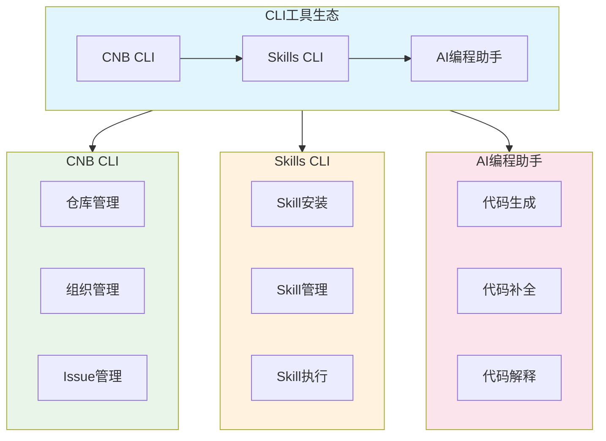
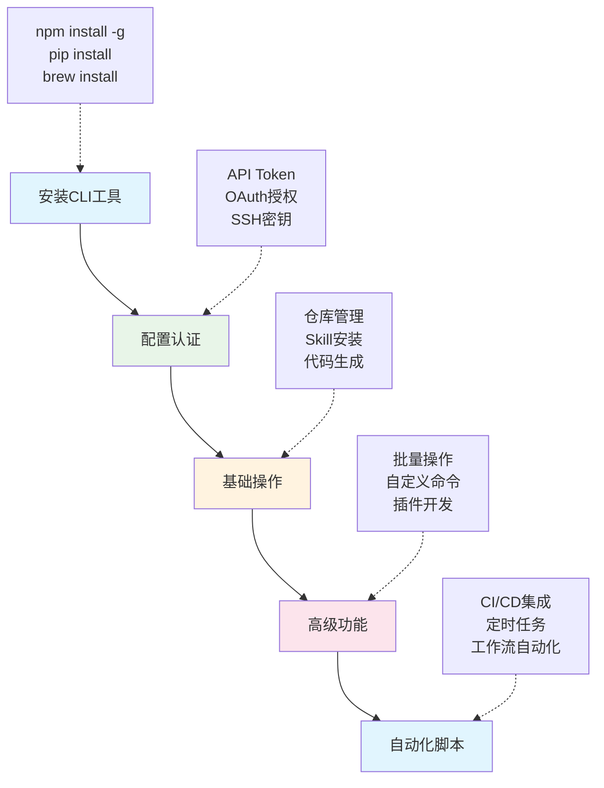

<div class="chapter-audio-player" style="display:flex;align-items:center;gap:12px;padding:12px 16px;background:linear-gradient(135deg,#f0f9ff,#e0f2fe);border:1px solid #bae6fd;border-radius:12px;margin-bottom:24px">
  <button id="ch05-play-btn" onclick="toggleChapterAudio('ch05')" style="width:40px;height:40px;border:none;border-radius:50%;background:linear-gradient(135deg,#3B82F6,#2563EB);color:white;font-size:16px;cursor:pointer;display:flex;align-items:center;justify-content:center;flex-shrink:0">▶</button>
  <div style="flex:1;min-width:0">
    <div style="font-weight:600;font-size:14px;color:#0f172a">📢 本章语音导览</div>
    <audio id="ch05-audio" preload="none" style="width:100%;height:32px;margin-top:4px">
      <source src="/audio/ch05_narration.mp3" type="audio/mpeg">
    </audio>
  </div>
  <a href="/slides/#ch05" style="font-size:13px;color:#2563EB;text-decoration:none;white-space:nowrap">🖼️ 查看课件 →</a>
</div>

# 第5章 CLI工具实战：AI辅助开发的命令行利器

## CLI工具概述

命令行界面（CLI）是AI辅助开发的核心执行层。与图形界面相比，CLI工具具有以下优势：

- **自动化友好**：可编写脚本批量执行，适合CI/CD流水线

- **资源占用低**：无需图形界面，服务器环境也能运行

- **组合能力强**：通过管道（pipe）将多个工具串联

- **AI原生**：大语言模型天然擅长生成和执行命令

本章将系统介绍课程中涉及的所有CLI工具，帮助你构建完整的AI开发工具链。



<figcaption>本章 CLI 工具生态全景图（自制）</figcaption>

## CNB CLI------代码仓库管理

CNB（Cloud Native Build）是课程使用的代码托管平台，提供`cnb`命令行工具管理仓库、组织、Issue等资源。

### 安装

``` {style="shell"}
# macOS / Linux
npm install -g @anthropic-ai/cnb

# 验证安装
cnb --version
```

### 登录与认证

``` {style="shell"}
# 登录CNB（OAuth2授权流程）
cnb login

# 终端会显示授权链接和user_code，浏览器打开后确认授权
# 登录成功后，凭证自动保存，后续命令无需重复登录

# 检查登录状态
cnb status
```

### 常用命令

``` {style="shell"}
# 查看仓库信息
cnb repositories get-repos

# 克隆仓库
git clone https://cnb.cool/组织名/仓库名.git

# 创建Issue
cnb issues create-issue --repo 组织名/仓库名 --title "Issue标题"

# 查看Pull Request
cnb pulls list-pulls --repo 组织名/仓库名
```

### Git集成

CNB CLI可作为Git凭证助手，自动管理HTTPS认证：

``` {style="shell"}
# 配置Git使用CNB凭证助手
git config --global credential.https://cnb.cool.helper "cnb git-credential"

# 之后git push/pull会自动使用CNB凭证
git push origin main
```

## Skills CLI------AI能力包管理

Skills是领域知识文件（SKILL.md），赋予AI专业能力。Skills CLI用于安装和管理这些能力包。

### 安装

``` {style="shell"}
# 通过npx直接使用（无需全局安装）
npx skills add 作者/技能名

# 全局安装Skills CLI
npm install -g @anthropic-ai/skills
```

### 常用操作

``` {style="shell"}
# 安装Skill
npx skills add LearnPrompt/luban-skill

# 安装到全局（所有项目可用）
npx skills add LearnPrompt/luban-skill -g

# 列出已安装的Skill
npx skills list

# 搜索Skill
npx skills search "金融分析"
```

### 本课程推荐Skill

  **Skill**               **功能**        **安装命令**
  ----------------------- --------------- ------------------------------------------
  luban-skill             Skill打磨工坊   `npx skills add LearnPrompt/luban-skill`
  consulting-frameworks   咨询分析框架    课程内置
  finance-expert          金融专业知识    课程内置
  finance-news            金融舆情分析    课程内置

## AI CLI工具

AI CLI工具是直接与大语言模型交互的命令行客户端，是AI辅助开发的核心执行工具。

### Claude Code

Claude Code是Anthropic官方的AI编程助手，提供命令行交互方式。

``` {style="shell"}
# 安装
npm install -g @anthropic-ai/claude-code

# 启动交互式会话
claude

# 执行单条命令
claude -p "解释这段代码的作用"

# 在管道中使用
cat main.py | claude -p "找出潜在的bug"
```

**核心特性**：上下文感知、多文件编辑、Git集成、MCP支持。

### Codex CLI

Codex CLI是OpenAI的命令行AI助手，基于GPT-4o模型。

``` {style="shell"}
# 安装
npm install -g @openai/codex

# 启动
codex

# 执行任务
codex "创建一个Python脚本，分析CSV数据并生成图表"
```

### Qoder CLI

Qoder CLI支持多模型切换，适合需要灵活选择模型的场景。

``` {style="shell"}
# 安装
npm install -g @qoder-ai/qodercli

# 启动
qoder

# 切换模型
qoder --model gpt-4o
qoder --model claude-sonnet
```

### AI CLI工具对比

  **工具**      **厂商**    **核心模型**    **特点**
  ------------- ----------- --------------- ----------------------
  Claude Code   Anthropic   Claude Sonnet   上下文长、代码理解强
  Codex CLI     OpenAI      GPT-4o          多模态、推理能力强
  Qoder CLI     Qoder AI    多模型切换      灵活、支持自定义

## MiMo CLI------小米AI编程助手

MiMo CLI是小米推出的AI编程助手，提供命令行交互方式，支持代码生成、解释、重构等功能。

### 安装

``` {style="shell"}
# macOS / Linux（推荐）
curl -fsSL https://mimo.xiaomi.com/install | bash

# Windows（推荐使用npm）
npm install -g @mimo-ai/cli

# 验证安装
mimo --version
```

### 启动与使用

``` {style="shell"}
# 启动交互式会话
mimo

# 直接提问
mimo "如何用Python读取Excel文件？"

# 代码解释
mimo explain main.py

# 代码重构
mimo refactor main.py --style clean
```

### 最佳实践

- **终端选择**：Mac用户推荐在iTerm或VS Code终端中使用，体验更佳

- **上下文管理**：MiMo CLI会自动维护会话上下文，支持多轮对话

- **模型选择**：支持多种模型，可根据任务类型选择最适合的模型

### MiMo CLI与其他AI CLI对比

  **维度**   **MiMo CLI**       **Claude Code**      **Codex CLI**
  ---------- ------------------ -------------------- ---------------
  厂商       小米               Anthropic            OpenAI
  安装方式   curl/npm           npm                  npm
  核心优势   中文优化、本地化   长上下文、代码理解   多模态推理
  适用场景   中文开发环境       复杂代码分析         通用编程任务

## CC Switch------多账号管理

CC Switch是AI CLI多账号/多服务商管理工具，提供可视化界面统一管理Claude Code、Codex、Gemini CLI等7款工具的配置。

### 安装

``` {style="shell"}
# macOS
brew install --cask cc-switch

# Windows：从GitHub Releases下载.msi安装
# https://github.com/farion1231/cc-switch/releases
```

### 核心功能

- **多服务商切换**：50+预置服务商一键切换

- **系统托盘快切**：快速切换不同AI CLI配置

- **统一MCP管理**：集中管理所有MCP服务器配置

- **用量追踪**：监控API调用次数和费用

- **云端同步**：配置云端备份，多设备同步

### 使用场景

当你需要在不同AI服务商之间切换时（例如Claude额度用完切换到GPT-4o），CC Switch可以一键切换，无需手动修改配置文件。

## OpenCLI与OpenClaw

### OpenCLI------把网站变成命令行

OpenCLI可以将任何网站转换为命令行接口，实现网页操作的自动化。

``` {style="shell"}
# 安装
npm install -g @jackwener/opencli

# 验证安装
opencli --version

# 配置Chrome扩展连接
opencli setup
```

### OpenClaw------AI Skill包管理

OpenClaw是另一个Skill包管理器，提供丰富的社区Skill资源。

``` {style="shell"}
# 安装
npm install -g openclaw

# 验证安装
openclaw --version

# 安装Skill
openclaw install academic-paper-analysis
openclaw install arxiv
```

## MCP/Skill/CLI三种范式对比

在AI辅助开发生态中，MCP、Skill、CLI是三种核心范式，各有侧重：

  **维度**   **MCP**          **Skill**          **CLI**
  ---------- ---------------- ------------------ ------------
  本质       连接协议         领域知识文件       Shell命令
  类比       USB-C接口        操作手册           万能遥控器
  开发成本   高（写Server）   低（写Markdown）   零
  适合场景   企业SaaS连接     知识沉淀复用       本地自动化

::: notebox
CLI（执行层）+ Skill（知识层）+ MCP（连接层）= 完整AI工具链。

日常以CLI + Skill为主，MCP在需要跨系统数据连接时介入。例如：

- 使用`mimo`（CLI）生成代码

- 参考`finance-expert`（Skill）提供领域知识 通过`stata-mcp`（MCP）连接Stata执行统计分析
:::

## 环境检查与故障排除

### 完整安装检查清单

``` {style="shell"}
# LaTeX
xelatex --version
biber --version

# 运行时
node --version
npm --version
python --version
git --version

# AI CLI
qoder --version
claude --version
codex --version
mimo --version
opencli --version
openclaw --version
cnb --version
```

### 常见问题

  **问题**            **原因**           **解决方案**
  ------------------- ------------------ -----------------------------
  command not found   安装后未重启终端   关闭终端窗口，重新打开再试
  npm权限错误         全局安装需要权限   使用`sudo`或配置npm全局目录
  网络连接失败        防火墙或代理问题   检查网络设置，配置代理
  中文文件名乱码      终端编码非UTF-8    设置终端编码为UTF-8

## 本章小结

本章系统介绍了AI辅助开发中的CLI工具生态：

1.  **仓库管理**：CNB CLI管理代码仓库和协作

2.  **包管理**：Skills CLI和OpenClaw管理AI能力包

3.  **AI编程助手**：Claude Code、Codex CLI、MiMo CLI提供AI编程能力

4.  **配置管理**：CC Switch统一管理多AI服务商配置

5.  **自动化**：OpenCLI实现网页操作自动化

掌握这些CLI工具，你将能够构建高效的AI辅助开发工作流，显著提升金融科技项目的开发效率。

::: notebox
1.  安装并配置CNB CLI，克隆课程仓库

2.  安装MiMo CLI，体验AI辅助编程

3.  尝试使用Skills CLI安装一个Skill，观察AI如何利用领域知识
:::

## CLI工具使用流程总览


