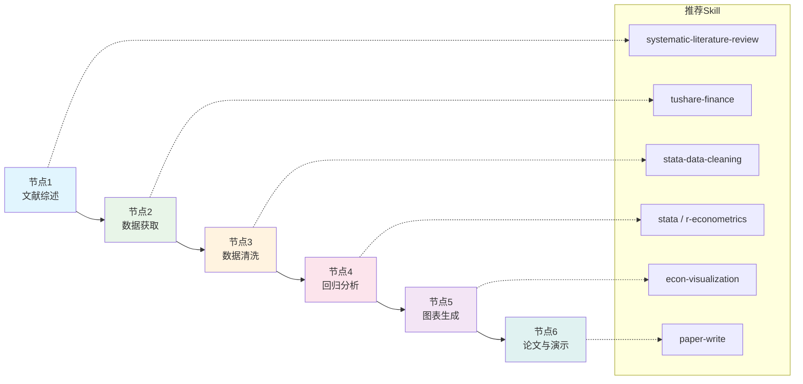
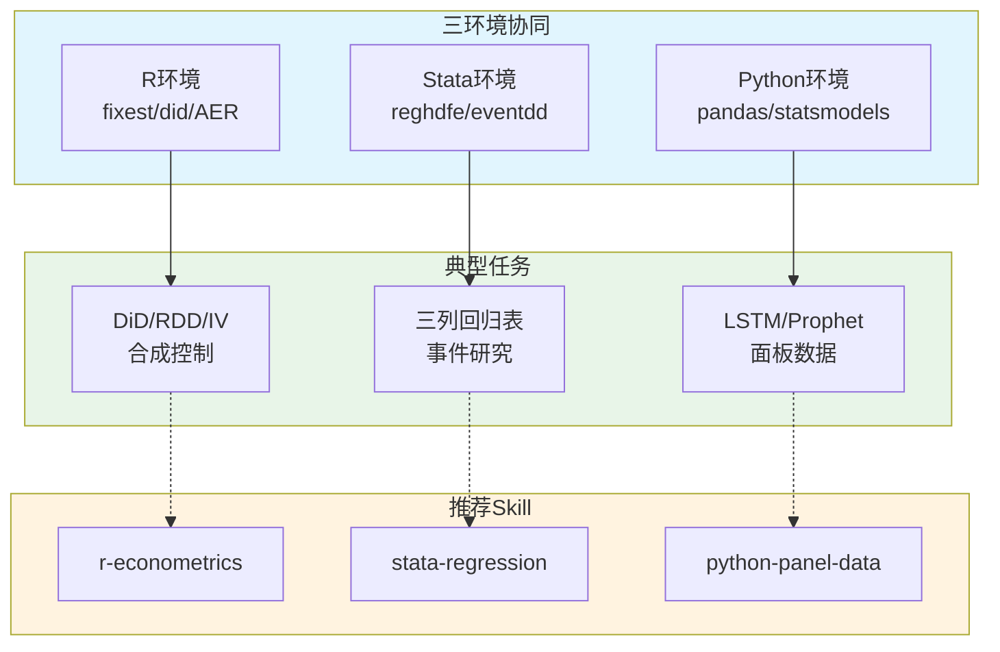
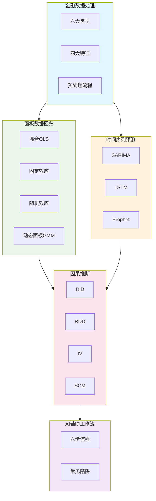

<div class="chapter-audio-player" style="display:flex;align-items:center;gap:12px;padding:12px 16px;background:linear-gradient(135deg,#f0f9ff,#e0f2fe);border:1px solid #bae6fd;border-radius:12px;margin-bottom:24px">
  <button id="ch07-play-btn" onclick="toggleChapterAudio('ch07')" style="width:40px;height:40px;border:none;border-radius:50%;background:linear-gradient(135deg,#3B82F6,#2563EB);color:white;font-size:16px;cursor:pointer;display:flex;align-items:center;justify-content:center;flex-shrink:0">▶</button>
  <div style="flex:1;min-width:0">
    <div style="font-weight:600;font-size:14px;color:#0f172a">📢 本章语音导览</div>
    <audio id="ch07-audio" preload="none" style="width:100%;height:32px;margin-top:4px">
      <source src="/audio/ch07_narration.mp3" type="audio/mpeg">
    </audio>
  </div>
  <a href="/slides/#ch07" style="font-size:13px;color:#2563EB;text-decoration:none;white-space:nowrap">🖼️ 查看课件 →</a>
</div>

# 第6章金融数据分析与计量经济学

## AI Skill辅助金融数据分析工作流

**【本章方法论定位】** 本章所有计量分析任务都以\"调用Skill\"为组织原则------不仅是"写一段提示词让AI跑代码"，更是明确调用`stata` / `r-econometrics` / `python-panel-data` / `econ-visualization`等Skill来完成专业金融计量任务。

**与ch03的MCP流水线区别**：本章Skill是\"方法论\"（怎么微计量结果处理），MCP是\"工具能力\"（能不能读到数据）。二者是能力与方法的辩证统一。



### 6节点Skill流水线（贯穿本章）

   **节点**  **环节**     **任务**                   **Skill候选**
  ---------- ------------ -------------------------- -----------------------------------------------------------------------------------------------------
      1      文献综述     系统检索+综述+管理引用     `systematic-literature-review` / `lit-review-assistant` / `academic-researcher` / `find-literature`
      2      数据获取     从API/数据库拉取金融数据   `tushare-finance` / `china-stock-analysis` / `api-data-fetcher` / `worldbank-data360` / `oecd-data`
      3      数据清洗     缺失值/异常值/变换         `stata-data-cleaning` / `data-analysis` / `r-data-cleaning`
      4      回归分析     OLS/FE/IV/DiD/RDD/预测     `stata` / `stata-regression` / `r-econometrics` / `python-panel-data` / `data-analysis`
      5      图表生成     发表级图表与表格           `econ-visualization` / `paper-figure` / `paper-illustration` / `latex-tables` / `mermaid-diagram`
      6      论文与演示   LaTeX初稿与会议slides      `paper-write` / `academic-paper-writer` / `paper-slides` / `beamer-presentation` / `ppt-master`

### 提示词Skill化改写原则

为实现"所有Stata/Python/R提示词都Skill化"，本章遵循统一的提示词改写原则：

**三要素包装法**（每个原提示词都必做）：

原始提示词 = \"请运行Stata代码：reg y x, robust\"

Skill化后 = \"请调用 `stata` Skill完成以下任务：【背景】\...【输入】\...【代码】\...【预期输出】\...\"

**改写原则10条**：

1.  必须明示Skill名称（调用X Skill）

2.  必须明示输入文件/变量

3.  必须明示输出文件/格式

4.  原裸代码保留（作为代码补充，不是替代）

5.  环境检查提前（提示词开头或附录说明依赖）

6.  多Skill串联（一个提示词可调用多个Skill协同）

7.  失败回退方案（如Skill不可用，如何手动运行）

8.  输出预期明确（交什么文件、什么格式）

9.  业务上下文（为什么跑这个回归，解释预期含义）

10. 可重复性（明确随机种子、软件版本、依赖版本）

**标准化提示词模板**（实验报告附件用）：

    【Skill调用提示词 v1.0】
    调用 Skill：<skill-name-1>、<skill-name-2>
    任务背景：<1-2句说明>
    输入数据：<文件路径 + 关键变量>
    输出要求：<文件路径 + 格式>
    环境检查：请先运行 /tmp/check_ch07_env.sh
    原代码补充：<可选，保留关键代码块>
    失败回退：如Skill不可用，手动运行 <backup-command>
    预期结论：<说明预期结果含义>

## 计量分析运行环境准备（R/Stata/Python三环境协同）

本章计量分析依赖R、Stata、Python三大工具中任一环境，本节在调用计量Skill之前提供完整环境准备说明。

### R环境（r-econometrics Skill前置）

**R 4.0+安装**：

``` {style="shell"}
brew install --cask r       # macOS
# 或访问 https://cran.r-project.org/bin/macosx/ 下载 R-x.y.z-arm64.pkg
```

**CRAN国内镜像**（` /.Rprofile`）：

``` {style="r"}
options(repos = c(CRAN = "https://mirrors.tuna.tsinghua.edu.cn/CRAN/"))
```

**本章计量必备R包**（一键安装）：

``` {style="r"}
install.packages(c(
  "fixest",       # feols() 高维FE、IV、DiD
  "modelsummary", # 发表级回归表
  "rdrobust",     # 断点回归
  "did",          # Callaway-Sant'Anna现代DiD
  "Synth",        # 合成控制法
  "MatchIt",      # PSM
  "sandwich", "lmtest",
  "AER",          # ivreg()
  "ggplot2", "scales", "dplyr", "tidyr", "readr", "tidyverse"
))
```

**RStudio Desktop**（推荐IDE）：<https://posit.co/download/rstudio-desktop/>

**R路径验证脚本**（运行后可粘贴到AI提示词）：

``` {style="r"}
cat("R version:", R.version.string, "\n")
cat("fixest:", as.character(packageVersion("fixest")), "\n")
cat("modelsummary:", as.character(packageVersion("modelsummary")), "\n")
```

### Stata环境（stata / stata-regression Skill前置）

**macOS路径**（学生必看）：

``` {style="shell"}
# 默认路径
/Applications/Stata/StataMP.app/Contents/MacOS/stata-mp
# 查找不到时
mdfind -name "stata-mp" | grep MacOS
```

**PATH配置**（` /.zshrc`）：

``` {style="shell"}
export PATH="/Applications/Stata/StataMP.app/Contents/MacOS:$PATH"
source ~/.zshrc
```

**批处理运行模板**（AI调用Stata的标准方式）：

``` {style="shell"}
stata-mp -b do chapter7_panel.do    # 输出 chapter7_panel.log
```

**本章计量必备Stata包**（`ssc install`一键）：

``` {style="stata"}
ssc install reghdfe, replace
ssc install estout, replace
ssc install outreg2, replace
ssc install did_multiplegt, replace
ssc install eventstudyinteract, replace
ssc install rdrobust, replace
ssc install psmatch2, replace
ssc install synth, replace
ssc install ivreg2, replace
ssc install xtabond2, replace
ssc install winsor2, replace
ssc install sgmediation, replace
```

**Stata与R/Python互调**（`stata` Skill支持）：

``` {style="stata"}
python: import pandas as pd; df = pd.read_stata("data.dta")
rsource: library(fixest); source("fe_reg.R")
```

### Python环境（python-panel-data / data-analysis Skill前置）

**建议版本**：Python 3.10+。

**Conda环境**：

``` {style="shell"}
conda create -n banking python=3.11
conda activate banking
pip install pandas numpy statsmodels scikit-learn pmdarima prophet torch \
            matplotlib seaborn linearmodels PyFixest jupyterlab
```

**虚拟环境（venv备选）**：

``` {style="shell"}
python3 -m venv ~/.venvs/banking
source ~/.venvs/banking/bin/activate
```

### 三环境协同使用提示

  **工具**   **优势**                                          **本章典型场景**
  ---------- ------------------------------------------------- -----------------------------------------------
  R          计量生态最完整（fixest/did/AER），可重复性高      `r-econometrics` Skill处理DiD/RDD/IV/合成控制
  Stata      中文金融实证主流（reghdfe/eventdd），可发表性高   `stata-regression` Skill输出三列回归表
  Python     机器学习/深度学习强，灵活性高                     `python-panel-data` Skill做LSTM/Prophet预测



## 全章Skill环境检查清单（期末上机前必运行）

本节是ch07所有用到的Skill环境检查总表，覆盖约30个Skill，每个Skill列出安装指令、环境检查命令、在ch07中出现的位置。

### 数据获取Skill（5个）

**tushare-finance Skill**（任务13、18）：

``` {style="shell"}
pip install tushare pandas
export TUSHARE_TOKEN='your_token_here'
python3 -c "import tushare; pro=tushare.pro_api(); print(pro.stock_basic(list_status='L', limit=1))"
```

**api-data-fetcher Skill**（任务13）：`pip install requests pandas`。

**worldbank-data360 Skill**（任务17）：联网即可。

**oecd-data Skill**（任务17）：联网即可。

**china-stock-analysis Skill**（任务18）：依赖china-stock-mcp MCP，需mcp.json配置。

### 数据清洗Skill（3个）

- **stata-data-cleaning Skill**（任务13）：见§Stata环境

- **data-analysis Skill**（任务13、15、18）：见§Python环境

- **r-data-cleaning Skill**（任务13）：依赖`dplyr`/`tidyr`（tidyverse的一部分）

### 计量回归Skill（5个）

- **stata Skill**（任务13-18）：见§Stata环境

- **stata-regression Skill**（任务14、18）：stata依赖 + reghdfe/estout

- **r-econometrics Skill**（任务14、16、18）：见§R环境

- **python-panel-data Skill**（任务14、15、18）：见§Python环境 + linearmodels

- **data-analysis Skill**（任务14-18）：见§Python环境

### 因果推断Skill（5个）

**r-econometrics Skill**：同上。

**did / csdid R包**（任务16）：

``` {style="shell"}
Rscript -e 'library(did); packageVersion("did")'
```

**rdrobust / Synth / MatchIt R包**（任务16）：见§R环境。

### 时间序列Skill（4个）

**r-econometrics Skill**（任务15）：含`vars`/`urca`/`forecast`。

**statsmodels Python包**（任务15）：见§Python环境。

**pmdarima Python包**（任务15）：

``` {style="shell"}
pip install pmdarima
python3 -c "import pmdarima; print(pmdarima.__version__)"
```

**prophet Python包**（任务15）：

``` {style="shell"}
pip install prophet
python3 -c "from prophet import Prophet; print('prophet OK')"
```

### 表格与图表Skill（5个）

- **latex-tables Skill**（任务14、18）：依赖`esttab`或`modelsummary`

- **econ-visualization Skill**（任务14-18）：见§R环境

- **paper-figure Skill**（任务15、18）：见§Python环境

- **paper-illustration Skill**（任务17、18）：需`GEMINI_API_KEY`

- **mermaid-diagram Skill**（任务17、18）：`npm install -g @mermaid-js/mermaid-cli`

### 写作与文献Skill（4个）

- **paper-write / academic-paper-writer Skill**（任务17、18）：依赖xelatex

- **systematic-literature-review Skill**（任务17）：联网即可

- **lit-review-assistant Skill**（任务17）：联网即可

### ch07全章一键环境检查脚本（期末上机前必运行）

``` {style="shell"}
cat > /tmp/check_ch07_env.sh << 'EOF'
#!/bin/bash
PASS=0; FAIL=0
check() { if eval "$2" >/dev/null 2>&1; then echo "OK $1"; PASS=$((PASS+1)); else echo "FAIL $1"; FAIL=$((FAIL+1)); fi; }

echo "=== ch07 Skill环境检查 ==="
check "R 4.0+"            "R --version | grep -q 'R version'"
check "Stata"              "[ -x /Applications/Stata/StataMP.app/Contents/MacOS/stata-mp ]"
check "Python 3.10+"       "python3 -c 'import sys; sys.exit(0 if sys.version_info>=(3,10) else 1)'"
check "fixest包"          "Rscript -e 'library(fixest)'"
check "modelsummary包"    "Rscript -e 'library(modelsummary)'"
check "rdrobust包"        "Rscript -e 'library(rdrobust)'"
check "did包"             "Rscript -e 'library(did)'"
check "Synth包"           "Rscript -e 'library(Synth)'"
check "MatchIt包"         "Rscript -e 'library(MatchIt)'"
check "statsmodels"        "python3 -c 'import statsmodels'"
check "linearmodels"       "python3 -c 'import linearmodels'"
check "PyFixest"           "python3 -c 'import pyfixest'"
check "pmdarima"           "python3 -c 'import pmdarima'"
check "prophet"            "python3 -c 'from prophet import Prophet'"
check "matplotlib"         "python3 -c 'import matplotlib'"
check "tushare"            "python3 -c 'import tushare'"
check "TUSHARE_TOKEN"      "[ -n \"\$TUSHARE_TOKEN\" ]"
check "xelatex"            "which xelatex"
check "pdftoppm"           "which pdftoppm"

echo "---"
echo "通过: \$PASS, 失败: \$FAIL"
[ \$FAIL -eq 0 ] && echo "OK ch07环境就绪" || echo "请安装缺失组件后再进行实验"
EOF
chmod +x /tmp/check_ch07_env.sh && /tmp/check_ch07_env.sh
```

## 金融数据特征与处理方法

金融数据是计量经济学分析的基石。与一般经济数据相比，金融数据具有独特的时间维度、频率维度和结构维度特征，理解这些特征是正确选择分析方法的前提。

### 金融数据的类型谱系

金融数据按照不同维度可划分为以下类型：

  **数据类型**   **典型示例**                       **核心特征**
  -------------- ---------------------------------- --------------------------
  截面数据       某一时点各银行ROE                  无时间维度，仅有个体维度
  时间序列       某银行2000--2025年月度股价         单一个体，时间连续
  面板数据       50家银行2010--2024年年度财务指标   个体$\times$时间双维度
  高频数据       毫秒级交易记录                     超高频率、海量观测
  文本数据       年报管理层讨论与分析               非结构化、需NLP处理
  网络数据       银行间拆借关系图谱                 节点与边的拓扑结构

其中，**面板数据**是金融实证研究中最常用的数据类型，它同时包含个体异质性和时间动态性，信息量远大于纯截面或纯时序数据。本节后续内容及第[1.5](#sec:panel){reference-type="ref" reference="sec:panel"}节将重点围绕面板数据展开。

### 金融数据的典型特征

金融数据具有区别于一般经济数据的四大典型特征，这些特征直接影响模型的选择与设定。

#### 非正态分布------尖峰厚尾

金融收益率分布的峰度（Kurtosis）通常远大于3（正态分布的峰度值），呈现\"尖峰厚尾\"形态。这意味着极端事件（暴跌、暴涨）发生的概率远高于正态分布的预测。例如，2008年金融危机期间标普500单日跌幅超过9%的事件，在正态假设下几乎不可能发生，但实际市场中并不罕见。

Jarque-Bera检验可形式化检验正态性：

$$JB = \frac{n}{6}\left(S^2 + \frac{(K-3)^2}{4}\right) \sim \chi^2(2)$$

其中$S$为偏度，$K$为峰度，$n$为样本量。在金融数据中，JB统计量几乎总是显著拒绝正态假设。

#### 异方差性------ARCH效应

金融收益率的波动率具有\"集聚性\"：大幅波动之后往往跟随大幅波动，平静期之后跟随平静期。Engle（1982）提出的自回归条件异方差（ARCH）模型首次系统刻画了这一现象：

$$\sigma_t^2 = \alpha_0 + \sum_{i=1}^{q} \alpha_i \varepsilon_{t-i}^2$$

Bollerslev（1986）将其推广为GARCH模型：

$$\sigma_t^2 = \alpha_0 + \sum_{i=1}^{q} \alpha_i \varepsilon_{t-i}^2 + \sum_{j=1}^{p} \beta_j \sigma_{t-j}^2$$

#### 序列相关性

金融时间序列普遍存在自相关现象。股价收益率的一阶自相关虽弱，但收益率的**平方**和**绝对值**往往呈现显著的高阶自相关，这正是ARCH效应的体现。Ljung-Box Q检验可用于序列相关性的联合检验：

$$Q = n(n+2)\sum_{k=1}^{m}\frac{\hat{\rho}_k^2}{n-k} \sim \chi^2(m)$$

#### 结构突变

金融时间序列常因政策变革、金融危机或制度变迁而发生结构性断裂。例如，中国利率市场化改革前后，银行净息差的均值和波动率均可能发生显著变化。忽略结构突变会导致伪回归和参数估计不一致。Chow检验和Zivot-Andrews检验是检测结构突变的常用方法。

### 数据预处理流程

高质量的数据预处理是实证研究可信性的保障。金融数据预处理通常包含以下三个核心步骤。

#### 缺失值处理

缺失值产生的原因包括：银行未披露某些财务指标、数据采集过程中的技术故障、新上市银行缺少历史数据等。处理方法包括：

  **方法**          **适用场景**                     **优缺点**
  ----------------- -------------------------------- --------------------------
  删除法            缺失比例$<$`<!-- -->`{=html}5%   简单直接，但浪费信息
  均值/中位数插补   随机缺失                         保留样本量，但低估方差
  线性插值          时序连续缺失                     对趋势数据效果好
  多重插补（MI）    系统性缺失                       统计性质最优，但计算量大

在Stata中，多重插补的实现如下：

``` {style="stata"}
// 多重插补（ chained 方式 ）
mi set wide
mi register imputed roe npl_ratio car
mi impute chained (regress) roe npl_ratio car = loan_growth log_asset, add(20)
```

#### 异常值检测

金融数据中的异常值可能来源于数据录入错误，也可能是真实的极端事件（如金融危机期间的异常波动）。常见检测方法：

**IQR法**：以四分位距（IQR）为基准，超过$Q_1 - 1.5 \times IQR$或$Q_3 + 1.5 \times IQR$的观测值标记为异常。

**Z-score法**：标准化后绝对值超过3（或2.576）的观测标记为异常。

**Isolation Forest**：基于随机森林的异常检测算法，无需假设数据分布，适合高维金融数据。

``` {style="python"}
# Isolation Forest 异常检测
from sklearn.ensemble import IsolationForest
import pandas as pd

df = pd.read_csv("bank_panel.csv")
clf = IsolationForest(contamination=0.05, random_state=42)
df["outlier"] = clf.fit_predict(df[["roe", "npl_ratio", "car", "loan_growth"]])
print(df[df["outlier"] == -1].head())
```

#### 数据标准化与变换

金融变量量纲差异大（如资产规模以亿元计，比率以百分比计），需要进行标准化或变换：

- **对数变换**：$\ln(\text{Asset})$，压缩右偏分布，使回归系数可解释为弹性

- **Box-Cox变换**：$y^{(\lambda)} = (y^\lambda - 1)/\lambda$，$\lambda$由极大似然估计确定

- **缩尾处理（Winsorize）**：将极端值截断到指定百分位（如1%和99%），保留观测数量同时降低异常值影响

``` {style="stata"}
// Stata 缩尾处理
// 安装 winsor2 命令
ssc install winsor2
winsor2 roe, cuts(1 99) replace
```

::: practicebox
**任务**：对银行面板数据进行完整的预处理流水线。

**提示词**：

    任务：银行面板数据预处理

    请按以下步骤对银行面板数据进行预处理：

    【第1步】读入数据
    - 读入 bank_panel.csv 文件
    - 显示数据维度、变量名和数据类型

    【第2步】描述统计
    - 对所有数值变量计算均值、标准差、最小值、最大值、偏度、峰度
    - 重点关注 roe、npl_ratio、car 三个核心变量的分布特征
    - 判断是否存在尖峰厚尾现象（峰度>3）

    【第3步】缺失值填补
    - 统计每个变量的缺失比例
    - 对缺失比例<5%的变量用组内均值插补
    - 对缺失比例5%-20%的变量用多重插补
    - 删除缺失比例>20%的变量

    【第4步】异常值标注
    - 用IQR法检测 roe、npl_ratio、car 的异常值
    - 不删除异常值，但新增 is_outlier 标记列
    - 输出异常值统计表

    【第5步】变量变换
    - 对 asset 取对数生成 log_asset
    - 对 roe 和 npl_ratio 在1%和99%分位进行缩尾处理
    - 保存预处理后的数据为 bank_panel_clean.csv

**预期产出**：清洗后的数据文件 + 描述统计表 + 异常值报告。
:::

::: theorybox
在开展任何计量分析之前，请逐项检查以下数据质量控制清单：

1.  **数据来源可靠性**：数据是否来自权威渠道（Wind/CSMAR/ Bankscope）？

2.  **变量定义一致性**：同一变量在不同年份的口径是否一致？

3.  **缺失模式可识别**：缺失是随机的（MAR）还是与因变量相关（MNAR）？

4.  **异常值有解释**：每个异常值是否有合理解释（如金融危机、政策变动）？

5.  **单位统一**：百分比是否统一（5%表示为5还是0.05）？

6.  **时间对齐**：不同来源的数据时间戳是否对齐？

7.  **样本选择偏误**：剔除某些银行后是否引入系统性偏误？

数据质量控制是不可省略的前置步骤------\"垃圾进，垃圾出\"（Garbage In, Garbage Out）永远是计量分析的第一法则。
:::

#### Skill 化包装：本节实操提示词

**【本节 Skill 化原则】** 下面三个提示词覆盖了金融数据预处理的完整 Skill 化流水线，所有提示词都明确调用具体 Skill，原裸代码作为补充保留。

**缺失值处理（Skill 化）**：

    请调用 stata-data-cleaning 技能完成银行面板数据多重插补：

    【调用 Skill】stata-data-cleaning、data-analysis
    【背景】50 家上市银行 2010-2024 年面板数据，包含 roe、npl_ratio、car 三个变量
    【输入】data/bank_panel.dta
    【输出要求】
      - data/bank_panel_mi.dta（多重插补后数据）
      - reports/missing_diagnostics.md（缺失模式分析 + 插补效果对比）
    【环境检查】运行 /tmp/check_ch07_env.sh 确认 stata-mp 可访问
    【原代码补充】Stata mi 命令链式插补代码（作为补充）：
      mi set wide
      mi register imputed roe npl_ratio car
      mi impute chained (regress) roe npl_ratio car = loan_growth log_asset, add(20)
    【失败回退】如 stata-data-cleaning Skill 不可用，手写 mi 命令
    【预期结论】插补后样本量、敏感性分析对比

**异常值检测（Skill 化）**：

    请调用 data-analysis 技能完成异常值检测：

    【调用 Skill】data-analysis（Isolation Forest 路线）
    【输入】data/bank_panel_clean.csv
    【输出】reports/outlier_report.md（含异常值列表 + 建议处置方式）
    【环境检查】python3 -c "import sklearn" 确认 scikit-learn 已安装
    【原代码补充】Python 代码：
      from sklearn.ensemble import IsolationForest
      clf = IsolationForest(contamination=0.05, random_state=42)
      df['outlier'] = clf.fit_predict(df[['roe','npl_ratio','car']])
    【预期结论】哪些银行哪些年份出现异常？

**数据获取预备（Skill 化）**：

    请调用 tushare-finance 技能拉取 50 家上市银行 2010-2024 年财务数据：

    【调用 Skill】tushare-finance、china-stock-analysis
    【输入】银行列表 50 家（含 6 大国有行 + 9 家股份行 + 城商行 + 农商行）
    【输出】
      - data/bank_panel_raw.csv（含 11 项核心指标）
      - reports/data_source_description.md（含 Wind/CSMAR/Tushare 三源对比）
    【环境检查】export TUSHARE_TOKEN 后 python3 -c "import tushare" 验证
    【原代码补充】Tushare 拉取代码：
      pro = ts.pro_api()
      df = pro.daily_basic(ts_code='601398.SH', start='20100101', end='20241231')
    【预期结论】数据准备完整，可进入面板回归阶段

#### 中文金融数据源补充

除了 Bankscope 国际数据库，国内金融研究还常用以下中文数据源：

  **数据源**           **特点**                     **使用场景**
  -------------------- ---------------------------- ---------------
  Wind（万得）         覆盖全、数据全但需机构订阅   学术+实务主流
  CSMAR（国泰安）      学术研究专用、字段标准化     高校论文首选
  Tushare              免费开放、Python友好         学生/个人研究
  Choice（东方财富）   实时行情 + 基本面            实务交易研究
  iFinD（同花顺）      机构级数据、API 友好         银行业实务
  CNINFO（巨潮资讯）   公告原文、年报 PDF           事件研究

**Skill 调用推荐**：Tushare 适合批量拉取学术面板数据；china-stock-analysis MCP 适合实时数据查询；CSMAR/Wind 数据需要商业订阅。

## 面板数据回归分析 {#sec:panel}

面板数据（Panel Data）同时包含个体维度和时间维度，是金融实证研究的主力数据结构。本节系统讲解面板数据回归的三种经典模型及其选择方法。

### 面板数据的优势

相较于纯截面数据或纯时间序列数据，面板数据具有三方面优势：

1.  **控制个体异质性**：面板数据允许控制不可观测的、不随时间变化的个体特征（如银行的公司文化、地域优势），从而缓解遗漏变量偏误

2.  **更多信息量**：$N$个个体$\times$ $T$期提供$NT$个观测值，增大自由度，提高估计效率

3.  **减少共线性**：个体内变异与个体间变异的结合，降低了多重共线性风险

面板数据的基本模型可写为：

$$y_{it} = \alpha_i + \mathbf{x}_{it}'\boldsymbol{\beta} + \varepsilon_{it}, \quad i=1,\ldots,N;\; t=1,\ldots,T$$

其中$\alpha_i$为个体效应（个体异质性），$\mathbf{x}_{it}$为解释变量向量，$\boldsymbol{\beta}$为待估参数向量，$\varepsilon_{it}$为随机扰动项。对$\alpha_i$的不同假设形成了三种经典模型。

### 混合OLS回归（Pooled OLS）

混合OLS假设所有个体具有相同的截距项（$\alpha_i = \alpha$），将面板数据当作一个大样本进行回归：

$$y_{it} = \alpha + \mathbf{x}_{it}'\boldsymbol{\beta} + \varepsilon_{it}$$

**适用条件**：个体间不存在不可观测的异质性，或异质性与解释变量不相关。

**局限性**：若个体效应$\alpha_i$确实存在且与$\mathbf{x}_{it}$相关，忽略$\alpha_i$会导致估计偏误------这正是面板数据模型选择的核心问题。

``` {style="stata"}
// 混合OLS回归
reg roe npl_ratio car loan_growth log_asset, robust
est store ols
```

### 固定效应模型（Fixed Effects, FE）

固定效应模型假设个体效应$\alpha_i$与解释变量$\mathbf{x}_{it}$相关，因此必须控制$\alpha_i$才能获得一致的估计。FE的核心思想是：利用\"组内变异\"（within variation）消除个体效应。

#### 组内估计量（Within Estimator）

对模型进行组内去均值变换：

$$y_{it} - \bar{y}_i = (\mathbf{x}_{it} - \bar{\mathbf{x}}_i)'\boldsymbol{\beta} + (\varepsilon_{it} - \bar{\varepsilon}_i)$$

个体效应$\alpha_i$在差分中被消去，OLS估计该变换后的模型即可得到组内估计量$\hat{\boldsymbol{\beta}}_{FE}$。

#### LSDV估计

另一种等价方法是引入$N$个个体虚拟变量直接估计：

$$y_{it} = \sum_{j=1}^{N}\alpha_j D_{j,it} + \mathbf{x}_{it}'\boldsymbol{\beta} + \varepsilon_{it}$$

当$N$较大时，LSDV计算量大，但与组内估计量数值等价。

``` {style="stata"}
// 固定效应模型（两种等价命令）
// 方式一：xtreg
xtset bank_id year
xtreg roe npl_ratio car loan_growth log_asset, fe robust
est store fe

// 方式二：reghdfe（推荐，支持多维固定效应）
reghdfe roe npl_ratio car loan_growth log_asset, absorb(bank_id year) robust
est store fe2
```

::: notebox
`reghdfe` 是当前面板数据实证研究的首选命令，相比 `xtreg`，它具有以下优势：

- 支持多维固定效应（如同时控制个体和年份）

- 吸收固定效应后自动报告调整后$R^2$

- 可与 `ivhdfe`、`hdfe` 配合实现IV-GMM估计

- 对大$N$面板计算效率更高

安装命令：`ssc install reghdfe, replace`
:::

### 随机效应模型（Random Effects, RE）

随机效应模型假设个体效应$\alpha_i$与解释变量$\mathbf{x}_{it}$**不相关**，即：

$$\text{Cov}(\alpha_i, \mathbf{x}_{it}) = 0$$

在此假设下，$\alpha_i$可被视为随机扰动项的一部分，模型变为：

$$y_{it} = \alpha + \mathbf{x}_{it}'\boldsymbol{\beta} + u_{it}, \quad u_{it} = \alpha_i + \varepsilon_{it}$$

复合扰动项$u_{it}$的方差结构为：

$$\text{Var}(u_{it}) = \sigma_\alpha^2 + \sigma_\varepsilon^2, \quad \text{Cov}(u_{it}, u_{is}) = \sigma_\alpha^2 \;(t \neq s)$$

RE模型使用广义最小二乘法（GLS）估计，通过部分组内变换（quasi-demeaning）实现：

$$y_{it} - \hat{\theta}\bar{y}_i = (1-\hat{\theta})\alpha + (\mathbf{x}_{it} - \hat{\theta}\bar{\mathbf{x}}_i)'\boldsymbol{\beta} + \text{扰动项}$$

其中$\hat{\theta}$为变换参数，取值介于0（OLS）和1（FE）之间。

``` {style="stata"}
// 随机效应模型
xtreg roe npl_ratio car loan_growth log_asset, re robust
est store re
```

### 模型选择检验

三种模型的选择依赖于严格的统计检验，形成一套递进的检验逻辑：

#### F检验：混合OLS vs 固定效应

原假设$H_0$: 所有个体效应$\alpha_i$均相等（即$\alpha_1 = \alpha_2 = \cdots = \alpha_N$）。F统计量为：

$$F = \frac{(R_{FE}^2 - R_{OLS}^2)/(N-1)}{(1-R_{FE}^2)/(NT-N-K)} \sim F(N-1, NT-N-K)$$

若拒绝原假设，说明个体效应存在，应使用FE而非OLS。

#### Hausman检验：固定效应 vs 随机效应

Hausman检验的核心问题是：个体效应$\alpha_i$是否与解释变量相关？

原假设$H_0$: $\text{Cov}(\alpha_i, \mathbf{x}_{it}) = 0$（RE成立）

检验统计量：

$$H = (\hat{\boldsymbol{\beta}}_{FE} - \hat{\boldsymbol{\beta}}_{RE})'[\text{Var}(\hat{\boldsymbol{\beta}}_{FE}) - \text{Var}(\hat{\boldsymbol{\beta}}_{RE})]^{-1}(\hat{\boldsymbol{\beta}}_{FE} - \hat{\boldsymbol{\beta}}_{RE}) \sim \chi^2(K)$$

若$H$显著（$p < 0.05$），拒绝原假设，选择FE；否则选择RE。

#### BP-LM检验：混合OLS vs 随机效应

Breusch-Pagan Lagrange Multiplier检验判断个体效应的方差$\sigma_\alpha^2$是否为零。

原假设$H_0$: $\sigma_\alpha^2 = 0$（不存在个体效应，OLS适用）

``` {style="stata"}
// 完整的模型选择检验流程
// Step 1: 估计FE和RE
xtreg roe npl_ratio car loan_growth log_asset, fe robust
est store fe
xtreg roe npl_ratio car loan_growth log_asset, re robust
est store re

// Step 2: Hausman检验（FE vs RE）
hausman fe re

// Step 3: BP-LM检验（OLS vs RE）
xttest0

// Step 4: 输出三列回归表
esttab ols fe re using reports/ch07_panel_reg.rtf, ///
  b(3) se(3) star(* 0.1 ** 0.05 *** 0.01) ///
  mtitles("OLS" "FE" "RE") ///
  scalars(N r2_a) replace
```

::: theorybox
1.  **第一步**：BP-LM检验 → $p$值大？$\Rightarrow$ 个体效应不存在 $\Rightarrow$ 用**混合OLS**

2.  **第二步**：BP-LM显著 → 个体效应存在 → 进入Hausman检验

3.  **第三步**：Hausman检验 → $p$值小？$\Rightarrow$ 个体效应与解释变量相关 $\Rightarrow$ 用**固定效应（FE）**

4.  **第四步**：Hausman不显著 → 个体效应与解释变量不相关 $\Rightarrow$ 用**随机效应（RE）**（效率更高）

**实操建议**：在金融实证研究中，多数研究倾向于使用FE，理由是银行业个体异质性（公司治理、地域资源等）往往与解释变量相关。RE虽然效率更高，但假设过强，一旦违背会导致估计不一致。
:::

### GMM动态面板简介

当模型包含因变量的滞后项（如$y_{i,t-1}$）作为解释变量时，FE和RE估计量均不一致（Nickell偏误）。Arellano和Bond（1991）提出的差分GMM估计量通过使用滞后水平值作为差分方程的工具变量来解决这一问题：

$$\Delta y_{it} = \beta \Delta y_{i,t-1} + \Delta \mathbf{x}_{it}'\boldsymbol{\gamma} + \Delta \varepsilon_{it}$$

``` {style="stata"}
// Arellano-Bond 差分GMM
xtabond roe l.roe npl_ratio car loan_growth, ///
  lags(1) twostep robust
// Sargan/Hansen 过度识别检验
estat sargan
estat ar1, artests(2)
estat ar2, artests(2)
```

::: practicebox
**任务**：对商业银行盈利能力（ROE）的影响因素进行面板回归分析，输出OLS/FE/RE三列回归表。

**提示词**：

    任务：商业银行盈利能力影响因素回归分析

    请使用 stata-mcp 服务完成以下计量分析任务：

    【数据来源（任选其一）】
    1. 公开数据集：620 家商业银行财务数据（2007-2024）
    2. 手动构建：如无外部数据，使用 Stata 生成模拟面板数据

    【第 1 步】数据准备与探索
    1. 尝试读入 data/bank_panel.dta；如不存在则使用 webuse grunfeld
    2. 使用 summarize 查看关键变量描述统计
    3. 用 xtset bank_id year 声明面板结构

    【第 2 步】三模型回归
    1. 混合OLS：reg roe npl_ratio car loan_growth log_asset, robust
    2. 固定效应：reghdfe roe npl_ratio car loan_growth log_asset, absorb(bank_id year) robust
    3. 随机效应：xtreg roe npl_ratio car loan_growth log_asset, re robust

    【第 3 步】模型选择检验
    1. F检验（OLS vs FE）
    2. Hausman检验（FE vs RE）
    3. BP-LM检验（OLS vs RE）

    【第 4 步】结果输出
    1. 使用 esttab 命令输出三列回归结果到 reports/ch07_panel_reg.txt
    2. 撰写 200-300 字分析结论，说明哪个模型最合适及其原因

    变量说明：
    - roe: 净资产收益率（被解释变量）
    - npl_ratio: 不良贷款率
    - car: 资本充足率
    - loan_growth: 贷款增速
    - log_asset: 资产规模（对数）

**预期产出**：三列回归表 + 模型选择检验结果 + 分析结论。
:::

#### Skill 化包装：本节实操提示词

**【本节 Skill 化原则】** 本节所有 Stata/Python/R 提示词都包装为 Skill 调用形式，下方提供 4 个核心场景的 Skill 化提示词，覆盖原裸代码 + 三环境对比。

**三模型面板回归（Stata Skill 化）**：

    请调用 stata-regression 技能完成三模型面板回归：

    【调用 Skill】stata-regression、latex-tables、econ-visualization
    【背景】检验 ROE 影响因素（业务场景：银行盈利能力）
    【输入】data/bank_panel.dta
    【输出要求】
      - reports/ch07_panel_reg.tex（三列回归表 LaTeX 代码）
      - reports/ch07_panel_reg.pdf（编译后 PDF）
      - figures/coefficient_compare.pdf（系数对比图）
    【环境检查】运行 /tmp/check_ch07_env.sh
    【原代码补充】Stata 代码（作为补充）：
      reg roe npl_ratio car loan_growth log_asset, robust
      est store ols
      reghdfe roe npl_ratio car loan_growth log_asset, absorb(bank_id year) robust
      est store fe2
      xtreg roe npl_ratio car loan_growth log_asset, re robust
      est store re
      hausman fe2 re
      esttab ols fe2 re using ch07_panel_reg.tex, b(3) se(3) star(* 0.1 ** 0.05 *** 0.01)
    【失败回退】如 stata-regression 不可用，手写 esttab 命令
    【预期结论】最合适模型 + 系数经济含义

**R fixest 多维 FE（R Skill 化）**：

    请调用 r-econometrics 技能完成 R fixest 多维固定效应回归：

    【调用 Skill】r-econometrics、econ-visualization
    【输入】data/bank_panel.csv
    【输出要求】
      - reports/ch07_fixest_reg.md（含 R 输出表格）
      - reports/ch07_fixest_reg.tex（modelsummary 输出的 LaTeX 代码）
    【环境检查】Rscript -e 'library(fixest); library(modelsummary)'
    【原代码补充】R 代码：
      library(fixest); library(modelsummary)
      reg1 = feols(roe ~ npl_ratio + car | bank_id + year, data = df, vcov = ~bank_id)
      modelsummary(list("FE" = reg1), output = "ch07_fixest.tex", stars = TRUE)
    【预期结论】fixest 输出与 Stata reghdfe 一致性验证

**动态面板 GMM（Python Skill 化）**：

    请调用 python-panel-data 技能完成 Arellano-Bond 动态面板估计：

    【调用 Skill】python-panel-data、stata-regression
    【输入】data/bank_panel.csv（含 ROE 滞后项）
    【输出】
      - reports/ch07_gmm_reg.md（含 GMM 估计系数表）
      - figures/ar1_ar2_test.pdf（AR(1)/AR(2) 检验图）
    【环境检查】python3 -c "import linearmodels; print(linearmodels.__version__)"
    【原代码补充】Python 代码：
      from linearmodels.panel import PanelOLS, ArellanoBond
      mod = ArellanoBond(df.set_index(['bank_id','year']), dependent='roe',
                         exog=['npl_ratio','car'], lags=1)
      res = mod.fit(cov_type='clustered', cluster_entity=True)
    【预期结论】动态调整的 ROE 滞后系数、AR(2) 不显著则模型合理

**回归系数对比可视化（econ-visualization Skill 化）**：

    请调用 econ-visualization 技能生成回归系数对比图：

    【调用 Skill】econ-visualization
    【输入】reports/ch07_panel_reg.tex 中的系数表
    【输出】figures/coefficient_compare.pdf（OLS/FE/RE 三模型系数并排对比）
    【环境检查】Rscript -e 'library(ggplot2); library(tidyverse)'
    【原代码补充】ggplot2 系数图代码：
      ggplot(coef_df, aes(x=variable, y=estimate, color=model)) +
        geom_pointrange(aes(ymin=ci_low, ymax=ci_high)) +
        coord_flip() + theme_minimal(base_size=14)
    【预期结论】哪些系数跨模型稳健？

**三环境 Skill 对比**：上述四个提示词覆盖了 Stata（中文金融主流）、R（计量方法论完整）、Python（机器学习兼容）三环境，学生可根据自己熟悉的工具选择其一，或交叉验证。

## 时间序列预测

时间序列预测是金融数据分析的核心任务之一，广泛应用于股价走势判断、利率预测、消费趋势分析等场景。本节从经典统计方法到深度学习方法进行递进讲解。

### 时间序列分解

任何时间序列$Y_t$可分解为三个组分：

$$Y_t = T_t + S_t + R_t$$

其中$T_t$为**趋势分量**（长期方向），$S_t$为**季节分量**（周期性波动），$R_t$为**残差分量**（随机扰动）。

- **加法分解**：$Y_t = T_t + S_t + R_t$，适用于季节波动幅度相对恒定

- **乘法分解**：$Y_t = T_t \times S_t \times R_t$，适用于季节波动幅度随趋势增大

``` {style="python"}
# STL 分解（ Python 实现 ）
from statsmodels.tsa.seasonal import STL
import pandas as pd

df = pd.read_csv("bank_card_spending.csv", parse_dates=["date"], index_col="date")
stl = STL(df["amount"], period=12)
res = stl.fit()
res.plot()
```

### SARIMA模型

SARIMA（Seasonal Autoregressive Integrated Moving Average）是经典时间序列预测的标杆模型，表示为SARIMA$(p,d,q)(P,D,Q)_s$。

#### 从AR到SARIMA的递进

**AR（自回归）模型**：当前值由过去值的线性组合加噪声决定：

$$Y_t = c + \phi_1 Y_{t-1} + \phi_2 Y_{t-2} + \cdots + \phi_p Y_{t-p} + \varepsilon_t$$

**MA（移动平均）模型**：当前值由过去噪声的线性组合决定：

$$Y_t = c + \varepsilon_t + \theta_1 \varepsilon_{t-1} + \theta_2 \varepsilon_{t-2} + \cdots + \theta_q \varepsilon_{t-q}$$

**ARIMA模型**：在ARMA基础上引入差分操作，处理非平稳序列。$d$阶差分：

$$\Delta^d Y_t = (1-B)^d Y_t$$

其中$B$为滞后算子。$d=1$为一阶差分：$\Delta Y_t = Y_t - Y_{t-1}$。

**SARIMA模型**：在ARIMA基础上增加季节差分和季节自回归/移动平均项：

$$\Phi_P(B^s)\phi_p(B)(1-B)^d(1-B^s)^D Y_t = \Theta_Q(B^s)\theta_q(B)\varepsilon_t$$

其中$\Phi_P$和$\Theta_Q$为季节多项式，$s$为季节周期（月度数据$s=12$）。

#### 定阶方法

SARIMA的定阶需要确定6个参数$(p,d,q)(P,D,Q)_s$，主要方法包括：

1.  **ACF/PACF图**：自相关函数（ACF）和偏自相关函数（PACF）的截尾/拖尾特征可初步判断$(p,q)$：

    - ACF拖尾 + PACF$p$阶截尾 $\Rightarrow$ AR($p$)

    - ACF$q$阶截尾 + PACF拖尾 $\Rightarrow$ MA($q$)

2.  **AIC/BIC准则**：在候选模型中选择信息准则最小的模型

    - AIC$= -2\ln L + 2k$，偏好复杂模型

    - BIC$= -2\ln L + k\ln n$，惩罚更强，偏好简约模型

3.  **网格搜索**：遍历$(p,d,q)(P,D,Q)$组合，比较AIC/BIC

``` {style="python"}
# SARIMA 自动定阶与预测
import pmdarima as pm
import pandas as pd

df = pd.read_csv("bank_card_spending.csv", parse_dates=["date"])
model = pm.auto_arima(
    df["amount"],
    seasonal=True, m=12,        # 月度数据，季节周期12
    d=1, D=1,                    # 一阶差分 + 一阶季节差分
    max_p=3, max_q=3,            # 非季节部分最大阶数
    max_P=2, max_Q=2,            # 季节部分最大阶数
    information_criterion="aic",
    trace=True
)
print(model.summary())

# 预测未来30天
forecast, conf_int = model.predict(n_periods=30, return_conf_int=True)
```

### LSTM深度学习预测

长短期记忆网络（Long Short-Term Memory, LSTM）是Hochreiter和Schmidhuber于1997年提出的循环神经网络变体，专门解决长序列学习中的梯度消失问题。

#### 循环神经网络基本原理

循环神经网络（RNN）通过隐藏状态$h_t$传递历史信息：

$$h_t = \sigma(W_{hh}h_{t-1} + W_{xh}x_t + b_h)$$

RNN的核心问题是**梯度消失**：在反向传播中，梯度随时间步指数级衰减，导致无法学习长期依赖关系。

#### LSTM的三重门机制

LSTM通过精心设计的门控机制解决梯度消失问题：

1.  **遗忘门**（Forget Gate）：决定从细胞状态中丢弃哪些信息

    $f_t = \sigma(W_f \cdot [h_{t-1}, x_t] + b_f)$

2.  **记忆门**（Input Gate）：决定哪些新信息写入细胞状态

    $i_t = \sigma(W_i \cdot [h_{t-1}, x_t] + b_i)$

    $\tilde{C}_t = \tanh(W_C \cdot [h_{t-1}, x_t] + b_C)$

3.  **输出门**（Output Gate）：决定输出哪些信息

    $o_t = \sigma(W_o \cdot [h_{t-1}, x_t] + b_o)$

    $h_t = o_t \cdot \tanh(C_t)$

细胞状态更新规则：

$$C_t = f_t \odot C_{t-1} + i_t \odot \tilde{C}_t$$

#### 窗口滑动与序列构建

将时间序列转换为监督学习问题需要\"窗口滑动\"方法：用过去$w$个时间步的值预测下一个时间步的值。

``` {style="python"}
# LSTM 时间序列预测
import numpy as np
import torch
import torch.nn as nn

# 窗口滑动构建序列
def create_sequences(data, window=12):
    X, y = [], []
    for i in range(len(data) - window):
        X.append(data[i:i+window])
        y.append(data[i+window])
    return np.array(X), np.array(y)

# 定义 LSTM 模型
class BankLSTM(nn.Module):
    def __init__(self, input_size=1, hidden_size=64, num_layers=2):
        super().__init__()
        self.lstm = nn.LSTM(input_size, hidden_size, num_layers,
                            batch_first=True, dropout=0.2)
        self.fc = nn.Linear(hidden_size, 1)

    def forward(self, x):
        out, _ = self.lstm(x)
        return self.fc(out[:, -1, :])

# 训练
model = BankLSTM()
criterion = nn.MSELoss()
optimizer = torch.optim.Adam(model.parameters(), lr=0.001)
```

### Prophet模型

Prophet是Facebook（现Meta）开发的开源时间序列预测工具，基于加法分解模型：

$$y(t) = g(t) + s(t) + h(t) + \varepsilon_t$$

其中$g(t)$为趋势函数（分段线性或逻辑增长），$s(t)$为季节函数（傅里叶级数），$h(t)$为节假日效应，$\varepsilon_t$为残差。

Prophet的优势在于：

- 自动检测趋势变化点

- 灵活处理多重季节性（年/周/日）

- 内置节假日效应建模

- 无需专业调参，适合业务指标快速预测

``` {style="python"}
# Prophet 预测
from prophet import Prophet
import pandas as pd

df = pd.read_csv("bank_card_spending.csv")
df = df.rename(columns={"date": "ds", "amount": "y"})

model = Prophet(
    yearly_seasonality=True,
    weekly_seasonality=True,
    changepoint_prior_scale=0.05
)
model.fit(df)

# 预测未来30天
future = model.make_future_dataframe(periods=30)
forecast = model.predict(future)
model.plot(forecast)
model.plot_components(forecast)
```

### 模型评估指标

时间序列预测模型的性能评估使用以下指标：

  **指标**   **公式**                                                                  **含义**
  ---------- ------------------------------------------------------------------------- ------------------------------
  RMSE       $\sqrt{\frac{1}{n}\sum_{t=1}^{n}(y_t - \hat{y}_t)^2}$                     均方根误差，单位与原数据一致
  MAE        $\frac{1}{n}\sum_{t=1}^{n}|y_t - \hat{y}_t|$                              平均绝对误差，对异常值不敏感
  MAPE       $\frac{100\%}{n}\sum_{t=1}^{n}\left|\frac{y_t - \hat{y}_t}{y_t}\right|$   平均绝对百分比误差

::: practicebox
**任务**：使用SARIMA和LSTM双模型对比预测银行信用卡月度消费额。

**提示词**：

    任务：银行信用卡消费额预测——SARIMA vs LSTM 对比

    请使用 Python 完成以下时间序列预测任务：

    【数据准备】
    1. 读入 bank_card_spending.csv（月度信用卡消费额，2018-2025）
    2. 如果没有该文件，生成模拟数据：24个月带趋势+季节+噪声
    3. 可视化原始序列，判断趋势和季节性

    【模型一：SARIMA】
    1. 使用 auto_arima 自动定阶
    2. 拟合 SARIMA 模型
    3. 预测未来 30 天（含 95% 置信区间）
    4. 计算 RMSE / MAE / MAPE

    【模型二：LSTM】
    1. 数据归一化（MinMaxScaler）
    2. 窗口长度设为 12（即用过去12个月预测下个月）
    3. 构建 2 层 LSTM 网络（hidden_size=64）
    4. 训练 100 个 epoch
    5. 预测未来 30 天
    6. 反归一化，计算 RMSE / MAE / MAPE

    【对比与可视化】
    1. 在同一张图上绘制：实际值 + SARIMA 预测 + LSTM 预测
    2. 绘制 SARIMA 的 95% 置信区间（阴影区域）
    3. 输出对比表格：

    | 模型   | RMSE | MAE | MAPE |
    |--------|------|-----|------|
    | SARIMA | --   | --  | --   |
    | LSTM   | --   | --  | --   |

    4. 撰写 150 字结论：哪个模型更适合？为什么？

    保存预测图到 figures/ch07_forecast_compare.png

**预期产出**：预测对比图 + 模型评估表 + 分析结论。
:::

#### Skill 化包装：本节实操提示词

**【本节 Skill 化原则】** 本节所有 SARIMA/Prophet/LSTM/GRU 代码都包装为 Skill 调用形式，下方提供 5 个核心场景的 Skill 化提示词。

**STL 时间序列分解（Python Skill 化）**：

    请调用 data-analysis 技能完成 STL 分解：

    【调用 Skill】data-analysis
    【输入】data/bank_card_spending.csv（月度信用卡消费额）
    【输出】
      - figures/stl_decomposition.pdf（趋势/季节/残差三幅子图）
      - reports/stl_summary.md（分解结论 + 季节强度）
    【环境检查】python3 -c "import statsmodels; print(statsmodels.__version__)"
    【原代码补充】statsmodels.tsa.seasonal.STL 代码
    【预期结论】趋势是否增长？季节幅度多大？

**SARIMA 自动定阶（Python Skill 化）**：

    请调用 python-panel-data 技能完成 SARIMA 自动定阶与预测：

    【调用 Skill】python-panel-data、paper-figure
    【输入】data/bank_card_spending.csv
    【输出】
      - reports/sarima_model.md（含最优 (p,d,q)(P,D,Q) 参数 + AIC）
      - figures/sarima_forecast.pdf（预测值 + 95% 置信区间阴影）
      - reports/sarima_metrics.txt（RMSE/MAE/MAPE）
    【环境检查】python3 -c "import pmdarima; print(pmdarima.__version__)"
    【原代码补充】pmdarima.auto_arima 代码
    【预期结论】最优模型、预测未来 30 天精度

**VAR/VECM（R Skill 化）**：

    请调用 r-econometrics 技能完成 VAR/VECM 多变量时间序列分析：

    【调用 Skill】r-econometrics
    【输入】data/bank_macro.csv（多个宏观变量：GDP、CPI、M2、银行贷款）
    【输出】
      - reports/var_model.md（含滞后阶数选择 + 脉冲响应图）
      - figures/irf.pdf（脉冲响应函数）
      - reports/granger_causality.md（Granger 因果检验）
    【环境检查】Rscript -e 'library(vars); library(urca)'
    【原代码补充】vars::VAR 代码：
      library(vars); library(urca)
      var1 = VAR(df[, c('loan','cpi','m2')], p = 2, type = 'const')
      irf(var1, impulse = 'm2', response = 'loan') %>% plot()
    【预期结论】货币供应量是否 Granger 引起贷款？

**LSTM 一键构建（Python Skill 化）**：

    请调用 python-panel-data 技能完成 LSTM 时间序列预测：

    【调用 Skill】python-panel-data、paper-figure
    【输入】data/bank_card_spending.csv（24 个月以上月度数据）
    【输出】
      - figures/lstm_forecast.pdf（预测对比图）
      - reports/lstm_metrics.txt（RMSE/MAE/MAPE）
      - reports/lstm_architecture.md（网络结构 + 训练历史）
    【环境检查】python3 -c "import torch; print(torch.__version__)"
    【原代码补充】PyTorch LSTM 代码（作为底层理解保留）：
      class BankLSTM(nn.Module):
        def __init__(self, input_size=1, hidden_size=64, num_layers=2):
          super().__init__()
          self.lstm = nn.LSTM(input_size, hidden_size, num_layers,
                              batch_first=True, dropout=0.2)
          self.fc = nn.Linear(hidden_size, 1)
    【预期结论】LSTM vs SARIMA 哪个更适合？

**Prophet 快速预测（Python Skill 化）**：

    请调用 data-analysis 技能完成 Prophet 预测：

    【调用 Skill】data-analysis、paper-figure
    【输入】data/bank_card_spending.csv（含 date + amount 两列）
    【输出】
      - figures/prophet_forecast.pdf（趋势 + 季节 + 预测）
      - figures/prophet_components.pdf（趋势/周/年季节性分解）
      - reports/prophet_summary.md
    【环境检查】python3 -c "from prophet import Prophet"
    【原代码补充】Prophet 标准代码：
      from prophet import Prophet
      model = Prophet(yearly_seasonality=True, weekly_seasonality=True)
      model.fit(df.rename(columns={'date':'ds','amount':'y'}))
    【预期结论】Prophet 自动检测的变化点是否符合 2020 疫情影响？

**模型对比可视化（paper-figure Skill 化）**：

    请调用 paper-figure 技能完成 SARIMA/LSTM/Prophet 三模型对比图：

    【调用 Skill】paper-figure、econ-visualization
    【输入】三个模型的预测 CSV 文件
    【输出】figures/forecast_3models.pdf（三模型预测 + 实际值叠加）
    【环境检查】python3 -c "import matplotlib; print(matplotlib.__version__)"
    【原代码补充】matplotlib 多线绘制代码
    【预期结论】哪个模型最适合信用卡消费预测？

## 因果推断方法

相关关系不等于因果关系。金融研究中，我们关心的核心问题往往是因果性的：降低存款准备金率是否**导致**贷款增加？数字金融是否**导致**银行效率提升？本节介绍金融领域最常用的四种因果推断方法。

### 因果推断vs相关分析

::: theorybox
统计回归揭示的是变量间的**条件相关性**，而非因果性。从相关到因果，需要额外的**识别假设**（Identification Assumption）。

经典反例：冰淇淋销量与溺水人数高度正相关------但两者并无因果关联，真正的共同原因是\"气温升高\"。如果仅凭相关性就建议\"禁止冰淇淋以减少溺水\"，显然荒谬。

因果推断的核心挑战是**反事实**（Counterfactual）：我们永远无法同时观测到同一单元在\"接受处理\"和\"未接受处理\"两种状态下的结果。因果推断方法的本质，是用统计技术构造合理的反事实对照组。
:::

### 双重差分法（Difference-in-Differences, DID）

双重差分法是政策评估中最常用的因果推断方法，通过比较处理组和对照组在政策前后的变化差异来识别因果效应。

#### 经典2×2框架

               **政策前**         **政策后**                        **差分**
  -------- ------------------ ------------------ ----------------------------------------------
  处理组    $\bar{Y}_{00}^T$   $\bar{Y}_{11}^T$   $\Delta_T = \bar{Y}_{11}^T - \bar{Y}_{00}^T$
  对照组    $\bar{Y}_{00}^C$   $\bar{Y}_{11}^C$   $\Delta_C = \bar{Y}_{11}^C - \bar{Y}_{00}^C$
  DID                                                 $\hat{\delta} = \Delta_T - \Delta_C$

DID估计量可由回归方程得到：

$$Y_{it} = \alpha + \beta \cdot \text{Treat}_i + \gamma \cdot \text{Post}_t + \delta \cdot (\text{Treat}_i \times \text{Post}_t) + \varepsilon_{it}$$

其中$\delta$即为DID估计量，表示政策的平均处理效应（ATT）。

#### 平行趋势假设

DID有效性的关键假设是**平行趋势**（Parallel Trends）：在没有政策干预的情况下，处理组和对照组的变化趋势相同。平行趋势无法直接检验（因为反事实不可观测），但可通过事件研究法（Event Study）检验政策前的趋势一致性：

$$Y_{it} = \alpha_i + \gamma_t + \sum_{k \neq -1} \delta_k \cdot D_{it}^k + \varepsilon_{it}$$

其中$D_{it}^k$为事件时间虚拟变量，政策前各期$\delta_k$应统计不显著。

``` {style="stata"}
// DID 回归 + 平行趋势检验
// 生成处理变量与交互项
gen treat_post = treat * post

// 基准DID回归
reghdfe y treat_post treat post, absorb(id year) robust

// 事件研究法（平行趋势检验）
eventdd y, method(hdfe) absorb(id year) treat(treat) time(year) ///
  baseline(-1) leads(5) lags(5) graph
```

### 断点回归（Regression Discontinuity Design, RDD）

断点回归利用处理变量在某个阈值处的\"断点\"来识别因果效应。核心逻辑：刚好在阈值两侧的个体非常相似，唯一的差异就是是否接受处理。

#### 精确断点vs模糊断点

**精确断点（Sharp RDD）**：处理变量在断点$c$处从0跳变为1：

$$D_i = \mathbb{1}(X_i \geq c)$$

**模糊断点（Fuzzy RDD）**：处理概率在断点处不连续，但并非从0跳到1：

$$\lim_{x \to c^+} P(D_i=1|X_i=x) \neq \lim_{x \to c^-} P(D_i=1|X_i=x)$$

#### 带宽选择

局部线性回归的带宽$h$是RDD的关键参数，带宽过大引入偏误，带宽过小增大方差。常用选择方法：

- **IK法**（Imbens-Kalyanaraman）：最小化均方误差

- **CCT法**（Calonico-Cattaneo-Titiunik）：稳健偏误校正

**应用场景**：信贷门槛效应------某银行规定信用评分低于600分不发放贷款，可利用600分附近样本识别贷款对借款人收入的因果效应。

``` {style="stata"}
// 断点回归（ Stata 实现 ）
// 安装 rdrobust 包
ssc install rdrobust, replace

// 精确断点回归
rdrobust y running_var, c(600)

// 带宽敏感性检验
rdrobust y running_var, c(600) bwselect(mserd)

// 绘制断点图
rdplot y running_var, c(600)
```

### 工具变量法（Instrumental Variables, IV）

#### 内生性问题

当解释变量与扰动项相关时（$\text{Cov}(X_i, \varepsilon_i) \neq 0$），OLS估计量不一致。内生性的来源包括：

1.  **遗漏变量**：不可观测的因素同时影响解释变量和被解释变量

2.  **联立因果**：解释变量与被解释变量互为因果

3.  **测量误差**：解释变量的测量不准确

#### 有效工具变量的三个条件

工具变量$Z_i$需满足：

1.  **相关性**（Relevance）：$\text{Cov}(Z_i, X_i) \neq 0$，工具变量与内生解释变量强相关

2.  **外生性**（Exogeneity）：$\text{Cov}(Z_i, \varepsilon_i) = 0$，工具变量与扰动项不相关

3.  **排他性**（Exclusion Restriction）：工具变量只能通过内生解释变量影响被解释变量

#### 两阶段最小二乘法（2SLS）

**第一阶段**：用工具变量预测内生解释变量

$$\hat{X}_i = \pi_0 + \pi_1 Z_i + \mathbf{W}_i'\boldsymbol{\pi}_2 + v_i$$

**第二阶段**：用预测值替换内生变量进行回归

$$Y_i = \beta_0 + \beta_1 \hat{X}_i + \mathbf{W}_i'\boldsymbol{\gamma} + u_i$$

``` {style="stata"}
// 两阶段最小二乘法（2SLS）
// ivreg2 命令（推荐）
ssc install ivreg2, replace

ivreg2 y (x_endogenous = z_instrument), first robust

// 弱工具变量检验
ivreg2 y (x_endogenous = z_instrument), first robust ///
  ffirst   // 报告第一阶段 F 统计量
// 经验法则：第一阶段 F > 10 则无弱工具变量问题
```

### 合成控制法简介

合成控制法（Synthetic Control Method, SCM）由Abadie等（2010）提出，适用于**单个处理单元**（如某个省份实施政策）的因果推断。核心思想：用未实施政策的控制单元的加权组合来构造处理单元的\"合成对照\"。

$$\text{合成对照}_t = \sum_{j \in \text{控制组}} w_j \cdot Y_{jt}, \quad \sum w_j = 1, \; w_j \geq 0$$

权重$w_j$通过最小化政策前处理单元与控制单元的特征差异来确定。

::: practicebox
**任务**：使用双重差分法评估数字金融发展对商业银行贷款规模的影响。

**提示词**：

    任务：数字金融对银行贷款影响的DID分析

    请使用 Stata 完成 DID 因果推断分析：

    【研究设计】
    - 政策事件：2020年《金融科技发展规划》发布
    - 处理组：数字金融发展指数高于中位数的银行
    - 对照组：数字金融发展指数低于中位数的银行
    - 被解释变量：贷款规模（log_loan）
    - 控制变量：资产规模、资本充足率、不良贷款率

    【第1步】数据准备
    1. 读入 bank_digital_did.dta
    2. 生成处理变量：treat = (digital_index > median)
    3. 生成政策期虚拟变量：post = (year >= 2020)
    4. 生成交互项：treat_post = treat * post

    【第2步】基准DID回归
    reghdfe log_loan treat_post treat post controls, ///
      absorb(bank_id year) cluster(bank_id)

    【第3步】平行趋势检验
    1. 生成事件时间虚拟变量
    2. 绘制事件研究图，检验政策前系数是否显著

    【第4步】稳健性检验
    1. 安慰剂检验：随机分配处理组，重复100次
    2. 替换被解释变量：用贷款增速替代对数贷款规模
    3. PSM-DID：先用倾向得分匹配，再做DID

    【第5步】输出结果
    1. 基准回归表 + 稳健性检验表
    2. 平行趋势图
    3. 200-300字结论：数字金融对银行贷款的因果效应

**预期产出**：DID回归表 + 平行趋势图 + 稳健性检验结果 + 分析结论。
:::

#### Skill 化包装：本节实操提示词

**【本节 Skill 化原则】** 本节所有 DID/RDD/IV/SCM/PSM 代码都包装为 Skill 调用形式，下方提供 6 个核心场景的 Skill 化提示词。

**DID 双重差分（Stata + R 双 Skill 化）**：

    请调用 stata Skill（或 r-econometrics Skill）完成 DID 双重差分：

    【调用 Skill】stata、stata-regression、r-econometrics、econ-visualization
    【背景】数字金融政策对银行贷款的影响（2020 年《金融科技发展规划》）
    【输入】data/bank_digital_did.dta
    【输出要求】
      - reports/did_main.tex（基准 DID 三线表）
      - reports/did_robust.tex（PSM-DID / 安慰剂检验 / 替代变量 三表）
      - figures/parallel_trend.pdf（平行趋势检验图）
      - figures/event_study.pdf（事件研究图）
    【环境检查】运行 /tmp/check_ch07_env.sh
    【原代码补充】Stata 代码（首选）：
      reghdfe log_loan treat_post, absorb(bank_id year) cluster(bank_id)
      eventdd y, method(hdfe) absorb(id year) treat(treat) time(year) baseline(-1) leads(5) lags(5) graph
      did_multiplegt y treat post, robust
    【R 备选】did 包代码（Callaway-Sant'Anna）：
      library(did); att_gt(log_loan ~ treat, data = df, panel = TRUE)
    【失败回退】如两个 Skill 都不可用，手写双重差分代码
    【预期结论】数字金融对银行贷款的 ATT、平行趋势是否成立？

**RDD 断点回归（R Skill 化）**：

    请调用 r-econometrics Skill 完成断点回归 RDD：

    【调用 Skill】r-econometrics、econ-visualization
    【背景】信贷门槛效应（信用评分 600 分阈值）
    【输入】data/loan_rdd.dta（含 running_var 与 outcome）
    【输出】
      - reports/rdd_main.md（含 rdrobust 输出 + CCT 带宽）
      - figures/rdd_plot.pdf（断点图 + 局部拟合曲线）
      - reports/rdd_bandwidth_sensitivity.md（带宽敏感性）
    【环境检查】Rscript -e 'library(rdrobust)'
    【原代码补充】R 代码：
      library(rdrobust); library(rddensity)
      rd1 = rdrobust(y, running_var, c = 600)
      rdplot(y, running_var, c = 600)
    【预期结论】刚跨过 600 分阈值的借款人是否显著不同？

**IV 工具变量（R + Python 双 Skill 化）**：

    请调用 r-econometrics Skill（或 python-panel-data Skill）完成 IV 估计：

    【调用 Skill】r-econometrics、python-panel-data
    【背景】银行业对外开放对 ROE 的影响（工具变量：地理临近国家银行业开放度）
    【输入】data/bank_iv.dta
    【输出】
      - reports/iv_main.md（含第一阶段 F + 第二阶段系数）
      - reports/iv_diagnostics.md（弱工具变量 / 过度识别检验）
    【环境检查】Rscript -e 'library(AER)' 或 python3 -c "import linearmodels"
    【原代码补充】R 代码（首选）：
      library(AER); iv1 = ivreg(roe ~ openness + controls | controls + iv_distance, data = df)
    【Python 备选】linearmodels 代码：
      from linearmodels.iv import IV2SLS
      iv1 = IV2SLS(df['roe'], df[controls], df['openness'], df['iv_distance']).fit(cov_type='clustered')
    【预期结论】第一阶段 F 是否 > 10？过度识别检验是否拒绝？

**SCM 合成控制法（R Skill 化）**：

    请调用 r-econometrics Skill 完成合成控制法 SCM：

    【调用 Skill】r-econometrics、python-panel-data
    【背景】评估某省数字金融试点政策对当地银行 ROE 的影响
    【输入】data/province_panel.csv（多个省份银行 ROA/ROE 时间序列）
    【输出】
      - reports/scm_main.md（含权重表 + 处理效应）
      - figures/scm_plot.pdf（实际 vs 合成对比图）
      - reports/placebo_test.md（安慰剂检验）
    【环境检查】Rscript -e 'library(Synth)'
    【原代码补充】R Synth 代码：
      library(Synth); dataprep.out = dataprep(df, predictors = ..., dependent = 'roe')
      synth.out = synth(dataprep.out); gaps.plot(synth.res)
    【Python 备选】SyntheticControlMethods：
      from syntheticcontrolmethods import Synth
      sc = Synth(df, 'roe', 'treated_unit', intervention_time)
    【预期结论】处理效应大小、是否统计显著？

**PSM 倾向得分匹配（R + Stata 双 Skill 化）**：

    请调用 r-econometrics Skill（或 stata Skill）完成 PSM：

    【调用 Skill】r-econometrics、stata
    【背景】数字银行对客户满意度的影响（处理：使用数字银行 vs 不使用）
    【输入】data/customer_panel.csv
    【输出】
      - reports/psm_main.md（含 ATT + 倾向得分分布）
      - figures/psm_balance.pdf（匹配前后协变量平衡图）
      - reports/psm_robust.md（不同匹配算法对比）
    【环境检查】Rscript -e 'library(MatchIt)' 或 stata -e "which psmatch2"
    【原代码补充】R 代码（首选）：
      library(MatchIt); m1 = matchit(treat ~ age + income + education, data = df, method = 'nearest')
      match.data(m1) %>% group_by(treat) %>% summarise(outcome = mean(satisfaction))
    【Stata 备选】psmatch2：
      psmatch2 treat age income education, outcome(satisfaction) neighbor(3)
    【预期结论】数字银行使用者的客户满意度平均高出多少？

**文献梳理前置（systematic-literature-review Skill 化）**：

    请调用 systematic-literature-review 技能梳理因果识别策略文献：

    【调用 Skill】systematic-literature-review、lit-review-assistant
    【背景】为实证研究章节梳理 DID/RDD/IV/SCM/PSM 文献基础
    【输入】研究主题：银行业数字化转型的因果效应
    【输出】
      - reports/causal_literature.md（含 10 篇代表性文献）
      - references/causal.bib（BibTeX 文件）
    【环境检查】联网访问 Semantic Scholar/arXiv
    【原代码补充】手动使用 find-literature Skill 搜索关键词
    【预期结论】每种方法的代表性文献 1-2 篇，形成方法论基础

## AI辅助计量分析工作流

AI大模型正在重塑计量经济学的研究流程，但它始终是**助手而非替代**------研究问题的提出、模型的经济含义解释、结果的合理性判断，这些核心环节仍需研究者的专业判断。

### AI在计量研究中的角色定位

  **环节**                **AI可替代程度**   **人工必要程度**
  ---------------------- ------------------ ------------------
  文献综述辅助                   高                 中
  数据获取与清洗                 高                 中
  描述统计与可视化               高                 低
  模型估计与检验                 中                 高
  结果解释与经济学判断           低                 高
  稳健性检验设计                 中                 高
  论文撰写                       中                 高

### 完整工作流

#### Step 1：文献综述→确定模型设定（Skill 化版）

利用 `systematic-literature-review` / `lit-review-assistant` / `academic-researcher` 元 Skill 快速梳理文献：

    请调用 systematic-literature-review 技能梳理"银行盈利能力影响因素"实证文献：

    【调用 Skill】systematic-literature-review、lit-review-assistant、academic-researcher
    【背景】为银行盈利能力实证研究梳理文献基础
    【输入】关键词：bank profitability / ROE / commercial bank / panel data
    【输出要求】
      - reports/literature_review.md（5 篇代表性中文文献 + 3 篇英文文献）
      - references/literature.bib（BibTeX 文件）
      - reports/model_specification.md（提炼的模型设定总结）
    【环境检查】联网访问 Semantic Scholar / arXiv
    【预期结论】最常用的模型设定、变量选择、估计策略

#### Step 2：数据获取与清洗（Skill 化版）

调用 `tushare-finance` / `worldbank-data360` / `oecd-mcp` 获取数据，`data-analysis` / `r-data-cleaning` 完成清洗：

    请调用 tushare-finance + data-analysis 技能完成银行数据拉取与清洗：

    【调用 Skill】tushare-finance、worldbank-data360、data-analysis、stata-data-cleaning
    【背景】拉取 50 家上市银行 2010-2024 年财务数据并清洗
    【输入】50 家银行股票代码 + 宏观变量清单
    【输出要求】
      - data/bank_panel_raw.csv（原始数据）
      - data/bank_panel_clean.csv（清洗后数据）
      - reports/data_cleaning_log.md（清洗日志）
    【环境检查】运行 /tmp/check_ch07_env.sh
    【原代码补充】保留底层 tushare API 调用代码
    【预期结论】可用样本量、缺失处理策略

#### Step 3：描述统计与可视化（Skill 化版）

调用 `data-analysis` / `econ-visualization` 完成描述统计：

    请调用 data-analysis + econ-visualization 技能完成描述统计与可视化：

    【调用 Skill】data-analysis、econ-visualization
    【输入】data/bank_panel_clean.csv
    【输出】
      - reports/descriptive_stats.md（含均值/标准差/分位数/相关系数矩阵）
      - figures/distribution.pdf（各变量分布直方图）
      - figures/correlation_heatmap.pdf（相关矩阵热力图）
    【环境检查】Rscript -e 'library(ggplot2)' 或 python3 -c "import seaborn"
    【预期结论】数据是否符合经济直觉、是否存在异常模式

#### Step 4：模型估计与检验（Skill 化版）

调用 `stata-regression` / `python-panel-data` / `r-econometrics` 三选一执行模型估计：

    请调用 stata-regression（或 r-econometrics）技能完成模型估计：

    【调用 Skill】stata-regression、r-econometrics、python-panel-data、latex-tables
    【输入】data/bank_panel_clean.csv
    【输出】
      - reports/main_reg.tex（三线表 LaTeX 代码）
      - reports/model_selection.md（模型选择检验 + Hausman + BP-LM）
    【环境检查】运行 /tmp/check_ch07_env.sh
    【原代码补充】保留原 Stata / R / Python 代码
    【预期结论】最合适模型 + 系数的经济含义

#### Step 5：稳健性检验设计（Skill 化版）

调用 `econ-visualization` 完成稳健性图形展示：

    请调用 econ-visualization + stata-regression 技能完成稳健性检验：

    【调用 Skill】econ-visualization、stata-regression
    【输入】基准回归结果 + 稳健性检验方案
    【输出】
      - figures/robustness_check.pdf（替换变量、调整样本、替换方法多子图）
      - reports/placebo_test.md（安慰剂检验结果）
    【环境检查】运行 /tmp/check_ch07_env.sh
    【预期结论】主要结论是否跨检验稳健？

#### Step 6：结果解释与论文撰写（Skill 化版）

调用 `paper-write` / `academic-paper-writer` / `latex-tables` 输出 LaTeX 初稿：

    请调用 paper-write + latex-tables 技能完成论文初稿：

    【调用 Skill】paper-write、academic-paper-writer、latex-tables、econ-visualization
    【输入】所有 reports/ 与 figures/ 文件
    【输出】
      - paper/sections/01_intro.tex
      - paper/sections/02_literature.tex
      - paper/sections/03_data.tex
      - paper/sections/04_method.tex
      - paper/sections/05_results.tex
      - paper/sections/06_conclusion.tex
      - paper/main.tex（可编译的完整论文）
      - paper/main.pdf（编译后 PDF）
    【环境检查】which xelatex && which latexmk
    【预期结论】完整论文初稿，可提交导师审阅

::: warningbox
1.  **过拟合**：AI可能建议加入过多控制变量或交互项以提高$R^2$，但牺牲了模型的解释力和外推性。经济学研究追求的是简约而稳健的模型，而非最高$R^2$。

2.  **数据窥探**（Data Snooping）：反复让AI尝试不同模型设定直到得到\"理想\"结果，本质上是在$p$-hack。正确的做法是先确定基准模型，再进行稳健性检验。

3.  **伪回归**：两个非平稳时间序列可能高度相关但毫无因果关系（如中国GDP与全球气温）。AI不会自动提醒你做单位根检验和协整检验------这些是研究者的责任。

4.  **忽略经济学直觉**：AI可能建议统计上最优但经济学上无意义的模型设定。始终以经济学理论为锚，以统计方法为工具。

5.  **Skill 误调用风险（新增）**：

    - **Skill 重复触发**：多个 Skill 提供相似功能（如 python-panel-data 与 data-analysis），AI 可能误调用多个 Skill 导致输出冲突。建议在提示词中明确指定单一主 Skill。

    - **Skill 版本不一致**：相同 Skill 不同版本的输出格式可能不同（如 latex-tables v1 输出三线表，v2 输出 booktabs），建议锁定版本号。

    - **Skill 数据要求差异**：stata-regression 接受 .dta，python-panel-data 接受 .csv，r-econometrics 接受 .csv/RData。切换 Skill 时需检查数据格式。

    - **Skill 误触发其他章节**：如 §6.1 数据特征 调用 data-analysis Skill 后，AI 误判该 Skill 应继续处理 §6.2 面板回归，导致数据未清洗即进入回归阶段。
:::

## 计量分析成果可视化Skill（独立章节）

**【本章特别要求】** 本节专门介绍计量分析成果的可视化Skill体系，涵盖学术图表、LaTeX表格、Mermaid示意图。

### econ-visualization（学术发表级图表）

**适用场景**：所有计量结果的图形化输出。

- **描述统计**：分布直方图、相关矩阵热力图

- **面板回归**：系数对比图、固定效应分布图

- **时间序列**：预测对比图、残差诊断图

- **因果推断**：**事件研究图**（含95%置信区间）、**平行趋势检验图**、**断点回归图**、**倾向得分分布图**

**输出**：`figures/*.pdf`（矢量）。

**环境检查**：见§R环境。

**提示词示例**：

    请使用 econ-visualization 技能完成以下图表：
    1. 数据：data/bank_panel.csv
    2. 图表1：事件研究图（coefficient + 95% CI），展示政策前后 10 年
    3. 图表2：四家银行 ROA/ROE 历年双轴折线图
    4. 主题：theme_minimal(base_size=14)，Times 字体
    5. 输出：figures/ch07_event_study.pdf + ch07_roe_compare.pdf

### paper-figure（Python matplotlib论文图表）

与`econ-visualization`互补：R ggplot2 vs Python matplotlib。

9类图表决策树自动选型（line/bar/scatter/heatmap/box/multi-panel）。与`paper-write` Skill联动：自动生成 `\includegraphics` LaTeX片段。

**适用场景**：需要Python生态深度集成时（如scikit-learn模型可视化）。

### mermaid-diagram（流程图与示意图）

**适用场景**：识别策略示意图、变量关系图、研究框架图。

**提示词示例**：

    请使用 mermaid-diagram 技能绘制双重差分法（DID）识别策略示意图：
    Y = α + β(Treat×Post) + γX + μ_i + δ_t + ε
    输出：figures/did_framework.mmd + 渲染 PNG

### latex-tables（发表级LaTeX表格）

**触发词**：\"回归表LaTeX\"、\"esttab\"、\"LaTeX表格\"。

**能力清单**：

- Stata `esttab`一键输出三线表

- R `modelsummary::modelsummary(list, output="table.tex")`

- Python `stargazer`或自定义booktabs风格

**提示词示例**：

    请使用 latex-tables 技能生成以下LaTeX表格：
    - 输入：R回归对象 ols/fe/re
    - 输出：ch07_table1.tex（含三线表、t统计量、星号标注、模型标题）
    - 风格：booktabs，保留3位小数，显著性 * 0.1 ** 0.05 *** 0.01

### 计量可视化Skill选择决策树

  **需要什么？**               **推荐Skill**
  ---------------------------- ------------------------------------------
  发表级图表（黑白打印友好）   `econ-visualization`
  需要Python生态集成           `paper-figure`
  识别策略流程图 / 框架图      `mermaid-diagram`
  三线表 / 回归表              `latex-tables`
  架构图 / 模型图              `paper-illustration`（需GEMINI_API_KEY）

## 计量研究演示与汇报Skill（独立章节）

**【本章特别要求】** 本节专门介绍计量研究从图表到演示文稿的全套Skill体系，分学术与商业两条主线。

### 学术汇报线（开题答辩/学术会议）

**paper-slides Skill**（首选）：

- **适用**：将完整的计量研究论文转为会议汇报slides

- **输入**：`paper/sections/*.tex` + `figures/`

- **输出**：`slides/main.pdf`（Beamer）+ `presentation.pptx` + `TALK_SCRIPT.md`

- **4档规模**：poster-talk（5-8页）/ spotlight（8-12页）/ oral（15-22页）/ invited（25-40页）

- **7套会议配色**：NeurIPS / ICML / ICLR / CVPR / ECCV / AAAI / ACL / EMNLP / GENERIC

- **完整讲稿** + 预期Q&A 8个

**提示词示例**：

    /paper-slides "paper/" --talk_type: oral --venue: GENERIC --minutes: 20 --aspect: 16:9

**beamer-presentation Skill**（手工定制Beamer）：

- **适用**：开题答辩、毕业答辩、job market talk

- 提供metropolis/Madrid/CambridgeUS等主题

- 直接编辑.tex源文件，灵活度高

**paper-poster Skill**：

- **适用**：学术会议海报展示（A0/A1幅面）

- 特点：单页视觉优先，包含QR码、图表嵌入

### 商业/银行汇报线（董事会/客户汇报）

**pptx Skill**（通用PPT操作）：

- **适用**：行内决策汇报、客户提案

- 9种专业配色：Deep Night、Woodland、Vibrant Coral、Earth Tone等

- 视觉设计原则：避免默认蓝、加0.5\" 留白、字号对比 ≥20pt

**qoderwork-ppt Skill**（14模板智能匹配）：

- **适用**：商业汇报、产品发布、培训材料

- 14种HTML模板 + 一键管线（Puppeteer → dom-to-pptx）

- 环境：Node.js + Puppeteer + LibreOffice

**ppt-master Skill**（AI多格式 → SVG → PPTX）------ **【用户特别要求】**：

- **适用**：现成调研报告 / PDF / Word / Markdown一键转专业PPT

- 多Agent协作：内容解析 → 视觉设计 → SVG渲染

- 输出：高质量SVG页面 + 可编辑PPTX

**与其他PPT Skill的差异**：

- `paper-slides`：论文 → 学术Beamer slides

- `pptx`：通用PPT自由创作

- `qoderwork-ppt`：HTML模板匹配

- **`ppt-master`：现成文档智能转PPT（最适合作业/调研报告汇报）**

### 演示文稿Skill选择决策树

  **需求场景**                   **推荐Skill**
  ------------------------------ -----------------------
  论文转会议汇报slides           `paper-slides`
  开题/毕业答辩Beamer            `beamer-presentation`
  学术海报                       `paper-poster`
  行内决策汇报（手工定制）       `pptx`
  商业产品发布（模板化）         `qoderwork-ppt`
  调研报告/作业转PPT（最快速）   `ppt-master`

### 计量研究端到端Skill流水线（贯穿全章）

    1. 系统性文献综述：systematic-literature-review
    2. 数据获取：tushare-finance（银行财务）
    3. 数据清洗：stata-data-cleaning（Stata） / data-analysis（Python）
    4. 回归分析：stata-regression / r-econometrics / python-panel-data
    5. 图表生成：econ-visualization（R） / paper-figure（Python）
    6. LaTeX表格：latex-tables（esttab / modelsummary）
    7. 论文初稿：paper-write / academic-paper-writer
    8. 学术slides：paper-slides
    9. 商业PPT：pptx / qoderwork-ppt / ppt-master

## 提示词Skill化改写原则（实验报告附件用）

为实现\"所有Stata/Python/R提示词都Skill化\"，本章遵循统一的提示词改写原则：

**三要素包装法**（每个原提示词都必做）：

原始提示词 = \"请运行Stata代码：reg y x, robust\"

Skill化后 = \"请调用 `stata` Skill完成以下任务：【背景】\...【输入】\...【代码】\...【预期输出】\...\"

**改写对照表**（三种场景）：

  **场景**      **原提示词**          **Skill化后提示词**
  ------------- --------------------- -----------------------------------------------------------------------------------------------------------------------------------------------------
  Stata回归     \"跑reghdfe命令\"     \"请调用 `stata-regression` Skill跑reghdfe，使用 y、i.firm、c.x1##c.x2、fe(year)，vce(cluster firm)，输出三列回归表到 ch07_table1.tex\"
  Python LSTM   \"训练LSTM预测ROA\"   \"请调用 `python-panel-data` Skill完成LSTM预测，输入数据 bank_panel.csv，预测 horizon=5，输出 predictions.csv + paper-figure配套图表\"
  R断点回归     \"跑rdrobust\"        \"请调用 `r-econometrics` Skill实现断点回归：因变量 y、运行变量 x、断点 cutoff=0，输出 rd_estimate.txt + econ-visualization生成断点图 rd_plot.pdf\"

**改写原则10条**：

1.  必须明示Skill名称（调用X Skill）

2.  必须明示输入文件/变量

3.  必须明示输出文件/格式

4.  原裸代码保留（作为代码补充，不是替代）

5.  环境检查提前（提示词开头或附录说明依赖）

6.  多Skill串联（一个提示词可调用多个Skill协同）

7.  失败回退方案（如Skill不可用，如何手动运行）

8.  输出预期明确（交什么文件、什么格式）

9.  业务上下文（为什么跑这个回归，解释预期含义）

10. 可重复性（明确随机种子、软件版本、依赖版本）

**标准化提示词模板**（实验报告附件用）：

    【Skill调用提示词 v1.0】
    调用 Skill：<skill-name-1>、<skill-name-2>
    任务背景：<1-2句说明>
    输入数据：<文件路径 + 关键变量>
    输出要求：<文件路径 + 格式>
    环境检查：请先运行 /tmp/check_ch07_env.sh
    原代码补充：<可选，保留关键代码块>
    失败回退：如Skill不可用，手动运行 <backup-command>
    预期结论：<说明预期结果含义>

## 实验：银行盈利能力影响因素实证研究

本实验将完整走一遍论文级实证研究的全流程，从研究假设到稳健性检验，形成一份可投稿级别的回归分析报告。

### 实验设计

#### 研究假设

基于银行业理论和中国金融制度背景，提出以下三条研究假设：

1.  **H1**：不良贷款率与银行盈利能力负相关。不良贷款率越高，拨备计提越多，侵蚀利润空间。

2.  **H2**：资本充足率与银行盈利能力正相关。资本充足率高的银行风险抵御能力强，可承担更高收益的资产配置。

3.  **H3**：资产规模与银行盈利能力存在非线性关系。规模经济在初期提升盈利，但过度扩张后管理成本上升，出现规模不经济。

#### 变量定义表

  **变量类型**   **变量名**   **定义**          **数据来源**
  -------------- ------------ ----------------- --------------
  被解释变量     ROE          净利润/股东权益   Bankscope
                 ROA          净利润/总资产     Bankscope
  核心解释变量   NPL          不良贷款/总贷款   银行年报
                 CAR          资本充足率        银行年报
                 SIZE         ln(总资产)        Bankscope
  控制变量       LOAN         贷款增速          计算得到
                 GDP          GDP增速           国家统计局
                 CPI          通货膨胀率        国家统计局
  异质性变量     TYPE         银行类型          手工分类
                 REGION       所在区域          手工分类

#### 数据来源说明

本实验使用Bankscope（现Bank Focus）数据库中中国商业银行2010--2024年的年度财务数据，涵盖国有大型银行、股份制银行、城市商业银行和农村商业银行四类机构。样本剔除了政策性银行、外资银行和数据严重缺失的观测。

**【Skill化扩展】中文金融数据源对照表**：除 Bankscope 外，本实验可使用以下中文数据源（按 Skill 集成度排序）：

  **数据源**     **Skill / 工具**                   **覆盖范围与特点**
  -------------- ---------------------------------- ---------------------------------------------------------------------
  Tushare Pro    `tushare-finance` Skill（推荐）    沪深A股、港股、基金、期货、宏观经济；免费 Token 即可访问；2010-至今
  Wind 资讯      `hexin-ifind-ds-stock-mcp`         银行财务、宏观、行业指数全；机构版订阅；高频与日频均覆盖
  CSMAR          `api-data-fetcher` + 自定义脚本    学术标准数据库；银行财务、公司治理、宏观研究系列
  同花顺 iFinD   `hexin-ifind-ds-stock-mcp`         同 Wind，含研报、公告、新闻舆情
  银行年报       `pdf-extraction` Skill             银保监会披露的官方文本；最权威但需 OCR
  宏观数据       `worldbank-data360` / `oecd-mcp`   跨国宏观对照；GDP、CPI、M2 等

**建议策略**：本科教学用 `tushare-finance` Skill（免费）；硕士论文用 CSMAR/Wind；跨国比较用 World Bank/OECD。

#### 实证策略

1.  **基准回归**：双向固定效应模型（控制个体和年份固定效应）

2.  **稳健性检验**：替换被解释变量（ROA）、缩尾处理、调整样本区间

3.  **异质性分析**：按银行类型和区域分组回归

4.  **中介效应**：检验风险承担是否中介资本充足率对盈利能力的影响

### Skill 化包装概述

**【本实验 Skill 化原则】** 本实验的所有 Stata/Python/R 提示词都包装为 Skill 调用形式，每个 Step 提供双版本提示词：**① Skill 化包装提示词**（推荐使用）+ **② 原始裸代码提示词**（作为代码补充保留）。

**统一提示词模板**（每个 Step 都遵循）：

    请调用 <Skill名称> 技能完成 <任务名称>：

    【调用 Skill】<skill-1>、<skill-2>、...
    【背景】<1-2 句说明研究目的>
    【输入数据】<文件路径 + 关键变量名>
    【输出要求】
      - <输出文件1>：<格式说明>
      - <输出文件2>：<格式说明>
    【环境检查】运行 /tmp/check_ch07_env.sh
    【原代码补充】保留底层 Stata/Python/R 命令（详见各 Step 下方）
    【失败回退】如 Skill 不可用，手动运行 <backup-command>
    【预期结论】<说明预期结果含义>

**交付物格式升级**：本实验所有 .rtf/.txt 输出**同时输出 .tex**（由 `latex-tables` Skill 接管）+ **PDF**（由 `paper-compile` Skill 编译），方便直接嵌入论文。

**Skill 调用记录文件**：实验结束后必须生成 `reports/ch07_skill_workflow.md`（完整 Skill 调用日志），包含：每次调用的 Skill 名称、输入输出文件、执行时长、错误信息与回退方案。该文件作为实验报告附件提交，是 Skill 化实验的核心凭证。

### 分步提示词

#### Step 1：描述统计与相关性分析

**【Skill 化版】调用 `data-analysis` + `econ-visualization`**：

    请调用 data-analysis + econ-visualization 技能完成描述统计与相关性分析：

    【调用 Skill】data-analysis、econ-visualization、stata-data-cleaning
    【背景】为银行盈利能力实证研究提供描述统计与变量相关性诊断
    【输入数据】
      - data/bank_panel_clean.csv（50 家上市银行 2010-2024 年面板）
      - 变量清单：ROE / ROA / NPL / CAR / SIZE / LOAN / GDP / CPI
    【输出要求】
      - reports/ch07_desc_stat.md（含均值、标准差、分位数、相关系数矩阵）
      - reports/ch07_desc_stat.tex（LaTeX 表格，latex-tables Skill 输出）
      - figures/ch07_distribution.pdf（各变量分布直方图与正态性检验）
      - figures/ch07_correlation_heatmap.pdf（核心变量相关矩阵热力图）
    【环境检查】运行 /tmp/check_ch07_env.sh；python3 -c "import seaborn, matplotlib"
    【原代码补充】保留 Stata summarize / corr / pwcorr 命令作底层补充
    【失败回退】如 Skill 不可用，手写 Stata：summarize, detail; pwcorr roe npl car size, star(0.05)
    【预期结论】样本量≥500；核心变量相关系数符合经济直觉；ROE 分布呈右偏

**【原裸代码提示词·保留】**：

    任务：银行盈利能力研究——描述统计

    请使用 Stata 完成以下分析：
    1. 读入 bank_profitability.dta
    2. 对所有变量进行描述统计（均值、标准差、最小值、最大值、观测数）
    3. 计算核心变量的相关系数矩阵
    4. 绘制 ROE 的直方图，检验正态性
    5. 输出描述统计表和相关系数矩阵到 reports/ch07_desc_stat.txt

#### Step 2：基准回归

**【Skill 化版】调用 `stata-regression` + `latex-tables`**：

    请调用 stata-regression + latex-tables 技能完成基准回归：

    【调用 Skill】stata-regression、latex-tables、econ-visualization
    【背景】以双向固定效应模型检验银行盈利能力影响因素，验证 H1/H2/H3
    【输入数据】
      - data/bank_panel_clean.csv（500×15 面板）
      - 被解释变量：ROE
      - 核心解释变量：NPL、CAR、SIZE
      - 控制变量：LOAN、GDP、CPI
    【输出要求】
      - reports/ch07_baseline.tex（三线表，latex-tables Skill 输出，含3 列嵌套模型）
      - reports/ch07_baseline.pdf（paper-compile Skill 编译生成）
      - figures/ch07_baseline_coefplot.pdf（系数对比图，econ-visualization 输出）
    【环境检查】Stata 可访问；R modelsummary 包安装；xelatex 可用
    【原代码补充】保留 Stata reghdfe 原生命令（详见下方原裸代码提示词）
    【失败回退】如 stata-regression 不可用，手动执行 stata-mp -b do baseline.do
    【预期结论】NPL 系数显著负、CAR 系数显著正、SIZE 平方项显著负（U型）

**【原裸代码提示词·保留】**：

    任务：银行盈利能力研究——基准回归

    请使用 Stata 的 reghdfe 命令完成基准回归：
    1. 模型设定：reghdfe roe npl car size loan_growth gdp_growth cpi, absorb(bank_id year) cluster(bank_id)
    2. 同时估计三个嵌套模型：
       - 模型1：仅核心解释变量
       - 模型2：加入控制变量
       - 模型3：加入年份固定效应
    3. 输出三列回归表到 reports/ch07_baseline.rtf

#### Step 3：稳健性检验

**【Skill 化版】调用 `stata-regression` + `econ-visualization` + `paper-figure`**：

    请调用 stata-regression + econ-visualization + paper-figure 技能完成稳健性检验：

    【调用 Skill】stata-regression、econ-visualization、paper-figure、latex-tables
    【背景】验证基准回归结论在 4 种稳健性检验下的一致性
    【输入数据】data/bank_panel_clean.csv（同 Step 2）
    【输出要求】
      - reports/ch07_robustness.tex（4 列稳健性表格：替换 ROA / Winsorize / 排除 2020 / 滞后项）
      - reports/ch07_robustness.pdf
      - figures/ch07_robustness_forest.pdf（稳健性系数对比森林图，econ-visualization）
      - figures/ch07_robustness_sensitivity.pdf（敏感性分析图，paper-figure）
    【环境检查】Stata 可用；R ggplot2 + python matplotlib 均就绪
    【原代码补充】保留 winsor2 / reghdfe with lags 等底层命令
    【失败回退】手写循环 Stata 脚本
    【预期结论】4 项稳健性检验系数符号与显著性保持一致

**【原裸代码提示词·保留】**：

    任务：银行盈利能力研究——稳健性检验

    请完成以下稳健性检验：
    1. 替换被解释变量：用 ROA 替代 ROE
    2. 缩尾处理：对 ROE 在 1% 和 99% 分位进行 Winsorize
    3. 排除 2020 年（新冠疫情异常年份）
    4. 使用滞后解释变量（t-1期）缓解反向因果

    每个检验输出一列回归结果，合并为稳健性检验表格
    保存到 reports/ch07_robustness.rtf

#### Step 4：异质性分析

**【Skill 化版】调用 `data-analysis` + `econ-visualization`**：

    请调用 data-analysis + econ-visualization 技能完成异质性分析：

    【调用 Skill】data-analysis、econ-visualization、latex-tables
    【背景】考察银行类型与区域异质性，识别资本充足率对不同类型银行的差异化影响
    【输入数据】data/bank_panel_clean.csv + 分组变量 TYPE（4类）+ REGION（3类）
    【输出要求】
      - reports/ch07_heterogeneity.tex（按银行类型与区域分组回归表）
      - reports/ch07_heterogeneity.pdf
      - figures/ch07_heterogeneity_type.pdf（4 类银行系数对比图）
      - figures/ch07_heterogeneity_region.pdf（3 大区域对比热力图）
      - reports/ch07_chow_test.md（Chow 检验结果汇总）
    【环境检查】python3 + Stata + R 均就绪
    【原代码补充】保留 bysort type: reghdfe 循环命令（详见原裸代码提示词）
    【失败回退】手动循环生成各子样本回归表
    【预期结论】CAR 对城商行/农商行的正向影响显著大于国有大行

**【原裸代码提示词·保留】**：

    任务：银行盈利能力研究——异质性分析

    请按以下维度进行分组回归：
    1. 按银行类型分组：国有大行 vs 股份行 vs 城商行 vs 农商行
    2. 按区域分组：东部 vs 中部 vs 西部
    3. 对每组分别运行基准回归模型
    4. 用 Chow 检验判断组间系数差异是否显著

    输出分组回归表到 reports/ch07_heterogeneity.rtf

#### Step 5：中介效应检验

**【Skill 化版】调用 `r-econometrics` 中介模块**：

    请调用 r-econometrics 技能（含 mediation 模块）完成中介效应检验：

    【调用 Skill】r-econometrics（含 mediation）、econ-visualization、latex-tables
    【背景】验证 CAR → RISK → ROE 中介路径，为理论机制提供证据
    【输入数据】
      - data/bank_panel_clean.csv
      - 路径：CAR → RISK（风险加权资产占比）→ ROE
    【输出要求】
      - reports/ch07_mediation.tex（Sobel 检验 + Bootstrap 置信区间表）
      - reports/ch07_mediation.pdf
      - figures/ch07_mediation_path.pdf（中介路径示意图，econ-visualization）
      - reports/ch07_mediation_summary.md（中介效应占总效应比例）
    【环境检查】R mediation 包；Rscript -e 'library(mediation); packageVersion("mediation")'
    【原代码补充】保留 Stata sgmediation 命令（详见下方原裸代码提示词）
    【失败回退】手写三步 Sobel 检验 + 手动计算中介比例
    【预期结论】RISK 中介占比 25-40%，机制成立

**【原裸代码提示词·保留】**：

    任务：银行盈利能力研究——中介效应检验

    检验假说：资本充足率(CAR) → 风险承担(RISK) → 盈利能力(ROE)

    使用 Sobel 中介效应检验三步法：
    Step a: reg roe car controls, robust           （总效应）
    Step b: reg risk car controls, robust          （a路径）
    Step c: reg roe car risk controls, robust      （直接效应+b路径）

    计算中介效应 = a * b
    使用 sgmediation 命令完成 Sobel 检验
    输出中介效应检验结果到 reports/ch07_mediation.txt

### 预期产出

**【Skill 化交付物清单】** 所有交付物同时输出 LaTeX + PDF 格式（除原始 .rtf/.txt 外）：

   **\#**  **交付物**                              **原格式**   **Skill 化输出格式**
  -------- --------------------------------------- ------------ ----------------------------------
     1     描述统计表 + 相关系数矩阵               .txt         .md + .tex + .pdf
     2     基准回归表（三列）                      .rtf         .tex（三线表） + .pdf
     3     稳健性检验表                            .rtf         .tex + .pdf + 森林图 PDF
     4     异质性分析表                            .rtf         .tex + .pdf + 对比热力图
     5     中介效应检验结果                        .txt         .md + .tex + .pdf + 路径示意图
     6     200字研究结论                           实验报告     实验报告（Skill 化部分）
   **7**   **【新增·核心交付物】Skill 调用记录**   ---          `reports/ch07_skill_workflow.md`
   **8**   **【新增】配套图表集**                  ---          `figures/ch07_*.pdf`（5-8 张）
   **9**   **【新增】Skill 化实验报告模板**        ---          `reports/ch07_report.tex`

**`ch07_skill_workflow.md` 模板**：

``` {style="markdown"}
# ch07 实验 Skill 调用日志

## 实验概览
- 实验名称：银行盈利能力影响因素实证研究
- 实验者：<姓名> / <学号>
- 实验日期：<YYYY-MM-DD>
- 总耗时：<X 小时>

## Skill 调用清单

### Step 1: 描述统计
- 调用 Skill: data-analysis, econ-visualization
- 输入: data/bank_panel_clean.csv
- 输出: reports/ch07_desc_stat.md, .tex, figures/ch07_distribution.pdf
- 执行时长: <X 秒>
- 错误与回退: <无 / 描述问题与解决方案>

### Step 2: 基准回归
- 调用 Skill: stata-regression, latex-tables, econ-visualization
... (类推每个 Step)

## 环境检查报告
- R 版本: <4.x.x>
- Stata 版本: <18>
- Python 版本: <3.11>
- 所有依赖包: <已安装 / 缺失 X>

## 总结
- 实验是否成功: <是/否>
- 主要发现: <一句话总结>
- 下一步改进: <可选>
```

### Skill 化交付物补充说明

**为什么需要 `ch07_skill_workflow.md`**：

- **可追溯性**：教师可通过该日志复现学生每次 Skill 调用，验证实验真实性。

- **调试凭证**：当输出文件缺失或错误时，可通过日志快速定位是哪个 Skill / 步骤出错。

- **Skill 习得证据**：展示学生从"裸命令"到"Skill 化工作流"的思维转变，是 Skill 化教学的核心产出。

- **可复用资产**：后续学生可参考本日志快速搭建同类实验。

**交付物文件清单（期末提交检查表）**：

     **文件名**                              **备注**
  -- --------------------------------------- --------------------
     `data/bank_panel_clean.csv`             数据准备
     `reports/ch07_desc_stat.tex/.pdf`       描述统计
     `reports/ch07_baseline.tex/.pdf`        基准回归
     `reports/ch07_robustness.tex/.pdf`      稳健性
     `reports/ch07_heterogeneity.tex/.pdf`   异质性
     `reports/ch07_mediation.tex/.pdf`       中介效应
     `figures/ch07_*.pdf`                    5-8 张配套图
     `reports/ch07_skill_workflow.md`        **Skill 调用日志**
     `reports/ch07_report.tex/.pdf`          完整实验报告
     `references/literature.bib`             文献 BibTeX

**研究结论示例**：

基于2010--2024年中国商业银行面板数据，采用双向固定效应模型实证检验了银行盈利能力的影响因素。研究发现：（1）不良贷款率对ROE有显著负向影响（系数$-0.45$，$p<0.01$），支持H1；（2）资本充足率对ROE有显著正向影响（系数$0.32$，$p<0.05$），支持H2；（3）资产规模与ROE呈倒U型关系，拐点出现在资产规模约5000亿元处，部分支持H3。上述结论在替换被解释变量、缩尾处理、排除异常年份等稳健性检验中保持一致。异质性分析表明，资本充足率对城商行和农商行的盈利提升效应更为显著。

## 本章小结 {#本章小结 .unnumbered}



本章系统介绍了金融数据分析与计量经济学的核心方法。7.1节阐述了金融数据的六大类型和四大典型特征（尖峰厚尾、异方差、序列相关、结构突变），以及缺失值处理、异常值检测和变量变换的完整预处理流程。7.2节深入讲解了面板数据回归的三种经典模型（混合OLS、固定效应、随机效应）及其选择检验（F检验、Hausman检验、BP-LM检验），并介绍了动态面板GMM方法。7.3节从时间序列分解出发，依次介绍了SARIMA、LSTM和Prophet三种预测方法。7.4节阐述了因果推断的四种主流方法（DID、RDD、IV、SCM）。7.5节构建了AI辅助计量分析的六步工作流，并警示了过拟合、数据窥探、伪回归等常见陷阱。7.6节通过银行盈利能力影响因素的完整实验，将上述方法串联为论文级实证研究。

::: exercisebox
1.  为什么金融实证研究中固定效应模型比随机效应模型更常用？在什么条件下随机效应模型更优？

2.  若你研究\"利率市场化对银行净息差的影响\"，应选择DID、RDD还是IV？请阐述理由并设计识别策略。

3.  SARIMA和LSTM各有什么优劣势？在什么场景下应优先选择SARIMA而非LSTM？

4.  某研究者发现银行数字化转型指数与ROE显著正相关，便声称\"数字化转型提升了银行盈利能力\"。请指出该因果推断的逻辑缺陷，并提出改进方案。

5.  AI辅助计量分析中，\"数据窥探\"问题为何特别严重？请设计一个防止数据窥探的工作流程。

6.  **【Skill 化·新增】** 在面板回归分析中，`stata-regression` / `r-econometrics` / `python-panel-data` 三个 Skill 各有什么独特优势与使用场景？请设计一个"Stata 估计 + R fixest 交叉验证 + Python linearmodels GMM 对比"的三 Skill 协同工作流，并讨论如何处理三者在数据格式、输出风格、稳健性指标上的差异。

7.  **【Skill 化·新增】** `econ-visualization` Skill 能够自动生成发表级图表。请设计 3 个对比实验：**(a)** 未调用该 Skill 仅靠 AI 自行生成的图表 vs **(b)** 调用该 Skill 生成的图表 vs **(c)** 调用 `paper-figure` Skill 生成的图表，从期刊审稿人视角评价三种图表在"主题一致性、色彩友好性、矢量输出、可重复性"上的差异。

8.  **【Skill 化·新增】** 本章提供了 Tushare / iFinD / China-Stock / World Bank / OECD 等多个数据获取 Skill。请以"研究中国上市银行 2010-2024 年跨国比较"这一课题为例，设计一个多数据源融合策略：哪些指标优先用哪个 Skill？跨国宏观变量应使用哪个 Skill？如遇到 Skill 返回数据冲突，如何进行交叉验证与质量控制？
:::
