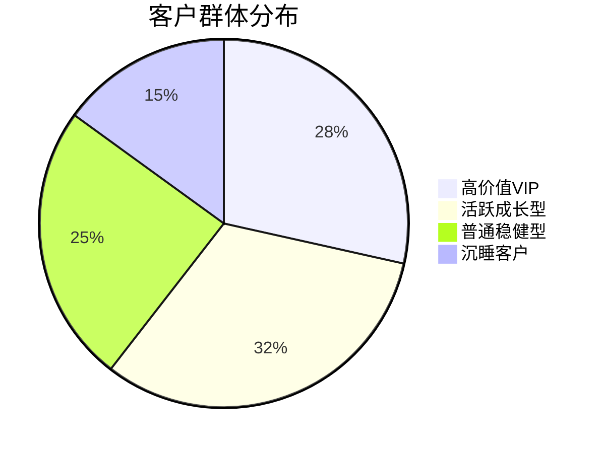

# L2Excel组 - 客户分群分析报告

## 一、数据分析概述

### 数据来源
- **数据集**：银行客户交易数据
- **样本量**：10,000名客户
- **时间范围**：2024年1月-12月

### 分析目标
1. 基于客户行为进行分群
2. 识别不同客户群体特征
3. 为精准营销提供依据

## 二、分群方法

### K-Means聚类分析

```python
# 聚类参数设置
kmeans = KMeans(
    n_clusters=4,
    random_state=42,
    max_iter=300
)
```

### 特征选择

| 特征 | 说明 | 权重 |
|------|------|------|
| 月均交易额 | 每月平均交易金额 | 0.3 |
| 交易频率 | 每月交易次数 | 0.25 |
| 产品数量 | 持有产品种类 | 0.2 |
| 开户时长 | 客户关系时长 | 0.15 |
| 活跃度 | 近30天活跃天数 | 0.1 |

## 三、分群结果

### 客户群体分布

| 客户群 | 数量 | 占比 | 命名 |
|--------|------|------|------|
| 群1 | 2,850 | 28.5% | 高价值VIP |
| 群2 | 3,200 | 32.0% | 活跃成长型 |
| 群3 | 2,450 | 24.5% | 普通稳健型 |
| 群4 | 1,500 | 15.0% | 沉睡客户 |

### 群体特征分析

#### 群1：高价值VIP

| 特征 | 平均值 | 描述 |
|------|--------|------|
| 月均交易额 | 50,000+ | 高消费能力 |
| 交易频率 | 20+次/月 | 高频交易 |
| 产品数量 | 5+种 | 多元化投资 |
| 开户时长 | 3年+ | 长期客户 |

**营销策略**：专属理财顾问、优先服务通道、定制化产品

#### 群2：活跃成长型

| 特征 | 平均值 | 描述 |
|------|--------|------|
| 月均交易额 | 10,000-50,000 | 中等消费 |
| 交易频率 | 10-20次/月 | 较活跃 |
| 产品数量 | 2-3种 | 初步多元化 |
| 开户时长 | 1-3年 | 成长中 |

**营销策略**：产品推荐、投资教育、升级引导

#### 群3：普通稳健型

| 特征 | 平均值 | 描述 |
|------|--------|------|
| 月均交易额 | 1,000-10,000 | 日常消费 |
| 交易频率 | 5-10次/月 | 稳定交易 |
| 产品数量 | 1-2种 | 单一产品 |
| 开户时长 | 1年+ | 稳定客户 |

**营销策略**：交叉销售、资产配置建议

#### 群4：沉睡客户

| 特征 | 平均值 | 描述 |
|------|--------|------|
| 月均交易额 | <1,000 | 低消费 |
| 交易频率 | <5次/月 | 不活跃 |
| 产品数量 | 1种 | 单一持有 |
| 开户时长 | 不确定 | 流失风险 |

**营销策略**：激活活动、关怀短信、优惠激励

## 四、可视化展示

### 客户分群分布图



### 各群体交易对比

```mermaid
bar
    title 各群体月均交易额对比
    "高价值VIP": 50000
    "活跃成长型": 25000
    "普通稳健型": 5000
    "沉睡客户": 500
```

## 五、行动建议

| 优先级 | 行动项 | 目标 | 负责人 |
|--------|--------|------|--------|
| 高 | VIP客户专属服务 | 提升满意度 | 客户经理 |
| 高 | 沉睡客户激活 | 提升活跃度 | 运营团队 |
| 中 | 成长型客户培育 | 促进升级 | 理财顾问 |
| 中 | 普通客户深耕 | 增加粘性 | 产品经理 |

## 六、结论

通过K-Means聚类分析，成功将客户分为4个不同群体。针对每个群体的特征制定差异化营销策略，可以有效提升客户价值和满意度。建议每季度更新一次分群模型，保持分析的时效性。