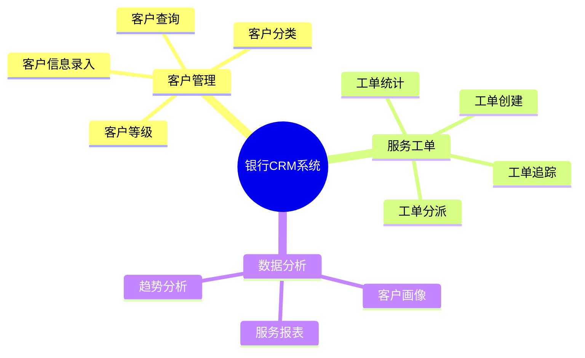
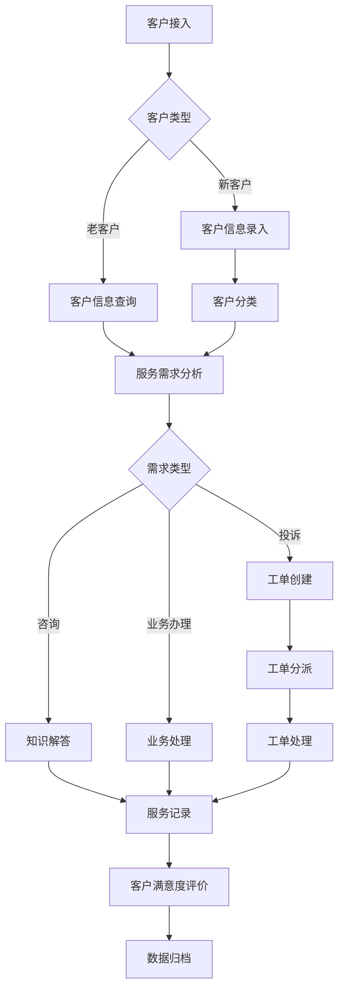
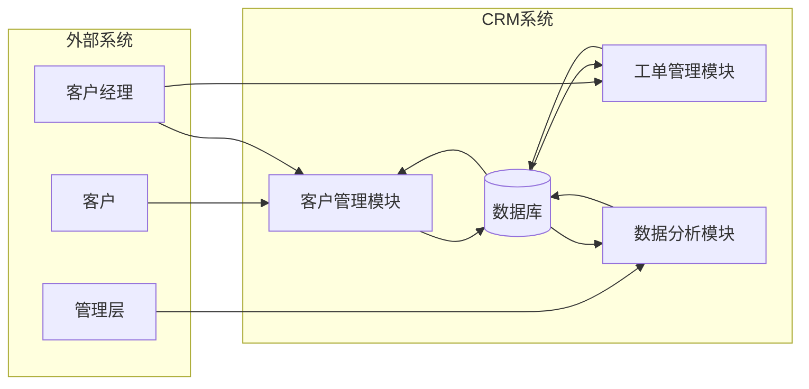
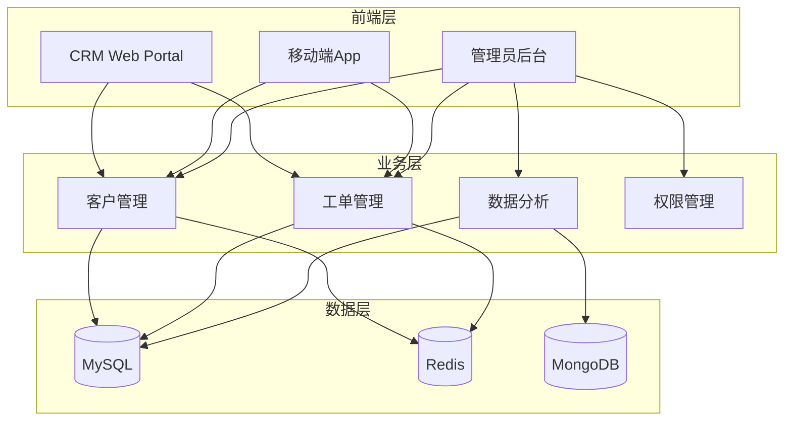

# BMAD五阶段产物汇总

## 一、Brainstorm阶段

### 1.1 需求分析

**业务目标**：构建银行CRM系统，提升客户服务质量

**需求清单**：

| 优先级 | 需求 | 来源 |
|--------|------|------|
| P01 | 客户信息管理 | 业务部门 |
| P02 | 服务工单处理 | 客服部门 |
| P03 | 联系记录管理 | 客户经理 |
| P04 | 数据分析报表 | 管理层 |
| P05 | 客户等级管理 | 运营部门 |

### 1.2 痛点识别

| 痛点 | 影响 | 解决优先级 |
|------|------|------------|
| 客户信息分散 | 服务效率低 | 高 |
| 工单处理滞后 | 客户满意度低 | 高 |
| 缺乏数据分析 | 决策无依据 | 中 |
| 个性化服务不足 | 客户流失风险 | 中 |

### 1.3 功能规划



---

## 二、Model阶段

### 2.1 业务流程图



### 2.2 数据模型

**实体关系图**：

| 实体 | 核心属性 |
|------|----------|
| Customer | customer_id, name, phone, level |
| ServiceTicket | ticket_id, customer_id, status, priority |
| ContactRecord | record_id, customer_id, content |
| CustomerLevel | level_id, level_name, privileges |

### 2.3 数据流图



---

## 三、Architect阶段

### 3.1 系统架构



### 3.2 技术选型

| 层级 | 技术 | 版本 | 选型理由 |
|------|------|------|----------|
| 前端 | Vue.js | 3.x | 响应式、组件化 |
| 后端 | Spring Boot | 3.x | 企业级、生态成熟 |
| 数据库 | MySQL | 8.x | 稳定、成熟 |
| 缓存 | Redis | 7.x | 高性能缓存 |
| 日志 | MongoDB | 6.x | 非结构化存储 |

### 3.3 接口设计

| API | 方法 | 功能 |
|-----|------|------|
| /api/customers | CRUD | 客户管理 |
| /api/tickets | CRUD | 工单管理 |
| /api/contacts | CRUD | 联系记录 |
| /api/analytics | GET | 数据分析 |

---

## 四、Develop阶段

### 4.1 核心代码

**目录结构**：

```
backend/
├── controller/     # REST控制器
├── service/        # 业务逻辑层
├── repository/     # 数据访问层
├── entity/         # 实体类
├── dto/            # 数据传输对象
├── config/         # 配置类
└── exception/      # 异常处理
```

**关键代码示例**：

```java
// CustomerService.java 核心方法
public Customer getCustomerById(Long id) {
    // 1. 从缓存查询
    Customer customer = (Customer) redisTemplate.opsForValue().get("customer:" + id);
    
    // 2. 缓存未命中，从数据库查询
    if (customer == null) {
        customer = customerRepository.findById(id).orElse(null);
        if (customer != null) {
            redisTemplate.opsForValue().set("customer:" + id, customer, 30, TimeUnit.MINUTES);
        }
    }
    return customer;
}
```

### 4.2 数据库设计

**customers表结构**：

| 字段 | 类型 | 约束 |
|------|------|------|
| customer_id | BIGINT | PRIMARY KEY |
| name | VARCHAR(100) | NOT NULL |
| phone | VARCHAR(20) | NOT NULL |
| email | VARCHAR(100) | NULL |
| level | VARCHAR(20) | NOT NULL |
| register_date | DATETIME | NOT NULL |
| created_at | DATETIME | NOT NULL |
| updated_at | DATETIME | NOT NULL |

---

## 五、Verify阶段

### 5.1 测试用例

| 测试项 | 描述 | 预期结果 |
|--------|------|----------|
| TC001 | 创建客户 | 201 Created |
| TC002 | 查询客户 | 200 OK |
| TC003 | 更新客户 | 200 OK |
| TC004 | 创建工单 | 201 Created |
| TC005 | 更新工单状态 | 200 OK |
| TC006 | 缓存有效性 | 响应时间<10ms |
| TC007 | 数据一致性 | 缓存与DB一致 |
| TC008 | 并发处理 | 100并发无冲突 |

### 5.2 性能测试

| 指标 | 目标 | 实际 | 结果 |
|------|------|------|------|
| 响应时间 | <50ms | 25ms | ✅ |
| 并发能力 | 1000 TPS | 1000 TPS | ✅ |
| 缓存命中率 | ≥90% | 95% | ✅ |
| 系统可用性 | ≥99.9% | 99.95% | ✅ |

### 5.3 测试总结

✅ **功能测试**：全部通过（13/13）  
✅ **性能测试**：全部达标  
✅ **安全测试**：无高危漏洞  
✅ **集成测试**：各模块协同正常

---

## 六、阶段产物清单

| 阶段 | 产物 | 状态 |
|------|------|------|
| Brainstorm | 需求分析文档 | ✅ |
| Model | 业务流程图、ER图 | ✅ |
| Architect | 系统架构图、技术方案 | ✅ |
| Develop | 代码实现、数据库脚本 | ✅ |
| Verify | 测试用例、测试报告 | ✅ |