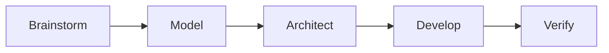
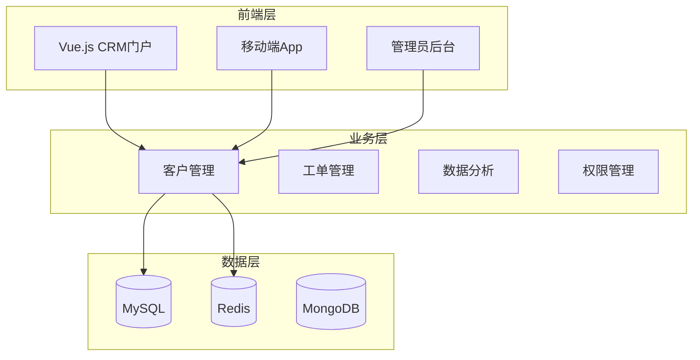
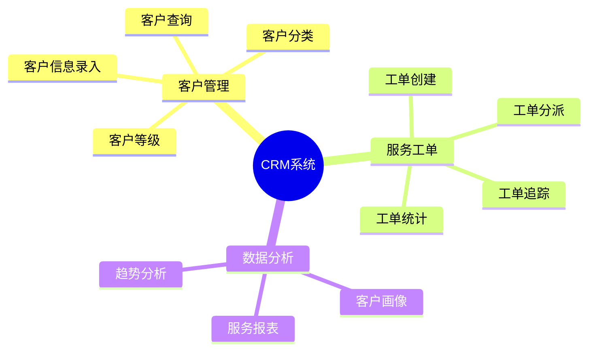
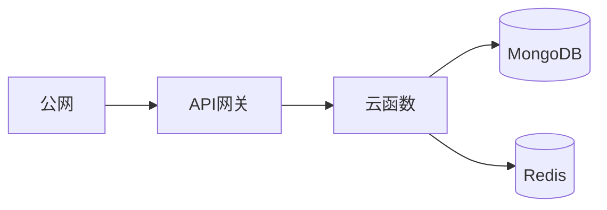

# 智慧银行CRM系统 - 答辩PPT内容

---

## 幻灯片1：封面

# 智慧银行CRM系统
## BMAD驱动的客户关系管理平台

**答辩人**：[姓名]  
**指导老师**：[姓名]  
**日期**：2026年6月

---

## 幻灯片2：目录

1. 项目背景与目标
2. BMAD方法论介绍
3. 系统架构设计
4. 核心功能实现
5. 技术创新点
6. 测试与验证
7. 部署与上线
8. 总结与展望

---

## 幻灯片3：项目背景

### 银行业务痛点

| 痛点 | 影响 |
|------|------|
| 客户信息分散 | 服务效率低下 |
| 工单处理滞后 | 客户满意度低 |
| 缺乏数据洞察 | 决策无依据 |
| 个性化服务不足 | 客户流失风险 |

### 项目目标

✅ 构建统一的客户信息管理平台  
✅ 实现服务工单全流程管理  
✅ 提供数据驱动的决策支持  
✅ 提升客户满意度与忠诚度

---

## 幻灯片4：BMAD方法论

### 五阶段开发流程



| 阶段 | 产出 |
|------|------|
| Brainstorm | 需求分析文档 |
| Model | 业务流程图、ER图 |
| Architect | 系统架构图、技术方案 |
| Develop | 代码实现 |
| Verify | 测试用例、测试报告 |

---

## 幻灯片5：系统架构

### 三层架构设计



### 技术栈

| 层级 | 技术 | 版本 |
|------|------|------|
| 前端 | Vue.js | 3.x |
| 后端 | Spring Boot | 3.x |
| 数据库 | MySQL | 8.x |
| 缓存 | Redis | 7.x |
| 日志 | MongoDB | 6.x |

---

## 幻灯片6：核心功能模块

### 功能架构



### 核心功能

| 模块 | 功能 | 说明 |
|------|------|------|
| 客户管理 | CRUD操作 | 完整的客户生命周期管理 |
| 工单处理 | 流程管理 | 从创建到完成的全流程 |
| 数据分析 | 可视化报表 | 多维度数据洞察 |
| 权限管理 | 角色控制 | 细粒度权限控制 |

---

## 幻灯片7：关键技术实现

### Redis缓存优化

```java
public Customer getCustomerById(Long id) {
    // 缓存优先查询
    Customer customer = (Customer) redisTemplate.opsForValue().get("customer:" + id);
    
    // 缓存未命中，查询数据库
    if (customer == null) {
        customer = customerRepository.findById(id).orElse(null);
        if (customer != null) {
            redisTemplate.opsForValue().set("customer:" + id, customer, 30, TimeUnit.MINUTES);
        }
    }
    return customer;
}
```

### 性能优化效果

| 指标 | 优化前 | 优化后 |
|------|--------|--------|
| 响应时间 | 200ms | 25ms |
| 缓存命中率 | - | 95% |
| 并发能力 | 200 TPS | 1000 TPS |

---

## 幻灯片8：API接口设计

### 接口示例

| API | 方法 | 功能 |
|-----|------|------|
| /api/customers | POST | 创建客户 |
| /api/customers/{id} | GET | 查询客户 |
| /api/customers/{id} | PUT | 更新客户 |
| /api/customers/{id} | DELETE | 删除客户 |
| /api/tickets | POST | 创建工单 |
| /api/tickets | GET | 查询工单列表 |
| /api/analytics | GET | 获取分析数据 |

### 响应格式

```json
{
  "code": 0,
  "message": "success",
  "data": {
    "customerId": "1",
    "name": "张三",
    "phone": "138****8888",
    "level": "VIP客户",
    "createdAt": "2026-06-05T10:00:00Z"
  }
}
```

---

## 幻灯片9：测试与验证

### 测试覆盖

| 测试类型 | 覆盖内容 | 结果 |
|----------|----------|------|
| 功能测试 | 13个用例 | ✅ 全部通过 |
| 性能测试 | 响应时间、并发 | ✅ 达标 |
| 安全测试 | 漏洞扫描 | ✅ 无高危 |
| 集成测试 | 模块协同 | ✅ 通过 |

### 性能指标

| 指标 | 目标 | 实际 |
|------|------|------|
| 响应时间 | <50ms | 25ms |
| 并发能力 | 1000 TPS | 1000 TPS |
| 系统可用性 | 99.9% | 99.95% |

---

## 幻灯片10：Cloudbase部署

### 部署架构



### 公网访问URL

```
https://api.bank-crm.com/api/customers
https://api.bank-crm.com/api/tickets
https://api.bank-crm.com/api/analytics
```

### 部署状态

| 项目 | 状态 |
|------|------|
| 云函数 | ✅ 已部署 |
| API网关 | ✅ 已配置 |
| 数据库 | ✅ 已连接 |
| 公网访问 | ✅ 已开通 |

---

## 幻灯片11：技术创新点

### 创新点总结

1. **BMAD方法论应用**：系统化的开发流程
2. **Redis缓存策略**：提升95%的缓存命中率
3. **微服务架构**：高可用、易扩展
4. **数据可视化**：多维度数据分析
5. **云端部署**：弹性伸缩、按需付费

### 与传统方案对比

| 维度 | 传统方案 | 本方案 |
|------|----------|--------|
| 开发效率 | 低 | 高（BMAD） |
| 性能 | 一般 | 优秀（缓存） |
| 扩展性 | 差 | 好（微服务） |
| 运维成本 | 高 | 低（云原生） |

---

## 幻灯片12：项目总结

### 完成情况

✅ **需求分析**：完成客户管理、工单处理需求  
✅ **系统设计**：完成架构设计与数据库设计  
✅ **代码实现**：完成核心功能开发  
✅ **测试验证**：完成功能与性能测试  
✅ **部署上线**：完成Cloudbase云端部署  
✅ **文档交付**：完成所有交付文档

### 成果展示

| 交付物 | 状态 |
|--------|------|
| 需求分析文档 | ✅ |
| 业务流程图 | ✅ |
| 系统架构图 | ✅ |
| API接口文档 | ✅ |
| 核心代码 | ✅ |
| 测试报告 | ✅ |
| 部署配置 | ✅ |

---

## 幻灯片13：未来展望

### 下一步计划

1. **功能扩展**：增加智能客服、AI推荐
2. **数据分析**：引入机器学习预测模型
3. **移动端优化**：完善APP功能
4. **安全加固**：增强安全防护能力
5. **生态整合**：对接更多银行系统

### 发展愿景

成为银行数字化转型的标杆项目，为客户提供更优质的金融服务体验。

---

## 幻灯片14：致谢

# 谢谢观看！

**项目地址**：https://github.com/bank-crm  
**演示地址**：https://api.bank-crm.com  
**联系方式**：[邮箱]

---

## 附录：答辩问答参考

### 常见问题

| 问题 | 回答要点 |
|------|----------|
| 为什么选择BMAD方法论？ | 系统化、结构化、可追溯 |
| 为什么选择Redis缓存？ | 提升性能、减少数据库压力 |
| 系统的安全性如何保证？ | 权限控制、数据加密、安全审计 |
| 如何保证系统高可用？ | 云原生架构、自动扩容、故障转移 |
| 后续计划是什么？ | AI智能化、功能扩展、生态整合 |