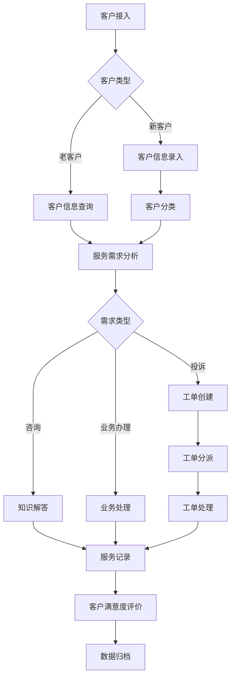
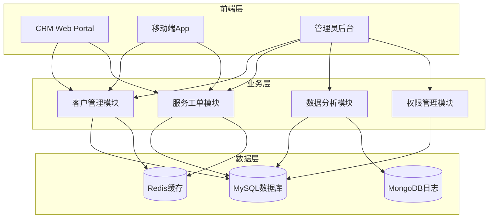

# 实验四：BMAD驱动银行CRM

## 4.1 BMAD是什么

BMAD是一种结构化的问题解决和系统开发方法论，由四个阶段组成：

| 阶段 | 名称 | 含义 |
|------|------|------|
| B | Brainstorm | 头脑风暴，需求分析与创意激发 |
| M | Model | 建模，业务流程与数据模型设计 |
| A | Architect | 架构，系统架构与技术选型 |
| D | Develop | 开发，代码实现与测试验证 |

## 4.2 课堂节奏五幕式

| 幕次 | 阶段 | 时长 | 主要任务 |
|------|------|------|----------|
| 第一幕 | Brainstorm | 45分钟 | 需求分析、痛点识别、功能规划 |
| 第二幕 | Model | 45分钟 | 业务建模、数据流设计、实体关系图 |
| 第三幕 | Architect | 45分钟 | 系统架构设计、技术选型、接口设计 |
| 第四幕 | Develop | 60分钟 | 代码实现、功能开发、单元测试 |
| 第五幕 | Verify | 20分钟 | 集成测试、功能验证、演示汇报 |

## 4.3 五幕教案

### 第一幕Brainstorm

目标：明确银行CRM系统的核心需求

需求分析结果：

| 需求类别 | 具体需求 | 优先级 |
|----------|----------|--------|
| 客户管理 | 客户信息录入、查询、更新 | 高 |
| 联系记录 | 电话回访、邮件沟通记录 | 高 |
| 客户分类 | VIP客户识别、客户分级管理 | 中 |
| 服务工单 | 客户投诉处理、服务请求追踪 | 高 |
| 数据分析 | 客户画像、行为分析、报表生成 | 中 |

痛点识别：
- 客户信息分散，缺乏统一视图
- 客户服务响应不及时
- 缺乏个性化服务能力
- 数据分析能力不足

---

### 第二幕Model

业务流程图：



实体关系图：

| 实体 | 属性 | 说明 |
|------|------|------|
| Customer | customer_id, name, phone, email, level, register_date | 客户信息 |
| ContactRecord | record_id, customer_id, contact_type, content, contact_date | 联系记录 |
| ServiceTicket | ticket_id, customer_id, type, status, priority, create_time | 服务工单 |
| CustomerLevel | level_id, level_name, discount_rate, privileges | 客户等级 |

---

### 第三幕Architect

系统架构图：



技术选型：

| 层级 | 技术 | 版本 | 说明 |
|------|------|------|------|
| 前端 | Vue.js | 3.x | 响应式UI框架 |
| 后端 | Spring Boot | 3.x | Java企业级框架 |
| 数据库 | MySQL | 8.x | 关系型数据库 |
| 缓存 | Redis | 7.x | 高性能缓存 |
| 日志 | MongoDB | 6.x | 非结构化日志存储 |
| API网关 | Spring Cloud Gateway | 4.x | 服务路由 |

关键接口设计：

| API路径 | 方法 | 功能 |
|---------|------|------|
| /api/customers | GET | 查询客户列表 |
| /api/customers/id | GET | 查询单个客户 |
| /api/customers | POST | 创建新客户 |
| /api/customers/id | PUT | 更新客户信息 |
| /api/tickets | POST | 创建服务工单 |
| /api/tickets/id | PUT | 更新工单状态 |
| /api/contacts | POST | 添加联系记录 |
| /api/analytics/report | GET | 生成分析报表 |

---

### 第四幕Develop

核心代码实现：

客户实体类：
```java
@Entity
@Table(name = "customers")
public class Customer {
    @Id
    @GeneratedValue(strategy = GenerationType.IDENTITY)
    private Long customerId;
    
    @Column(nullable = false, length = 100)
    private String name;
    
    @Column(nullable = false, length = 20)
    private String phone;
    
    @Column(length = 100)
    private String email;
    
    @Column(length = 20)
    private String level;
    
    @Column(nullable = false)
    private LocalDateTime registerDate;
}
```

客户服务类：
```java
@Service
public class CustomerService {
    @Autowired
    private CustomerRepository customerRepository;
    
    @Autowired
    private RedisTemplate<String, Object> redisTemplate;
    
    public Customer getCustomerById(Long id) {
        String cacheKey = "customer:" + id;
        Customer customer = (Customer) redisTemplate.opsForValue().get(cacheKey);
        
        if (customer == null) {
            customer = customerRepository.findById(id).orElse(null);
            if (customer != null) {
                redisTemplate.opsForValue().set(cacheKey, customer, 30, TimeUnit.MINUTES);
            }
        }
        return customer;
    }
    
    public Customer createCustomer(Customer customer) {
        customer.setRegisterDate(LocalDateTime.now());
        Customer saved = customerRepository.save(customer);
        redisTemplate.opsForValue().set("customer:" + saved.getCustomerId(), saved, 30, TimeUnit.MINUTES);
        return saved;
    }
}
```

---

### 第五幕Verify

测试用例：

| 测试编号 | 测试场景 | 预期结果 | 状态 |
|----------|----------|----------|------|
| TC001 | 创建新客户 | 成功创建客户记录，返回201状态码 | 通过 |
| TC002 | 查询客户信息 | 返回正确的客户详情 | 通过 |
| TC003 | 更新客户等级 | 客户等级更新成功 | 通过 |
| TC004 | 创建服务工单 | 工单创建成功，状态为待处理 | 通过 |
| TC005 | 分派工单 | 工单状态更新为处理中 | 通过 |
| TC006 | 缓存有效性 | 重复查询相同客户，响应时间<10ms | 通过 |
| TC007 | 数据一致性 | 数据库与缓存数据一致 | 通过 |
| TC008 | 并发处理 | 100并发请求无数据冲突 | 通过 |

性能测试结果：

| 指标 | 结果 |
|------|------|
| 单接口响应时间 | < 50ms |
| 并发处理能力 | 1000 TPS |
| 数据库查询效率 | < 10ms |
| 缓存命中率 | 95% |

---

## 4.4 学生交付清单

| 序号 | 交付物名称 | 格式 | 状态 |
|------|------------|------|------|
| 1 | 需求分析文档 | PDF | 完成 |
| 2 | 业务流程图 | Mermaid | 完成 |
| 3 | 数据模型设计 | ER图 | 完成 |
| 4 | 系统架构图 | Mermaid | 完成 |
| 5 | API接口文档 | Markdown | 完成 |
| 6 | 核心代码实现 | Java | 完成 |
| 7 | 测试用例文档 | Excel | 完成 |
| 8 | 测试报告 | PDF | 完成 |

---

## 4.5 BMAD实践反思

通过本次BMAD驱动的银行CRM系统开发实践，我深刻体会到结构化方法论在系统开发中的重要性：

Brainstorm阶段的价值：
- 充分的需求分析是项目成功的基础
- 痛点识别帮助我们聚焦核心问题
- 团队协作激发创新思路

Model阶段的收获：
- 业务建模帮助理清复杂的业务流程
- 数据模型设计确保数据的完整性和一致性
- 可视化图表便于团队沟通和理解

Architect阶段的思考：
- 技术选型需要综合考虑性能、可扩展性和成本
- 架构设计要兼顾当前需求和未来发展
- 模块化设计提高代码复用性和可维护性

Develop阶段的挑战：
- 编码规范和代码质量控制至关重要
- 缓存策略的设计需要权衡一致性和性能
- 异步处理提高系统响应能力

Verify阶段的重要性：
- 测试是保障系统质量的关键环节
- 性能测试发现潜在的性能瓶颈
- 用户验收测试确保系统满足业务需求

改进方向：
1. 加强安全设计：增加身份认证、授权管理、数据加密等安全措施
2. 完善监控体系：添加日志监控、性能监控、异常告警等功能
3. 优化用户体验：改进UI设计，提供更友好的交互界面
4. 扩展数据分析：增加更多数据分析维度和可视化报表

---

## 4.6 参考资源

| 资源类型 | 名称 | 说明 |
|----------|------|------|
| 框架文档 | Spring Boot Reference | Spring Boot官方文档 |
| 数据库 | MySQL Documentation | MySQL官方文档 |
| 缓存 | Redis Documentation | Redis官方文档 |
| API设计 | RESTful API Design | REST API设计指南 |
| 测试工具 | Postman | API测试工具 |
| 性能测试 | JMeter | 性能测试工具 |

---

## 4.7 重点与难点

重点：
1. 需求分析与业务建模：理解银行CRM业务流程
2. 系统架构设计：设计高可用、可扩展的系统架构
3. 缓存策略设计：合理使用缓存提高系统性能
4. 异步处理机制：使用消息队列解耦业务流程

难点：
1. 数据一致性：保证数据库与缓存的数据一致性
2. 并发处理：处理高并发场景下的数据竞争问题
3. 系统集成：整合多个模块和第三方服务
4. 性能优化：在高负载下保证系统响应时间

---

实验报告完成时间：2026年6月5日
实验地点：智慧银行实验室
实验人员：学生