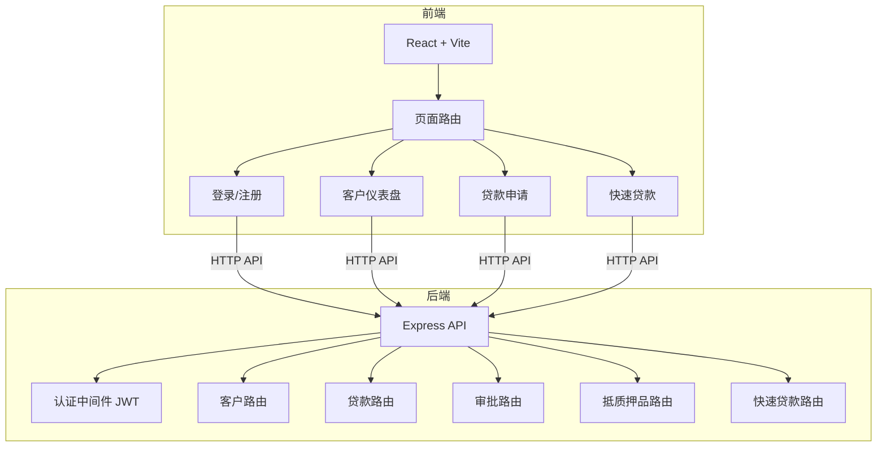
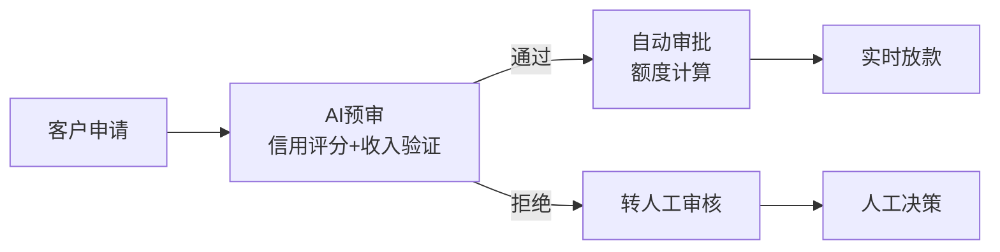
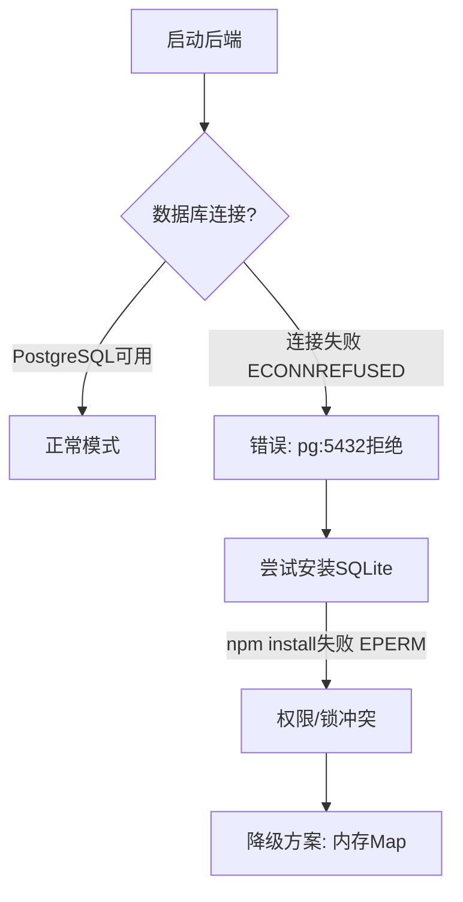
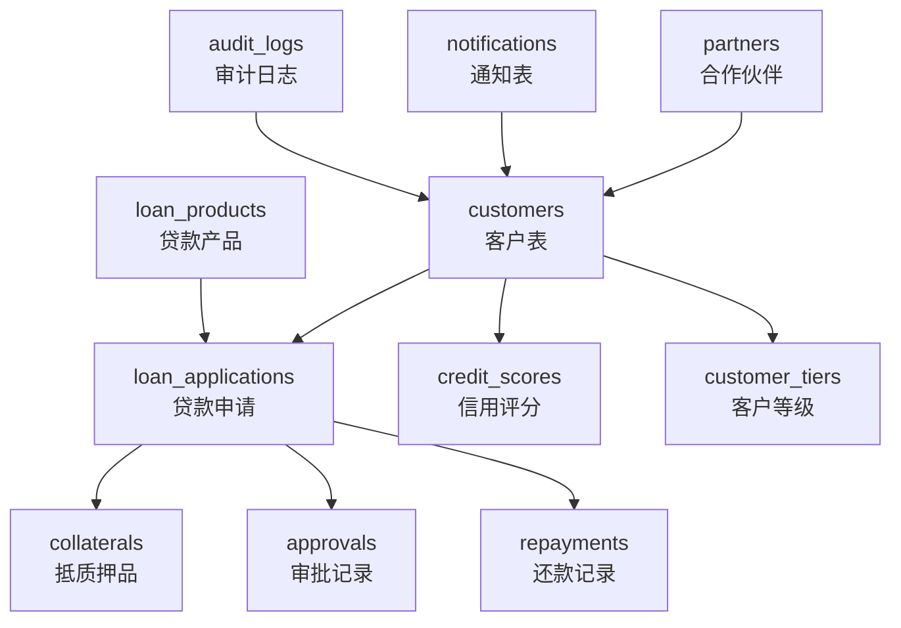

# BMAD 驱动的商业银行 CRM 系统开发实验手册

> **从零到部署的完整全栈工程实战指南**

---

## 实验概览

| 属性 | 内容 |
|:----:|------|
| **目标** | 使用 **BMAD（Business Manager, Architect, Developer）敏捷 AI 驱动框架**，从零开始规划、设计、实现、测试并部署一个商业银行 CRM 系统，覆盖完整软件工程生命周期 |
| **难度** | 中级 |
| **耗时** | 约 3-4 小时 |
| **适用课程** | 软件工程 · 金融科技 · 敏捷开发 |
| **前置要求** | 命令行基础、Node.js/npm、React/Vite 基础、Git 基础、Express.js 基础、敏捷开发概念 |

---

## 实验环境

| 类别 | 技术选型 |
|:----:|------|
| **操作系统** | Windows 25H2（实验环境），也支持 macOS / Linux |
| **IDE** | Qoder / Cursor / Claude Code（任选其一） |
| **Node.js** | v24.13.0（推荐 v18+） |
| **包管理器** | npm |
| **AI 框架** | BMAD v6+ |
| **后端** | Node.js + Express 4 |
| **前端** | React 18 + Vite 4 |
| **数据库** | PostgreSQL（设计目标） / 内存 Map（降级方案） |
| **版本控制** | Git + CNB（cnb.cool） |
| **部署平台** | Vercel（前端静态部署） |

---

## 实验流程总览


---

## 目录导航

| 序号 | 实验名称 | 阶段 | 链接 |
|:----:|------|:----:|------|
| 1 | 安装 BMAD 框架 | 环境准备 | [跳转](#实验一安装-bmad-框架) |
| 2 | 创建产品需求文档（PRD） | 需求分析 | [跳转](#实验二创建产品需求文档prd) |
| 3 | 创建技术架构设计 | 架构设计 | [跳转](#实验三创建技术架构设计) |
| 4 | 创建 UX 设计 | 交互设计 | [跳转](#实验四创建-ux-设计) |
| 5 | 创建 Epics 和 Stories | 需求拆解 | [跳转](#实验五创建-epics-和-stories) |
| 6 | Sprint 规划 | 迭代规划 | [跳转](#实验六sprint-规划) |
| 7 | Sprint 1 — 客户管理实现 | 代码实现 | [跳转](#实验七sprint-1--客户管理实现) |
| 8 | Sprint 2-3 — 迭代开发 | 迭代开发 | [跳转](#实验八sprint-2-3--迭代开发) |
| 9 | 数据库适配与降级方案 | 工程实践 | [跳转](#实验九数据库适配与降级方案) |
| 10 | 功能测试验证 | 质量保证 | [跳转](#实验十功能测试验证) |
| 11 | 版本控制与 CNB 推送 | 版本管理 | [跳转](#实验十一版本控制与-cnb-推送) |
| 12 | Vercel 部署（前端） | 生产部署 | [跳转](#实验十二vercel-部署前端) |

> **附录**：[项目交付物清单](#项目交付物清单) · [关键提示词汇总](#关键提示词汇总) · [总结](#总结) · [思考题](#思考题) · [扩展学习](#扩展学习)

---

## 实验一：安装 BMAD 框架 `环境准备`

### 1.1 目标

安装 BMAD 敏捷 AI 开发框架，为后续的需求分析、架构设计和代码实现提供方法论支撑。

### 1.2 BMAD 是什么

BMAD（Business Manager, Architect, Developer）是一套**AI 驱动的敏捷开发方法论**，核心思想是：

| 角色 | 职责 | BMAD 技能 |
|:----:|------|:----------|
| **产品经理 (John)** | 需求发现、PRD 编写 | `bmad-prd` |
| **业务分析师 (Mary)** | 市场调研、领域研究 | `bmad-domain-research` |
| **架构师 (Winston)** | 技术架构设计 | `bmad-create-architecture` |
| **UX 设计师 (Sally)** | 用户体验设计 | `bmad-ux` |
| **开发者 (Amelia)** | Story 实现、代码编写 | `bmad-dev-story` |
| **技术文档 (Paige)** | 知识管理、文档维护 | `bmad-agent-tech-writer` |

### 1.3 操作步骤

#### 场景 A：AI IDE 已预装 BMAD（如 Qoder）

BMAD 框架已集成在 Qoder IDE 中，无需额外安装。通过以下命令验证：

```bash
# 查看 BMAD 帮助
npx bmad-help

# 或在 Qoder 中使用技能
/bmad-help
```

#### 场景 B：AI IDE 未预装 BMAD（如 Cursor、Claude Code、VS Code 等）

如果使用的 AI IDE 没有内置 BMAD 技能，需手动安装 BMAD 框架。

**前置要求**：

| 项目 | 要求 |
|------|------|
| Node.js | v18+（推荐 v20+） |
| npm / npx | 随 Node.js 安装 |
| AI IDE | Cursor / Claude Code / Windsurf / VS Code + AI 插件 |
| Git | 用于 BMAD 文档版本管理 |

**步骤 1：安装 BMAD 框架**

在项目根目录的终端中执行：

```bash
# 在项目根目录运行安装器
npx bmad-method install
```

安装器会交互式地询问以下内容：

1. **安装目录**：默认为当前工作目录，直接回车确认
2. **模块选择**：勾选需要的模块（推荐全选核心模块）
   - `core` — 核心框架（必选，自动添加）
   - `bmm` — BMAD 方法论模块（必选）
   - `bmb` — BMAD 构建器模块（推荐）
   - `cis` — 持续集成支持（可选）
   - `gds` — 指导系统（可选）
   - `tea` — 测试评估（可选）
3. **版本确认**：选择 `Yes` 接受最新稳定版
4. **AI 工具集成**：选择你使用的 AI IDE
   - `claude-code` — Claude Code
   - `cursor` — Cursor IDE
   - 其他支持的 IDE 会自动列出
5. **模块配置**：设置项目名称、输出语言（中文）、输出文件夹（默认 `_bmad-output`）

**步骤 2：验证安装**

```bash
# 查看安装清单（记录了已安装的模块和版本）
cat _bmad/_config/manifest.yaml

# 在 AI IDE 中测试技能是否可用
# Cursor: 输入 /bmad-help
# Claude Code: 输入 /bmad-help
```

**步骤 3（可选）：非交互式快速安装**

适用于 CI/CD 环境或批量部署：

```bash
# 一键安装核心模块，集成 Claude Code
npx bmad-method install --yes --modules bmm,bmb --tools claude-code

# 一键安装核心模块，集成 Cursor
npx bmad-method install --yes --modules bmm,bmb --tools cursor

# 指定中文输出
npx bmad-method install --yes --modules bmm,bmb --tools claude-code \
  --set core.communication_language=zh \
  --set core.document_output_language=zh
```

**步骤 4（可选）：更新已有安装**

如果 `_bmad/` 目录已存在，重新运行安装器会提示：

```bash
npx bmad-method install
# → Quick Update（快速更新，保留现有配置）
# → Modify Install（修改安装，可增删模块）
```

> **故障排查**：如果出现 `API rate limit exceeded`，说明 GitHub 匿名请求超限，请设置 `GITHUB_TOKEN` 环境变量后重试。

### 1.4 预期结果

```
✅ BMAD 框架已就绪
可用技能列表：
  - bmad-product-brief   产品简报
  - bmad-prd             产品需求文档
  - bmad-create-architecture  架构设计
  - bmad-ux              UX设计
  - bmad-create-epics-and-stories  Epic拆分
  - bmad-sprint-planning Sprint规划
  - bmad-dev-story       Story开发
  ...
```

---

## 实验二：创建产品需求文档（PRD） `需求分析`

### 2.1 目标

使用 BMAD 的 PRD 技能，通过结构化的引导式问答，为商业银行 CRM 系统生成完整的产品需求文档。

### 2.2 操作步骤

**步骤 1：启动 PRD 技能**

```
/bmad-prd
```

**步骤 2：选择创建路径**

BMAD 会提供选项：
- **A（快速路径）**：基于预设模板快速生成，适合概念验证
- **B（深度路径）**：逐项引导问答，适合正式项目

本实验选择 **A（快速路径）**。

**步骤 3：提供项目主题**

```
主题：商业银行CRM系统
```

### 2.3 预期产出

BMAD 生成 `_bmad-output/prd.md`，包含 **8 大核心章节**：

| 章节 | 内容 |
|------|------|
| 1. 产品概述 | 系统定位、目标用户、核心价值 |
| 2. 功能需求 | 客户管理、贷款申请、审批流程等 |
| 3. 非功能需求 | 性能、安全、可用性 |
| 4. 用户角色 | 普通客户、客户经理、风控审批员、管理员 |
| 5. 客户等级体系 | 普通 / 白银 / 黄金 / 钻石 / 战略伙伴 |
| 6. 业务流程 | 注册→登录→申请→审批→放款 |
| 7. 技术约束 | 技术栈选型说明 |
| 8. 验收标准 | 功能完成度定义 |

### 2.4 关键提示词

```
请为商业银行CRM系统创建PRD文档。
系统需要支持：客户管理、贷款申请、额度评估、
客户等级体系（普通/白银/黄金/钻石/战略伙伴）、
即申即贷快速审批。
```

---

## 实验三：创建技术架构设计 `架构设计`

### 3.1 目标

基于 PRD，设计系统的技术架构，确定技术栈、模块划分和集成方案。

### 3.2 操作步骤

```
/bmad-create-architecture
```

提供 PRD 文件路径作为输入，BMAD 架构师（Winston）会生成架构文档。

### 3.3 预期产出

`_bmad-output/architecture.md`，包含：



**技术栈决策**：

| 层级 | 技术 | 选型理由 |
|------|------|----------|
| 前端框架 | React 18 | 组件化、生态成熟 |
| 构建工具 | Vite 4 | 极速 HMR、零配置 |
| 后端框架 | Express 4 | 轻量、灵活、社区大 |
| 认证 | JWT | 无状态、易扩展 |
| 数据库 | PostgreSQL | 关系型、支持复杂查询 |

---

## 实验四：创建 UX 设计 `交互设计`

### 4.1 目标

设计系统的用户体验流程和界面规范。

### 4.2 操作步骤

```
/bmad-ux
```

选择 **B** 创建完整的 UX 设计规格。

### 4.3 预期产出

`_bmad-output/ux/DESIGN.md` 和 `EXPERIENCE.md`，包含：

- **用户旅程图**：从注册到贷款发放的完整流程
- **页面线框图**：各核心页面的布局描述
- **交互规范**：表单验证、加载状态、错误提示
- **视觉风格**：银行级专业风格，蓝白配色

---

## 实验五：创建 Epics 和 Stories `需求拆解`

### 5.1 目标

将 PRD 中的功能需求拆解为可执行的 Epic 和 User Story。

### 5.2 操作步骤

```
/bmad-create-epics-and-stories
```

选择 **B** 创建完整列表。

### 5.3 预期产出

`_bmad-output/epics-stories.md`，将系统拆分为 **5 个 Epic、26 个 Story**：

| Epic | 内容 | Story 数 |
|------|------|:--------:|
| **Epic 1: 客户管理** | 注册、登录、信息管理、等级体系 | 7 |
| **Epic 2: 贷款核心** | 产品管理、申请、审批、抵质押品 | 6 |
| **Epic 3: 即申即贷** | AI 预审、快速放款、实时通知 | 5 |
| **Epic 4: 还款管理** | 还款计划、自动扣款、逾期处理 | 4 |
| **Epic 5: 增值服务** | 数据分析、营销、绩效 | 4 |

**Story 示例**：

```
Story 1.1: 用户注册
作为一位潜在客户，
我希望能够通过手机号注册账户，
以便开始使用银行的数字化服务。

验收标准：
- 输入手机号和密码
- 手机号格式验证
- 注册成功后自动登录
- 返回 JWT 令牌
```

---

## 实验六：Sprint 规划 `迭代规划`

### 6.1 目标

将 26 个 Story 分配到 4 个 Sprint，制定迭代开发计划。

### 6.2 操作步骤

```
/bmad-sprint-planning
```

### 6.3 预期产出

`_bmad-output/sprint-plan.md`：

| Sprint | 主题 | Stories | 预估人日 | 状态 |
|:------:|------|:-------:|:--------:|:----:|
| **Sprint 1** | 基础服务（客户管理） | 7 | 12 | ✅ 完成 |
| **Sprint 2** | 贷款核心 | 7 | 14 | ✅ 完成 |
| **Sprint 3** | 即申即贷 | 6 | 13 | ✅ 完成 |
| **Sprint 4** | 增值服务 | 6 | 12 | ⏳ 待开发 |

**依赖关系**：


---

## 实验七：Sprint 1 — 客户管理实现 `代码实现`

### 7.1 目标

实现 Sprint 1 的全部 7 个 Story，搭建项目骨架并完成客户管理全链路。

### 7.2 后端实现

**步骤 1：初始化后端项目**

```bash
mkdir backend && cd backend
npm init -y
npm install express cors jsonwebtoken
```

**步骤 2：创建项目结构**

```
backend/
├── src/
│   ├── db/
│   │   ├── index.js       # 数据库连接
│   │   └── migrate.js     # 迁移脚本
│   ├── routes/
│   │   ├── customers.js   # 客户路由
│   │   ├── loans.js       # 贷款路由
│   │   ├── approvals.js   # 审批路由
│   │   └── partners.js    # 合作伙伴路由
│   ├── middleware/
│   │   └── auth.js        # JWT认证中间件
│   └── index.js           # Express入口
├── .env                   # 环境变量
└── package.json
```

**步骤 3：实现核心 API**

`backend/src/index.js`：

```javascript
const express = require('express');
const cors = require('cors');

const app = express();
app.use(cors());
app.use(express.json());

// 注册路由
app.use('/api/customers', require('./routes/customers'));
app.use('/api/loans', require('./routes/loans'));
app.use('/api/approvals', require('./routes/approvals'));
app.use('/api/partners', require('./routes/partners'));

const PORT = process.env.PORT || 3001;
app.listen(PORT, () => {
  console.log(`CRM后端服务运行在 http://localhost:${PORT}`);
});
```

**步骤 4：数据库迁移脚本**

`backend/src/db/migrate.js` 创建 **11 张核心表**：

```sql
-- 核心表结构
customers (客户表)
loan_applications (贷款申请表)
collaterals (抵质押品表)
repayments (还款记录表)
customer_tiers (客户等级表)
loan_products (贷款产品表)
approvals (审批记录表)
partners (合作伙伴表)
notifications (通知表)
credit_scores (信用评分表)
audit_logs (审计日志表)
```

### 7.3 前端实现

**步骤 1：初始化前端**

```bash
npm create vite@latest frontend -- --template react
cd frontend && npm install
npm install react-router-dom
```

**步骤 2：实现核心页面**

| 页面 | 文件 | 功能 |
|------|------|------|
| 登录 | `App.jsx` 内 | 手机号 + 密码登录 |
| 注册 | `App.jsx` 内 | 新用户注册 |
| 仪表盘 | `App.jsx` 内 | 客户信息概览 |
| 贷款申请 | `App.jsx` 内 | 贷款产品选择与申请 |

**步骤 3：配置 Vite 代理**

`frontend/vite.config.js`：

```javascript
import { defineConfig } from 'vite';
import react from '@vitejs/plugin-react';

export default defineConfig({
  plugins: [react()],
  server: {
    port: 5173,
    proxy: {
      '/api': {
        target: 'http://localhost:3001',
        changeOrigin: true,
      },
    },
  },
});
```

### 7.4 验证

```bash
# 启动后端
cd backend && node src/index.js

# 启动前端（新终端）
cd frontend && npm run dev
```

访问 `http://localhost:5173`，应看到登录页面。

---

## 实验八：Sprint 2-3 — 迭代开发 `迭代开发`

### 8.1 目标

通过迭代方式完成 Sprint 2（贷款核心）和 Sprint 3（即申即贷）。

### 8.2 Sprint 2 新增模块

| 路由文件 | 功能 |
|----------|------|
| `collaterals.js` | 抵质押品管理（CRUD + 估值） |
| `repayments.js` | 还款计划与记录 |
| `tiers.js` | 客户等级体系管理 |

**前端集成**：在 `App.jsx` 中新增对应路由入口和导航链接。

### 8.3 Sprint 3 新增模块

| 路由文件 | 功能 |
|----------|------|
| `quick-loan.js` | 即申即贷（AI 预审 + 快速放款） |
| `test.js` | 测试账号初始化接口 |

**关键特性 — 即申即贷流程**：



### 8.4 测试账号初始化

为方便测试，`test.js` 路由提供初始化接口：

```
GET /api/test/init  → 初始化4个测试账号
```

| 手机号 | 密码 | 客户等级 | 信用分 |
|-------|------|---------|:------:|
| 13800138001 | password123 | 钻石 | 820 |
| 13800138002 | password123 | 黄金 | 750 |
| 13800138003 | password123 | 白银 | 680 |
| 13800138004 | password123 | 普通 | 600 |

---

## 实验九：数据库适配与降级方案 `工程实践`

### 9.1 目标

解决开发环境中 PostgreSQL 不可用的问题，实现数据库降级方案，确保系统可运行。

### 9.2 问题分析



### 9.3 降级方案实现

`backend/src/db/index.js`：

```javascript
// 内存Map模拟数据库
const mockData = {
  customers: new Map(),
  loans: new Map(),
  // ...其他表
};

const pool = {
  query: async (sql, params) => {
    console.log('SQL (模拟):', sql.substring(0, 50));
    // 模拟查询逻辑
    return { rows: [] };
  },
};

module.exports = { pool };
```

### 9.4 密码哈希降级

由于 `bcrypt` 模块安装失败（EPERM），使用 Base64 替代：

```javascript
// 替代bcrypt的简单哈希
const hashPassword = (password) => {
  return Buffer.from(password).toString('base64');
};

const verifyPassword = (password, hash) => {
  return hashPassword(password) === hash;
};
```

### 9.5 教学要点

> **降级策略**是工程实践中的重要技能。当理想方案不可行时，需要快速找到可用的替代方案，保证核心功能可用。生产环境中应使用正式的数据库和加密方案。

---

## 实验十：功能测试验证 `质量保证`

### 10.1 目标

验证系统核心功能（登录、客户管理、贷款申请）正常工作。

### 10.2 后端 API 测试

```bash
# 1. 初始化测试数据
curl http://localhost:3001/api/test/init

# 2. 测试登录
curl -X POST http://localhost:3001/api/customers/login \
  -H "Content-Type: application/json" \
  -d '{"phone":"13800138001","password":"password123"}'

# 3. 获取客户列表（需JWT）
curl http://localhost:3001/api/customers \
  -H "Authorization: Bearer <YOUR_TOKEN>"
```

### 10.3 前端界面测试

1. 打开浏览器访问 `http://localhost:5173`
2. 使用测试账号登录：`13800138001` / `password123`
3. 验证仪表盘数据显示
4. 测试贷款申请流程

### 10.4 常见问题

| 问题 | 原因 | 解决方案 |
|------|------|----------|
| 登录失败 401 | 数据库未连接 | 执行 `/api/test/init` |
| 端口被占用 | 旧进程未关闭 | `taskkill /f /im node.exe` |
| bcrypt 缺失 | 安装失败 | 使用 Base64 替代 |
| CORS 错误 | 跨域未配置 | 确认 `cors()` 中间件已加载 |

---

## 实验十一：版本控制与 CNB 推送 `版本管理`

### 11.1 目标

将完整项目代码推送到 CNB（cnb.cool）代码托管平台。

### 11.2 操作步骤

**步骤 1：初始化 Git 仓库**

```bash
cd "c:\new  weiyun\my test website"
git init
```

**步骤 2：创建 .gitignore**

```gitignore
node_modules/
dist/
build/
.env
.env.local
*.log
.DS_Store
Thumbs.db
.vercel-tmp/
.qoder/
```

**步骤 3：添加并提交代码**

```bash
git add -A
git commit -m "feat: 添加完整项目代码（前后端+BMAD文档）"
```

**步骤 4：配置远程仓库**

```bash
# 添加CNB远程仓库
git remote add origin https://cnb.cool/xiaosicau/smartcrb-demo.git
```

**步骤 5：认证配置**

CNB 平台使用个人访问令牌（PAT）认证：

```bash
# 方式一：URL内嵌令牌（推荐自动化）
git remote set-url origin https://cnb:<TOKEN>@cnb.cool/xiaosicau/smartcrb-demo.git

# 方式二：CNB CLI登录
npm install -g @cnbcool/cnb-cli
cnb login  # 浏览器授权
```

**步骤 6：推送**

```bash
git push -u origin master
```

### 11.3 CNB 认证故障排查

| 现象 | 原因 | 解决方案 |
|------|------|----------|
| `Credentials have Expired` | OAuth token 过期 | 使用 PAT 令牌嵌入 URL |
| `ssh: port 22 timeout` | SSH 端口被封 | 改用 HTTPS 方式 |
| `Repository Not Found` | 仓库未初始化 | 在 CNB 网页端先创建仓库 |
| `cnb status` 显示已登录但 API 401 | status 不验证 API 有效性 | 重新 `cnb login` 或使用 PAT |

### 11.4 验证推送结果

访问 https://cnb.cool/xiaosicau/smartcrb-demo ，确认以下文件已上传：

```
✅ README.md
✅ backend/（完整后端代码）
✅ frontend/（完整前端代码）
✅ _bmad-output/（PRD、架构、Sprint计划等文档）
✅ .gitignore
```

---

## 实验十二：Vercel 部署（前端） `生产部署`

> 详细步骤请参考 **[Vercel部署实验手册.md](Vercel部署实验手册.md)**

### 12.1 前置准备：注册 Vercel 账户

Vercel 部署需要一个已注册的账户。以下是完整的注册流程：

**方式一：通过网页注册（推荐新手）**

1. 打开浏览器，访问 **https://vercel.com/signup**
2. 选择注册方式：
   - **GitHub 账户登录**（推荐）：点击 `Continue with GitHub`，授权 Vercel 访问
   - **GitLab 账户登录**：点击 `Continue with GitLab`
   - **Bitbucket 账户登录**：点击 `Continue with Bitbucket`
   - **邮箱注册**：输入邮箱，点击 `Continue with Email`
3. 填写用户名和密码（邮箱注册方式）
4. 验证邮箱：收到的验证邮件，点击确认链接
5. 完善信息：填写团队名称（可选），选择 Hobby（免费）计划
6. 注册完成，进入 Vercel Dashboard

> **提示**：Hobby（免费）计划支持个人项目部署，满足本实验需求。如需团队协作或商业用途，可升级到 Pro 计划。

**方式二：通过 CLI 首次登录时自动引导注册**

如果尚未注册，执行 `vercel login` 时会引导你完成注册（见下方 12.3 节）。

### 12.2 安装 Vercel CLI

Vercel CLI 是与 Vercel 平台交互的命令行工具，用于本地部署、项目管理、日志查看等。

**前置要求**：Node.js v18+ 已安装

```bash
# 使用 npm 全局安装（最常用）
npm install -g vercel

# 或使用 pnpm
pnpm add -g vercel

# 或使用 yarn
yarn global add vercel

# 验证安装
vercel --version
```

> **Windows 权限问题**：如果出现 `EPERM` 或 `EACCES` 错误，以管理员身份打开 PowerShell 后重试，或使用 `npx vercel` 替代全局安装。

### 12.3 登录 Vercel 账户

```bash
vercel login
```

CLI 会提示你选择登录方式：

```
> Log in to Vercel
  Continue with GitHub
  Continue with GitLab
  Continue with Bitbucket
❯ Continue with Email
```

**操作步骤**：

1. 使用键盘上下键选择登录方式，按 Enter 确认
2. **GitHub / GitLab / Bitbucket** 方式：浏览器会自动打开授权页面，点击 `Authorize Vercel` 完成授权
3. **Email** 方式：
   - 输入注册邮箱
   - CLI 会发送一个验证码到你的邮箱
   - 在终端输入收到的验证码
4. 终端显示 `Congratulations! You are now logged in.` 表示登录成功

**非交互式登录（CI/CD 环境）**：

```bash
# 方式一：使用 Token（推荐自动化）
# 1. 在浏览器中访问 https://vercel.com/account/tokens 创建 Token
# 2. 在终端中使用 Token
vercel login --token <YOUR_VERCEL_TOKEN>

# 方式二：设置环境变量（推荐 CI/CD）
# 在 CI/CD 的 Secrets 中设置 VERCEL_TOKEN
export VERCEL_TOKEN=<YOUR_VERCEL_TOKEN>
vercel --prod --yes
```

> **登录状态验证**：执行 `vercel whoami` 查看当前登录的账户名。

### 12.4 部署前端项目

```bash
# 1. 进入前端目录
cd frontend

# 2. 生产部署（--prod 部署到生产环境，--yes 使用默认配置）
vercel --prod --yes
```

**首次部署时的交互提示**：

```
? Set up and deploy "frontend"? [Y/n]        # 输入 Y
? Which scope do you want to deploy to?       # 选择你的账户
? Link to existing project? [y/N]            # 输入 N（新项目）
? What's your project's name?                # 输入项目名，如 smart-crm-frontend
? In which directory is your code located?    # 默认 ./ ，按 Enter
```

### 12.5 部署结果

| 信息项 | 说明 |
|--------|------|
| 生产 URL | `https://frontend-xxx.vercel.app` |
| 构建方式 | Vite 自动识别 |
| 输出目录 | `dist/` |
| 构建时间 | ~16s（含依赖安装） |

---

## 项目交付物清单 `附录`

### BMAD 文档产出

| 文档 | 路径 | 说明 |
|:----:|:-----|------|
| 产品需求文档 | `_bmad-output/prd.md` | 8 大章节，208 行 |
| 架构设计 | `_bmad-output/architecture.md` | 技术栈 + 模块设计 |
| UX 设计 | `_bmad-output/ux/DESIGN.md` | 用户旅程 + 界面规范 |
| Epic & Story | `_bmad-output/epics-stories.md` | 5 Epic / 26 Story |
| Sprint 计划 | `_bmad-output/sprint-plan.md` | 4 Sprint 路线图 |

### 代码产出

| 模块 | 文件数 | 说明 |
|:----:|:------:|------|
| 后端路由 | 9 | customers / loans / approvals / partners / collaterals / repayments / tiers / quick-loan / test |
| 后端基础设施 | 3 | index.js / db/index.js / db/migrate.js |
| 前端页面 | 1 | App.jsx（集成所有页面） |
| 前端配置 | 4 | package.json / vite.config.js / index.html / main.jsx |

### 数据库设计

11 张核心表覆盖完整银行业务域：



---

## 关键提示词汇总

以下是在整个开发过程中使用的**核心提示词**，可供复现实验：

| 序号 | 阶段 | 提示词 |
|:----:|:----:|------|
| 1 | 启动 BMAD | `请使用BMAD框架为商业银行CRM系统创建完整的开发文档。` |
| 2 | 创建 PRD | `/bmad-prd` + 主题：商业银行CRM系统，支持客户管理、贷款申请、额度评估、客户等级体系、即申即贷快速审批。选择 A（快速路径） |
| 3 | 架构设计 | `/bmad-create-architecture` + 基于已生成的PRD，设计技术架构 |
| 4 | UX 设计 | `/bmad-ux` + 选择B创建UX设计规格 |
| 5 | Epic 拆分 | `/bmad-create-epics-and-stories` + 选择B创建完整列表 |
| 6 | Sprint 规划 | `/bmad-sprint-planning` + 为26个Stories制定4个Sprint的开发计划 |
| 7 | 实现 Stories | `实现全部story` |
| 8 | 迭代推进 | `A`（选择继续下一个Sprint） |
| 9 | 数据库适配 | `A`（选择配置数据库连接）+ 选择SQLite方案 |
| 10 | 测试登录 | `使用13800138001登陆一下前端` |
| 11 | 推送 CNB | `给项目写一个readme，然后推送到cnb` + 仓库地址和PAT令牌 |

> **提示**：按顺序执行上述提示词，即可完整复现本实验全部流程。

---

## 总结

### BMAD 方法论价值

| 价值点 | 说明 |
|:------:|------|
| **结构化需求** | PRD 技能将模糊想法转化为 8 章节标准文档 |
| **角色分离** | PM / 架构师 / UX / 开发者各司其职 |
| **敏捷迭代** | Sprint 机制支持渐进式交付 |
| **AI 加速** | 从需求到代码，AI 全程辅助 |
| **文档驱动** | 每步产出可追溯的文档 |

### 技术架构亮点

| 序号 | 亮点 | 说明 |
|:----:|------|------|
| 1 | **前后端分离** | React + Express，独立开发部署 |
| 2 | **JWT 认证** | 无状态令牌，易于水平扩展 |
| 3 | **客户等级体系** | 5 级分层，支持差异化服务 |
| 4 | **即申即贷** | AI 预审 + 自动审批流程 |
| 5 | **降级容错** | 数据库不可用时自动降级到内存模式 |

### 工程实践要点

| 序号 | 要点 | 说明 |
|:----:|------|------|
| 1 | **先文档后代码** | BMAD 流程确保需求清晰再开发 |
| 2 | **渐进式交付** | Sprint by Sprint，持续可见进展 |
| 3 | **降级思维** | 生产级方案不可行时，快速找到替代方案 |
| 4 | **版本控制** | 代码、文档统一纳入 Git 管理 |
| 5 | **自动化部署** | Vercel 一键部署 + CI/CD 集成 |

---

## 思考题

> 完成实验后，思考以下问题以深化理解：

| 序号 | 思考方向 |
|:----:|------|
| 1 | BMAD 的角色分离（PM / 架构师 / UX / 开发者）如何提升软件质量？ |
| 2 | Sprint 依赖关系（线性 vs 并行）如何影响交付节奏？ |
| 3 | 数据库降级方案（内存 Map）在什么场景下是合理的？生产环境应如何改进？ |
| 4 | 即申即贷的 AI 预审模块，需要哪些数据输入？如何设计评分模型？ |
| 5 | CNB 的 OAuth 登录和 PAT 令牌两种认证方式，各有什么优缺点？ |
| 6 | 如果要将后端也部署到云端（而非仅前端部署 Vercel），有哪些方案？ |

---

## 扩展学习

| 主题 | 链接 |
|------|------|
| BMAD 官方文档 | https://github.com/bmad-code-org/bmad-method |
| BMAD 安装指南 | https://docs.bmad-method.org/how-to/install-bmad/ |
| Express.js 最佳实践 | https://expressjs.com/en/advanced/best-practice-performance.html |
| Vite 部署指南 | https://vitejs.dev/guide/build.html |
| JWT 安全最佳实践 | https://datatracker.ietf.org/doc/html/rfc7519 |
| CNB 平台文档 | https://docs.cnb.cool/ |
| Vercel CLI 文档 | https://vercel.com/docs/cli |
| 本项目部署手册 | [Vercel部署实验手册.md](./Vercel部署实验手册.md) |

---

> **[返回目录](#目录导航)** ｜ **[查看仓库](https://cnb.cool/xiaosicau/smartcrb-demo)**
